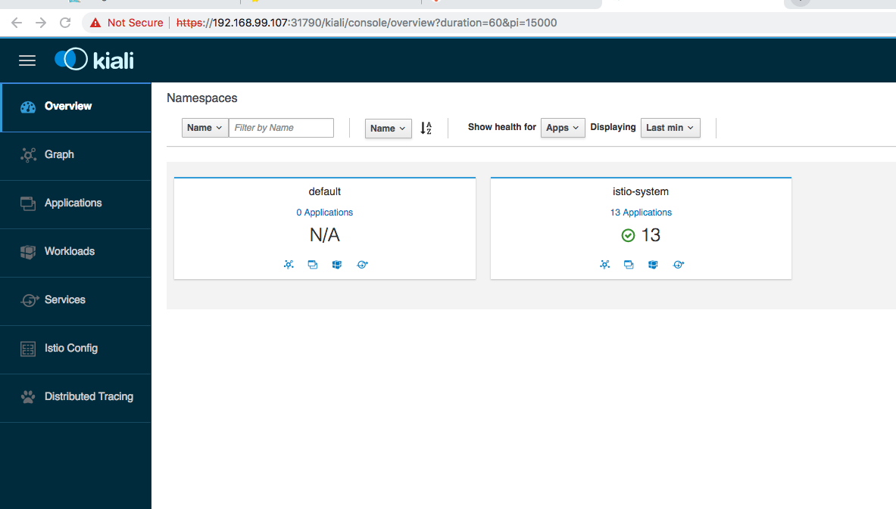

# Local Environment Setup

This document describes how to set up Minikube with Istio and Kiali to run cloud-native applications with multiple microservices locally.

After following these instructions you will be able to use the Kubernetes dashboard, Kiali, Jaeger, Grafana and Prometheus.


### Minikube

Follow the [instructions](https://kubernetes.io/docs/setup/minikube/) to install Minikube. After this run these commands:

```
$ minikube config set cpus 4
$ minikube config set memory 8192
$ minikube config set disk-size 50g
$ minikube start
$ minikube addons enable ingress 
$ eval $(minikube docker-env)
```

After this you can get the Minikube IP address and open the dashboard via these commands:

```
$ minikube ip
$ minikube dashboard
```

To stop the cluster run this command:

```
$ minikube stop
```


### Istio

To install Istio, run these commands:

```
$ curl -L https://git.io/getLatestIstio | sh -
# follow the instruction to set the path
$ cd istio-1.0.6
$ kubectl apply -f install/kubernetes/helm/istio/templates/crds.yaml
$ kubectl apply -f install/kubernetes/istio-demo.yaml
```

Check that all pods are running or completed before continuing.

```
$ kubectl get pod -n istio-system
```

Enable automatic sidecar injection:

```
$ kubectl label namespace default istio-injection=enabled
```

After this you can use the following tools:

[**Jaeger Dashboard**](https://www.jaegertracing.io/docs/1.6/getting-started/)

```
$ kubectl port-forward -n istio-system $(kubectl get pod -n istio-system -l app=jaeger -o jsonpath='{.items[0].metadata.name}') 16686:16686
```

http://localhost:16686

[**Grafana Dashboard**](https://grafana.com/dashboards)

```
$ kubectl -n istio-system port-forward $(kubectl -n istio-system get pod -l app=grafana -o jsonpath='{.items[0].metadata.name}') 3000:3000 &
```

http://localhost:3000/dashboard/db/istio-mesh-dashboard

[**Prometheus Dashboard**](https://prometheus.io/docs/practices/consoles/)

```
$ kubectl -n istio-system port-forward $(kubectl -n istio-system get pod -l app=prometheus -o jsonpath='{.items[0].metadata.name}') 9090:9090 &
```

http://localhost:9090


### [Kiali](https://www.kiali.io/)

Run the following command to install Kiali:

```
$ bash <(curl -L http://git.io/getLatestKialiKubernetes)
```

_Notes:_ 

* You maybe get on Mac following message:

```
ERROR: You do not have 'envsubst' in your PATH. Please install it and retry.
If you are on MacOS, you can get this by installing the gettext package
```

Follow steps in [stackoverflow entery](https://stackoverflow.com/questions/23620827/envsubst-command-not-found-on-mac-os-x-10-8) this fixed my installation on Mac.

* If you get this output, don't worry just following the next steps
```
=== Dashboards to install ===
404: Not Found
=============================
Applying YAML from URL via: curl -s https://raw.githubusercontent.com/kiali/kiali/v0.15.0/deploy/dashboards/404:
error: error validating "STDIN": error validating data: [apiVersion not set, kind not set]; if you choose to ignore these errors, turn validation off with --validate=false
NOTE: Could not deploy runtimes dashboard [404:]. Dashboards are not mandatory and won't prevent Kiali to work.
```

List the istio system and get the port information from Kiali.

```
$ kubectl get svc -n istio-system
NAME                     TYPE           CLUSTER-IP       EXTERNAL-IP   PORT(S)
kiali                    NodePort       10.97.190.154    <none>        20001:31790/TCP                                                                                                           20m
```

Get the ip address from your minikube instance:

```
$ minikube ip
192.168.99.107
```

Your browser and insert the information:

https://*[minikube-ip]*:*[kiali-nodeport]*/kiali 
In my sample https://192.168.99.107:31790/kiali

Logon to Kiali with you defined user and password, you used during the installation.



You are ready to use Kiali.
