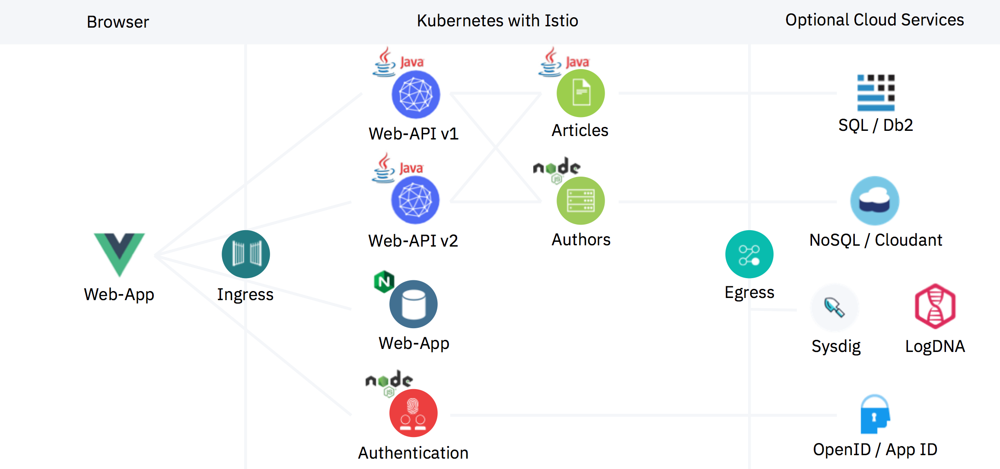
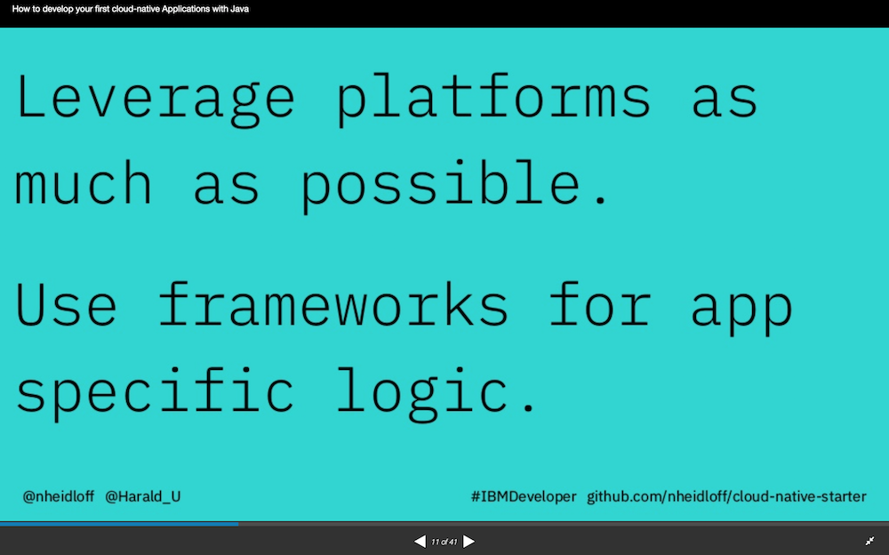

## Cloud Native Starter for Java EE based Microservices on Kubernetes and Istio

This project contains sample code that demonstrates how to get started with cloud-native applications and microservice based architectures. To get a fast overview of this project use our [Cloud Native Starter landing page](https://cloud-native-starter.mybluemix.net/).

The project has three parts:

> 1) **Basic concepts:** The documentation of this part is below. Cloud Native Starter demonstrates how to develop complete enterprise applications with Java and MicroProfile and how to operate them with Kubernetes, OpenShift and Istio.
To get a fast overview of the basic-concepts part, use the [basic-concepts landing page](https://cloud-native-starter-synchron.mybluemix.net/).

> 2) **Reactive:** The reactive part explains how to use reactive programming and event based messaging in Quarkus applications and how to run them on Kubernetes and OpenShift. For more open the [reactive](reactive) folder and that part can be used completely separately or to get a fast overview of the reactive part, use the [reactive landing page](https://cloud-native-starter-reactive.mybluemix.net/).

> 3) **Security:** The security part explains how to do authentication and authorization in Quarkus applications with Keycloak and how to do network encryption with Istio. For more open the [security](security) folder and that part can be used completely separately. For a fast overview of the security part, use the [security landing page](https://cloud-native-starter-security.mybluemix.net/).

### Basic concepts

The first part of the project focusses on how to build microservices with Java EE and the open source technologies [Eclipse MicroProfile](https://microprofile.io/), [Eclipse OpenJ9](https://www.eclipse.org/openj9/), [AdoptOpenJDK](https://adoptopenjdk.net/) and [Open Liberty](https://openliberty.io/).

The microservices can easily be deployed on Kubernetes environments running [Istio](https://istio.io/) like [Minikube](https://kubernetes.io/docs/setup/minikube/), [IBM Cloud Kubernetes Service](https://www.ibm.com/cloud/container-service), Red Hat OpenShift in [CodeReady Containers](https://developers.redhat.com/products/codeready-containers/overview) or [OpenShift on the IBM Cloud](https://cloud.ibm.com/docs/containers?topic=containers-openshift_tutorial).

The project showcases the following functionality:

* [Containerized Java EE Microservices](documentation/DemoJavaImage.md)
* [Exposing REST APIs](documentation/DemoExposeRESTAPIs.md)
* [Consuming REST APIs](documentation/DemoConsumeRESTAPIs.md)
* [Traffic Routing](documentation/DemoTrafficRouting.md)
* [Resiliency](documentation/DemoResiliency.md)
* [Authentication and Authorization](documentation/DemoAuthentication.md)
* [Metrics](documentation/DemoMetrics.md)
* [Health Checks](documentation/DemoHealthCheck.md)
* [Configuration](documentation/DemoConfiguration.md)
* [Distributed Logging and Monitoring](documentation/DemoDistributedLoggingMonitoring.md)
* [Persistence with Java Persistence API (JPA)](documentation/DemoJPA.md)

This diagram shows the key components:

<kbd></kbd>

The next screenshot shows the web application. More screenshots are in the [images](images) folder.

<kbd></kbd>


### Setup

The sample application can be run in four different environments:

1) **Minikube** (locally): See instructions below
2) **IBM Cloud Kubernetes Service** - see [instructions](documentation/IKSDeployment.md)
3) **CodeReady Containers** (Red Hat OpenShift locally) - see [instructions](documentation/OS4Cluster.md)
4) **Red Hat OpenShift on the IBM Cloud** - see [instructions](documentation/OS4Cluster.md)

The following instructions describe how to install everything locally on **Minikube**.

**Important:** Before the microservices can be installed, make sure you've set up Minikube and Istio correctly or follow these [instructions](documentation/SetupLocalEnvironment.md) to set up Minikube and Istio from scratch. This should not take longer than 30 minutes.

Before deploying the application, get the code:

```
$ git clone https://github.com/IBM/cloud-native-starter.git
$ cd cloud-native-starter
$ ROOT_FOLDER=$(pwd)
```

The microservices can be installed via scripts. In addition to Minikube and Istio you need the following tools to be available.

Prerequisites:

* [docker](https://docs.docker.com/install/)
* [git](https://git-scm.com/book/en/v2/Getting-Started-Installing-Git)
* [curl](https://curl.haxx.se/download.html)
* [kubectl](https://kubernetes.io/docs/tasks/tools/install-kubectl/)

Docker always needs to be installed locally. The tools git, curl and kubectl (and ibmcloud) can be installed locally or you can use a [Docker image](https://github.com/IBM/cloud-native-starter/blob/master/workshop-one-service/1-prereqs.md#tools) that comes with these tools.

```
$ cd ${ROOT_FOLDER}
$ docker run -v $ROOT_FOLDER/:/cloud-native-starter -it --rm ibmcom/ibm-cloud-developer-tools-amd64
```

Deploy (and redeploy):

```
$ cd ${ROOT_FOLDER}
$ scripts/check-prerequisites.sh
$ scripts/deploy-articles-java-jee.sh
$ scripts/deploy-web-api-java-jee.sh
$ scripts/deploy-authors-nodejs.sh
$ scripts/deploy-istio-ingress-v1.sh
$ scripts/deploy-web-app-vuejs.sh
$ scripts/show-urls.sh
```

After running the scripts above, you will get a list of all URLs in the terminal.

<kbd></kbd>

Example URL to open the web app: http://192.168.99.100:31380

Example API endpoint: http://192.168.99.100:31380/web-api/v1/getmultiple

At this point you have seen the "base line" of our Cloud Native Starter. The following documents describe how to implement additional functionality:

* [Containerized Java EE Microservices](documentation/DemoJavaImage.md)
* [Exposing REST APIs](documentation/DemoExposeRESTAPIs.md)
* [Consuming REST APIs](documentation/DemoConsumeRESTAPIs.md)
* [Traffic Routing](documentation/DemoTrafficRouting.md)
* [Resiliency](documentation/DemoResiliency.md)
* [Authentication and Authorization](documentation/DemoAuthentication.md)
* [Metrics](documentation/DemoMetrics.md)
* [Health Checks](documentation/DemoHealthCheck.md)
* [Configuration](documentation/DemoConfiguration.md)
* [Distributed Logging and Monitoring](documentation/DemoDistributedLoggingMonitoring.md)
* [Persistence with Java Persistence API (JPA)](documentation/DemoJPA.md)


### Cleanup

Run the following command to delete all cloud-native-starter components from Istio.

```
$ scripts/delete-all.sh
```

You can also delete single components:

```
$ scripts/delete-articles-java-jee.sh
$ scripts/delete-articles-java-jee-quarkus.sh
$ scripts/delete-web-api-java-jee.sh
$ scripts/delete-authors-nodejs.sh
$ scripts/delete-web-app-vuejs.sh
$ scripts/delete-istio-ingress.sh
```

### Authors

* [Niklas Heidloff](https://twitter.com/nheidloff)
* [Harald Uebele](https://twitter.com/harald_u)
* [Thomas Südbröcker](https://twitter.com/tsuedbroecker)


### Documentation - Overview

The following [slides](https://github.com/nheidloff/cloud-native-starter/blob/master/documentation/OneHourTalk.pdf) summarize this repo:

[](documentation/OneHourTalk.pdf)

* [Project Description and Design Principles](http://heidloff.net/article/example-java-app-cloud-kubernetes)
* Presentation at We Are Developers (30 mins): [How to develop your first cloud-native Applications with Java](http://heidloff.net/recording-of-talk-how-to-develop-your-first-cloud-native-applications-with-java/)
* Recording of Jakarta Tech Talk (45 mins): [How to develop your first cloud-native Applications with Java](http://heidloff.net/article/recording-jakarta-tech-talk-how-to-develop-microservices/)
* Recording of code.talks session in German: [Wie entwickle ich meine ersten Cloud-nativen Applikationen mit Java?](https://www.youtube.com/watch?v=oabKnZO2mUA)
* [Hands-on workshop with MicroProfile, Kubernetes and Istio](https://github.com/IBM/cloud-native-starter/tree/master/workshop) (three hours)
* [Hands-on workshop YouTube playlist](https://ibm.biz/Bdzpdp)(6 * 3 min)
* [Hands-on workshop build and deploy one microservice using Java, MicroProfile and Kubernetes](https://github.com/IBM/cloud-native-starter/tree/master/workshop-one-service) (one hour)


### Documentation - Kubernetes and MicroProfile

* [How to build and run a Hello World Java Microservice](http://heidloff.net/article/how-to-build-and-run-a-hello-world-java-microservice/)
* [Dockerizing Java MicroProfile Applications](http://heidloff.net/article/dockerizing-container-java-microprofile)
* [Developing resilient Microservices with Istio and MicroProfile](http://heidloff.net/article/resiliency-microservice-microprofile-java-istio)
* [Managing Microservices Traffic with Istio](https://haralduebele.blog/2019/03/11/managing-microservices-traffic-with-istio/)
* [Web Application to demo Traffic Management with Istio](http://heidloff.net/article/sample-app-manage-microservices-traffic-istio)
* [Implementing and documenting REST APIs with JavaEE](http://heidloff.net/article/rest-apis-microprofile-javaee-jaxrs)
* [Invoking REST APIs from Java Microservices](http://heidloff.net/invoke-rest-apis-java-microprofile-microservice)
* [Prometheus Metrics for MicroProfile Microservices in Istio](http://heidloff.net/article/prometheus-metrics-microprofile-microservices-istio/)
* [Distributed logging with LogDNA and Monitoring with Sysdig](https://haralduebele.blog/2019/04/08/whats-going-on-in-my-cluster/)
* [Implementing Health Checks with MicroProfile and Istio](http://heidloff.net/article/implementing-health-checks-microprofile-istio)
* [Configuring Microservices with MicroProfile and Kubernetes](http://heidloff.net/article/configuring-java-microservices-microprofile-kubernetes/)
* [Authenticating Web Users with OpenID and JWT](http://heidloff.net/article/authenticating-web-users-openid-connect-jwt/)
* [Authorization in Cloud-Native Applications via OpenID and Istio](http://heidloff.net/article/authentication-authorization-openid-connect-istio)
* [Authorization in Microservices with MicroProfile](http://heidloff.net/article/authorization-microservices-java-microprofile/)
* [Persistence for Java Microservices in Kubernetes via JPA](http://heidloff.net/article/persistence-java-microservices-kubernetes-jpa/)
* [Setup of a Local Kubernetes and Istio Dev Environment](http://heidloff.net/article/setup-local-development-kubernetes-istio)
* [Moving from Minikube to IBM Cloud Kubernetes Service](https://haralduebele.blog/2019/04/04/moving-from-minikube-to-ibm-cloud-kubernetes-service/)
* [Recorded demos: Traffic management, resiliency, authorization, logging](http://heidloff.net/article/how-to-develop-your-first-cloud-native-applications-with-java/)
* [Using Quarkus to run Java Apps on Kubernetes](http://heidloff.net/article/quarkus-javaee-microprofile-kubernetes)
* [Debugging Microservices running in Kubernetes](http://heidloff.net/article/debugging-microservices-kubernetes)
* [Deploying MicroProfile Microservices with Tekton](http://heidloff.net/article/deploying-microprofile-microservices-tekton/)


### Documentation - OpenShift

* [Setting up a cloud-native Sample App on Minishift in an Hour](http://heidloff.net/article/setup-cloud-native-sample-app-minishift/)
* [Deploying the Cloud Native Starter microservices on Minishift](https://haralduebele.blog/2019/07/03/deploying-the-cloud-native-starter-microservices-on-minishift/)
* [Deploying the Cloud Native Starter example on Red Hat OpenShift on the IBM Cloud](https://haralduebele.blog/2019/07/10/deploying-the-cloud-native-starter-example-on-red-hat-openshift-on-the-ibm-cloud/)
* [Source to Image Builder for Open Liberty Apps on OpenShift](http://heidloff.net/article/source-to-image-builder-open-liberty-openshift/)
* [How to develop Open Liberty Microservices on OpenShift](http://heidloff.net/article/how-to-develop-open-liberty-microservices-openshift/)
* [Deploying Open Liberty Microservices to OpenShift](http://heidloff.net/article/deploying-open-liberty-microservices-openshift/)
* [Accessing private GitLab Repositories from OpenShift](http://heidloff.net/article/accessing-private-gitlab-repositories-from-openshift/)
