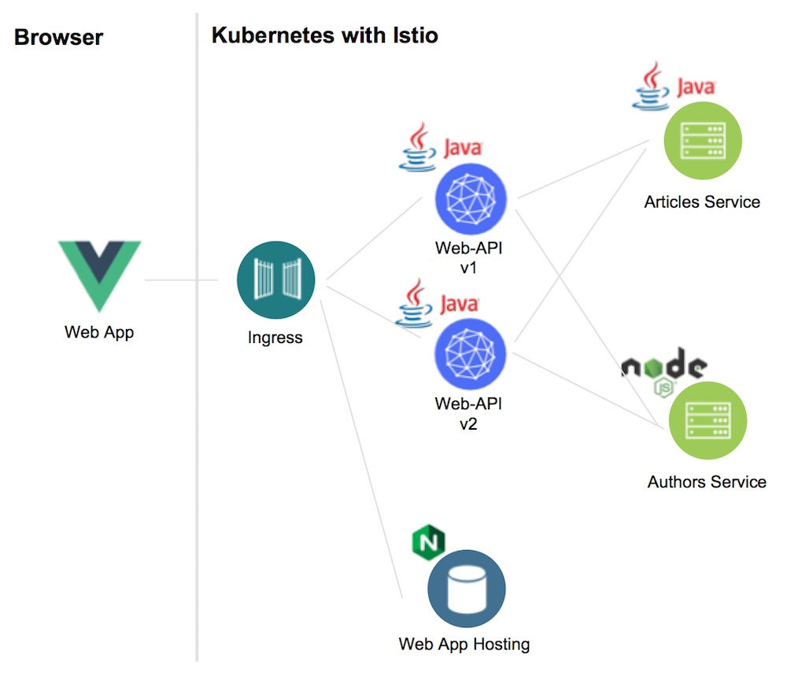
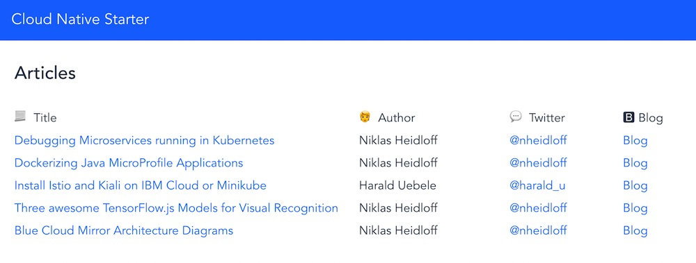
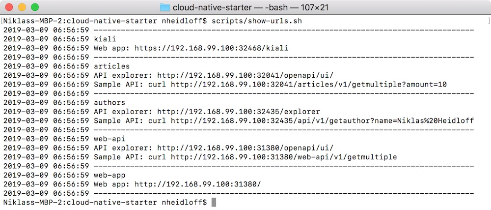
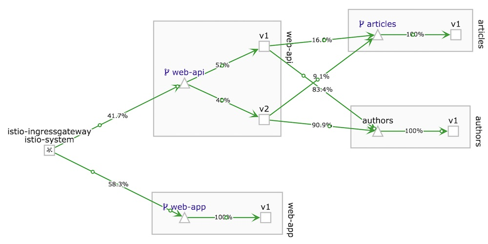

# Cloud Native Starter for Java and Node.js

This project contains sample code that shows how to build cloud-native applications with JavaEE and Node.js and deploy them to Kubernetes and Istio.

The project showcases the following functionality:

* JavaEE (with MicroProfile) and Node.js microservices
* Distributed tracing
* Traffic management
* Resiliency via fallbacks and circuit breakers
* REST APIs implementations incl. documentation
* REST API invocations
* Distributed logging
* Metrics
* Authentication and authorization
* Configuration
* Deployments

This diagram shows the key components:

<kbd></kbd>

The next screenshot shows the web application. More screenshots are in the [images](images) folder.

<kbd></kbd>

### Local Environment Setup

Follow these [instructions](LocalEnvironment.md) to set up the local environment with Minikube and Istio. This should not take longer than 30 minutes.


### Deployment

Prerequisites:

* [git](https://git-scm.com/book/en/v2/Getting-Started-Installing-Git) 
* [curl](https://curl.haxx.se/download.html)
* sed
* [docker](https://docs.docker.com/install/)
* [kubectl](https://kubernetes.io/docs/tasks/tools/install-kubectl/)
* [minikube](https://kubernetes.io/docs/setup/minikube/) 

Deploy (and redeploy):

```
$ git clone https://github.com/nheidloff/cloud-native-starter.git
$ cd cloud-native-starter
$ scripts/check-prerequisites.sh
$ scripts/deploy-articles-java-jee.sh
$ scripts/deploy-web-api-java-jee.sh
$ scripts/deploy-authors-nodejs.sh
$ scripts/deploy-web-app-vuejs.sh
$ scripts/deploy-istio-ingress-v1.sh
$ scripts/show-urls.sh
```


### Run the Demo

After running the scripts above, you will get a list of all URLs in the terminal.

<kbd></kbd>

Example URL to open the web app: http://192.168.99.100:31380

Example API endpoint: http://192.168.99.100:31380/web-api/v1/getmultiple


*Traffic Routing*

In order to demonstrate traffic routing you can run the following commands. 20 % of the web-api API request to read articles will now return 10 instead of 5 articles which is version 2. 80 % of the requests are still showing only 5 articles which is version 1. This distribution is set in `istio/istio-ingress-service-web-api-v1-v2-80-20.yaml` (weight: 80 vs. weight: 20).

```
$ scripts/deploy-web-api-java-jee-v2.sh
$ scripts/deploy-istio-ingress-v1-v2.sh
```
**BILD STIMMT NICHT MEHR**

<kbd></kbd>

*Resiliency*

In order to demonstrate resiliency you can run the following command to delete the authors service:

```
$ scripts/delete-authors-nodejs.sh
```

In the next step delete the articles service:

```
$ scripts/delete-web-api-java-jee.sh
```

*Cleanup*

Run these commands to delete the cloud native starter components:

```
$ scripts/delete-articles-java-jee.sh
$ scripts/delete-web-api-java-jee.sh
$ scripts/delete-authors-nodejs.sh
$ scripts/delete-web-app-vuejs.sh
$ scripts/delete-istio-ingress.sh
```


### Documentation

Here is a series of blog entries about this project:

* [Setup of a Local Kubernetes and Istio Dev Environment](http://heidloff.net/article/setup-local-development-kubernetes-istio)
* [Debugging Microservices running in Kubernetes](http://heidloff.net/article/debugging-microservices-kubernetes)
* [Dockerizing Java MicroProfile Applications](http://heidloff.net/article/dockerizing-container-java-microprofile)
* [Developing resilient Microservices with Istio and MicroProfile](http://heidloff.net/article/resiliency-microservice-microprofile-java-istio)
* [Using Quarkus to run Java Apps on Kubernetes](http://heidloff.net/article/quarkus-javaee-microprofile-kubernetes)
* [Managing Microservices Traffic with Istio](https://haralduebele.blog/2019/03/11/managing-microservices-traffic-with-istio/)
* APIs including documentation (functionality: done / blog: to be done)
* Invoking REST APIs (functionality: done / blog: to be done)
* Distributed logging (functionality: almost done / blog: to be done)
* Monitoring and metrics (functionality: to be done / blog: to be done)
* Authentication and authorization (functionality: to be done / blog: to be done)
* Configuration (functionality: almost done / blog: to be done)

Here is more information about Microservices, MicroProfile and Istio:

* [MicroProfile, the microservice programming model made for Istio](https://www.eclipse.org/community/eclipse_newsletter/2018/september/MicroProfile_istio.php)
* [Migrating Java Microservices to MicroProfile – Epilogue](https://www.ibm.com/blogs/bluemix/2019/02/migrating-java-microservices-to-microprofile-epilogue/)
* Video: [Istio Platform vs Spring and MicroProfile frameworks](https://www.youtube.com/watch?v=lFj8X0VLOFQ)
* Video: [Java EE, Jakarta EE, MicroProfile, Or Maybe All Of Them?](https://www.youtube.com/watch?v=Jemx1BrB45Y)
* Video: [Istio: Canaries and Kubernetes, Microservices and Service Mesh](https://www.youtube.com/watch?v=YQLOcjvbo9s)