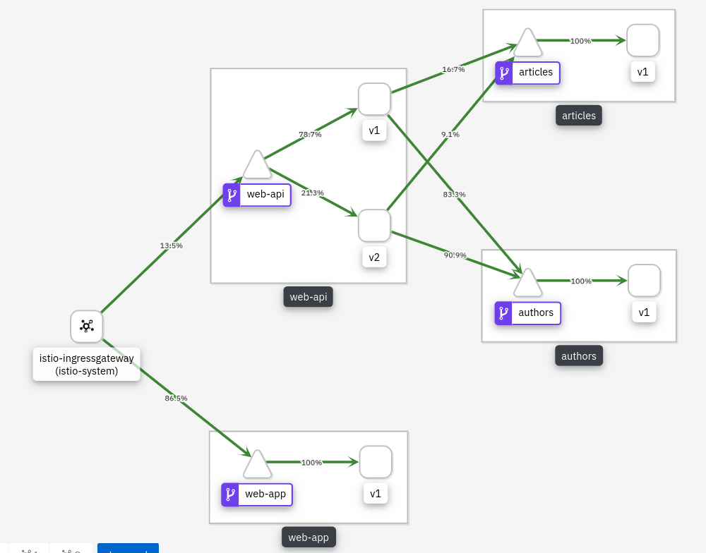

## Cloud Native Starter for Java EE based Microservices on Kubernetes and Istio

This project contains sample code that demonstrates how to get started with cloud-native applications and microservice based architectures. 

The project focusses on how to build microservices with Java EE and the open source technologies [Eclipse MicroProfile](https://microprofile.io/), [Eclipse OpenJ9](https://www.eclipse.org/openj9/), [AdoptOpenJDK](https://adoptopenjdk.net/) and [Open Liberty](https://openliberty.io/).

The microservices can be easily deployed on Kubernetes environments running [Istio](https://istio.io/) like [Minikube](https://kubernetes.io/docs/setup/minikube/) or the [IBM Cloud Kubernetes Service](https://www.ibm.com/cloud/container-service).

The project showcases the following functionality:

* REST APIs implementations incl. documentation
* REST API invocations
* Traffic management
* Resiliency via fallbacks and circuit breakers
* Authentication and authorization
* Distributed tracing and logging
* Monitoring and metrics

This diagram shows the key components:

<kbd></kbd>

The next screenshot shows the web application. More screenshots are in the [images](images) folder.

<kbd></kbd>


### Setup

The sample application can be run locally on Minikube or on the IBM Cloud. The following instructions describe how to install everything locally.

If you would like to run the cloud native starter application on IBM Cloud Kubernetes Service, follow these [instructions](IKS-Deployment.md). 

Before the microservices can be installed, make sure you've set up Minikube and Istio correctly or follow these [instructions](LocalEnvironment.md) to set up Minikube and Istio from scratch. This should not take longer than 30 minutes.

The microservices can be installed via scripts. In addition to Minikube and Istio you need the following tools to be installed.

Prerequisites:

* [git](https://git-scm.com/book/en/v2/Getting-Started-Installing-Git) 
* [curl](https://curl.haxx.se/download.html)
* [docker](https://docs.docker.com/install/)
* [kubectl](https://kubernetes.io/docs/tasks/tools/install-kubectl/)

Deploy (and redeploy):

```
$ git clone https://github.com/nheidloff/cloud-native-starter.git
$ cd cloud-native-starter
$ scripts/check-prerequisites.sh
$ scripts/deploy-articles-java-jee.sh
$ scripts/deploy-web-api-java-jee.sh
$ scripts/deploy-authors-nodejs.sh
$ scripts/deploy-web-app-vuejs.sh
$ scripts/deploy-istio-ingress-v1.sh
$ scripts/show-urls.sh
```


### Demo - Web Application

After running the scripts above, you will get a list of all URLs in the terminal.

<kbd></kbd>

Example URL to open the web app: http://192.168.99.100:31380

Example API endpoint: http://192.168.99.100:31380/web-api/v1/getmultiple


### Demo - Traffic Routing

In order to demonstrate traffic routing you can run the following commands. 20 % of the web-api API request to read articles will now return 10 instead of 5 articles which is version 2. 80 % of the requests are still showing only 5 articles which is version 1. 

```
$ scripts/deploy-web-api-java-jee-v2.sh
$ scripts/deploy-istio-ingress-v1-v2.sh
```

<kbd></kbd>


### Demo - Resiliency

In order to demonstrate resiliency you can run the following command to delete the authors service:

```
$ scripts/delete-authors-nodejs.sh
```

In the next step delete the articles service:

```
$ scripts/delete-web-api-java-jee.sh
```


### Demo - Metrics

The web-api service [produces](https://github.com/nheidloff/cloud-native-starter/blob/master/web-api-java-jee/src/main/java/com/ibm/webapi/apis/GetArticles.java) some application specific metrics. 

Run 'scripts/show-urls.sh' to get the URL to display the [unformatted](images/prometheus-3.png) metrics of this microservice as well as the URL to generate load. You can also run 'scripts/show-urls.sh' for a list of all relevant URLs.

In order to display the metrics with the Prometheus UI, Prometheus needs to be configured first:

```
$ scripts/configure-prometheus.sh
```

After this wait until the Prometheus pod has been restarted. Then run the command to forward the Prometheus port which is displayed as result of 'scripts/configure-prometheus.sh'.

The metrics are displayed in the Prometheus UI (http://localhost:9090) when you search for 'web-api' or 'articles'.

For example the [amount](images/prometheus-1.png) of times /web-api/v1/getmultiple has been invoked can be displayed as well as the [duration](images/prometheus-2.png) of these requests.


### Cleanup

Run the following command to delete all cloud-native-starter components from Istio.

```
$ scripts/delete-all.sh
```

You can also delete single components:

```
$ scripts/delete-articles-java-jee.sh
$ scripts/delete-articles-java-jee-quarkus.sh
$ scripts/delete-web-api-java-jee.sh
$ scripts/delete-authors-nodejs.sh
$ scripts/delete-web-app-vuejs.sh
$ scripts/delete-istio-ingress.sh
```

### Authors

* [Niklas Heidloff](https://twitter.com/nheidloff)
* [Harald Uebele](https://twitter.com/harald_u)


### Documentation

Here is a series of blog entries about this project:

* [Setup of a Local Kubernetes and Istio Dev Environment](http://heidloff.net/article/setup-local-development-kubernetes-istio)
* [Debugging Microservices running in Kubernetes](http://heidloff.net/article/debugging-microservices-kubernetes)
* [Dockerizing Java MicroProfile Applications](http://heidloff.net/article/dockerizing-container-java-microprofile)
* [Developing resilient Microservices with Istio and MicroProfile](http://heidloff.net/article/resiliency-microservice-microprofile-java-istio)
* [Using Quarkus to run Java Apps on Kubernetes](http://heidloff.net/article/quarkus-javaee-microprofile-kubernetes)
* [Managing Microservices Traffic with Istio](https://haralduebele.blog/2019/03/11/managing-microservices-traffic-with-istio/)
* [Web Application to demo Traffic Management with Istio](http://heidloff.net/article/sample-app-manage-microservices-traffic-istio)
* [Implementing and documenting REST APIs with JavaEE](http://heidloff.net/article/rest-apis-microprofile-javaee-jaxrs)
* [Invoking REST APIs from Java Microservices](http://heidloff.net/invoke-rest-apis-java-microprofile-microservice)
* [Prometheus Metrics for MicroProfile Microservices in Istio](http://heidloff.net/article/prometheus-metrics-microprofile-microservices-istio/)
* [Moving from Minikube to IBM Cloud Kubernetes Service](https://haralduebele.blog/2019/04/04/moving-from-minikube-to-ibm-cloud-kubernetes-service/)
* Distributed logging with LogDNA
* Monitoring with IBM Cloud Monitoring with Sysdig
* Istio Healthchecks for MicroProfile Microservices 
* Configuration of MicroProfile Microservices in Istio
* Authentication via OpenID Connect
* Authorization via Istio
* Authorization via MicroProfile
* SQL PersistenceSQL via JPA and JDBC

Here is more information about Microservices, MicroProfile and Istio:

* [MicroProfile, the microservice programming model made for Istio](https://www.eclipse.org/community/eclipse_newsletter/2018/september/MicroProfile_istio.php)
* [Migrating Java Microservices to MicroProfile – Epilogue](https://www.ibm.com/blogs/bluemix/2019/02/migrating-java-microservices-to-microprofile-epilogue/)
* Video: [Istio Platform vs Spring and MicroProfile frameworks](https://www.youtube.com/watch?v=lFj8X0VLOFQ)
* Video: [Java EE, Jakarta EE, MicroProfile, Or Maybe All Of Them?](https://www.youtube.com/watch?v=Jemx1BrB45Y)
* Video: [Istio: Canaries and Kubernetes, Microservices and Service Mesh](https://www.youtube.com/watch?v=YQLOcjvbo9s)