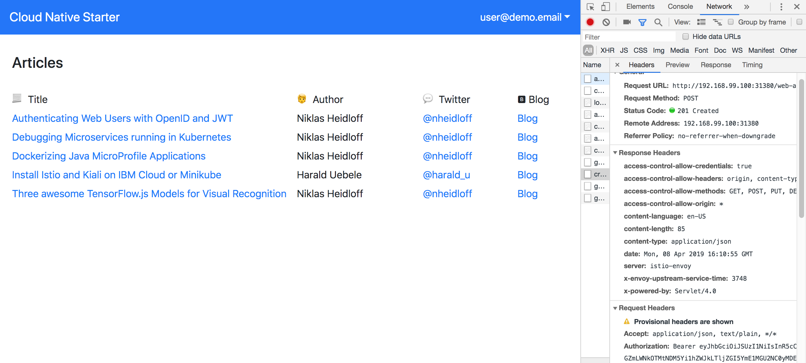

## Demo: Authentication and Authorization

In order to authenticate users, you need an OpenID identity provider. 

You can use [IBM App ID](https://console.bluemix.net/catalog/services/appid) or you can use an OpenID identity provider of your choice.

Before running the scripts below, make sure you can [access the IBM Cloud](SetupIBMCloudAccess.md).


**Create new App ID service instance**

Run the following command to create these artifacts:

* App ID service instance 'app-id-cloud-native'
* App ID Cloud Foundry alias 'app-id-cloud-native'
* App ID credentials
* App ID test user 'user@demo.email, verysecret'
* App ID test admin 'admin@demo.email, verysecret'
* App ID redirect URL

```
$ ibm-scripts/create-app-id.sh
```


**Reuse an existing App ID service instance**

The IBM Cloud lite plan only allows one App ID instance in your organization. If you have an App ID instance, you can use it rather than creating a new one. 

In this case paste the App ID credentials in [authentication-nodejs/.env](../authentication-nodejs/.env). Check out [authentication-nodejs/.env.template](../authentication-nodejs/.env.template) for an example.


**Use another OpenID identify provider**

You can use any OpenID identity provider. In this case paste the endpoint URLs in [authentication-nodejs/.env](../authentication-nodejs/.env). Check out [authentication-nodejs/.env.template](../authentication-nodejs/.env.template) for an example.


**Set up the Demo**

Invoke the following commands to set up the demo. Skip the commands you've already executed.

```
$ cd $PROJECT_HOME
$ scripts/check-prerequisites.sh
$ scripts/delete-all.sh
$ scripts/deploy-articles-java-jee.sh
$ scripts/deploy-web-api-java-jee.sh
$ scripts/deploy-authors-nodejs.sh
$ scripts/deploy-authentication-nodejs.sh
$ scripts/deploy-web-app-vuejs-authentication.sh
$ scripts/deploy-istio-ingress-v1.sh
$ scripts/show-urls.sh
```

Open the web application with the URL that is displayed as output of 'scripts/show-urls.sh'. When you click 'Login', use the credentials of the demo user.

After the login, the Vue.js application stores the id_token if the Vuex state.

<kbd></kbd>

Check out the [animated gif](../images/login.gif) to see the authentication flow.

<kbd></kbd>


### Authorization via Istio

Invocations of the endpoint 'create' of the 'web-api' service have been [protected](https://github.com/nheidloff/cloud-native-starter/blob/master/istio/protect-web-api.yaml.template) via Istio. Only authenticated users can invoke this endpoint by passing in the bearer token in the HTTP header.

When you invoke the endpoint without bearer token, you get an exception.

<kbd></kbd>

When you log in from the web application, the token is stored in Vuex. After this 'Create Article' can be invoked from the dropdown.

<kbd></kbd>

This screenshot shows the page to enter information about a new article:

<kbd></kbd>

When the REST API is invoked, the bearer is added:

<kbd></kbd>

Watch the [animated gif](endpoint-protection-istio.gif) to see the flow in action.


### Authorization via MicroProfile

In order to protect functionality on a more fine-grained level, authorization can be handled in the business logic of microservices.

From the web application 'Manage Application' can be invoked which triggers the endpoint '[manage](../web-api-java-jee/src/main/java/com/ibm/webapi/apis/Manage.java)' of the 'web-api' microservice.

Only the user 'admin@demo.email' is allowed to invoke this endpoint.

**to be done**
