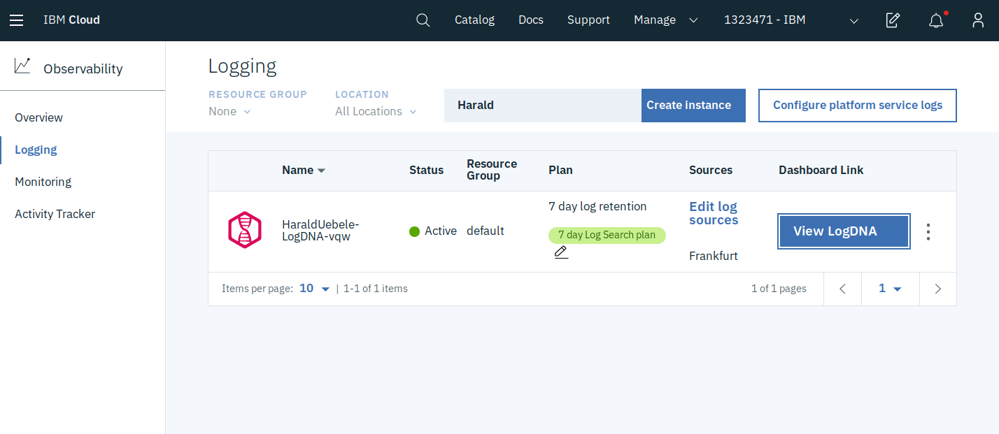
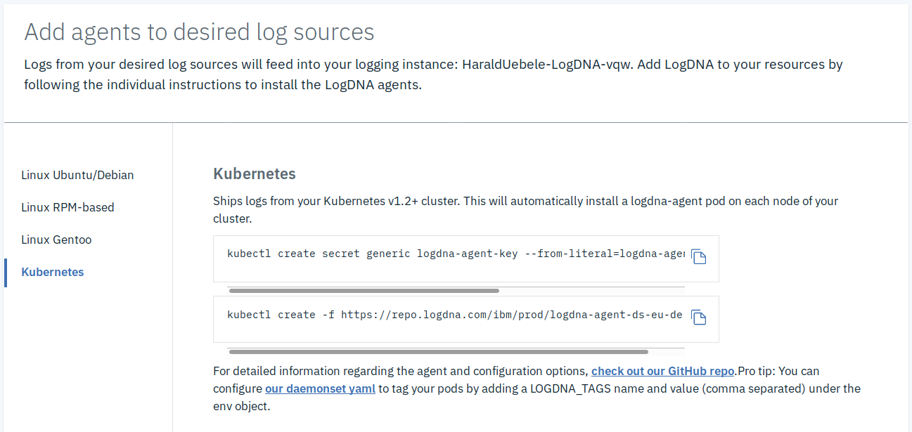
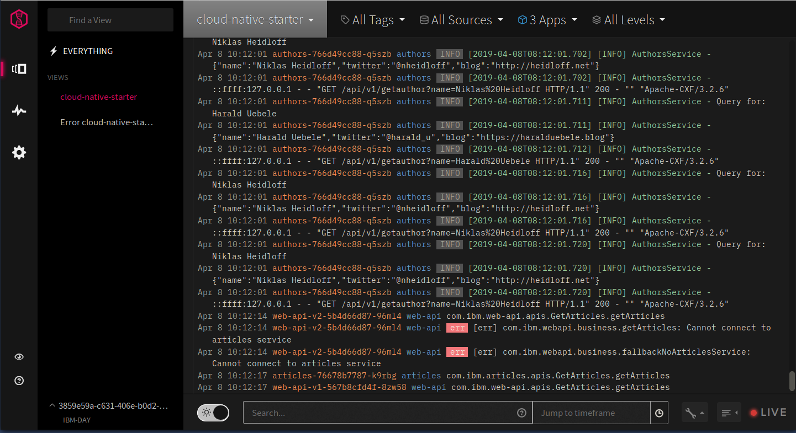
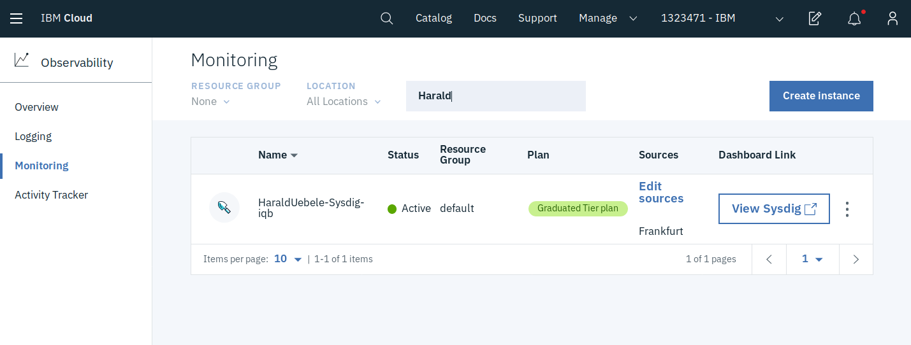
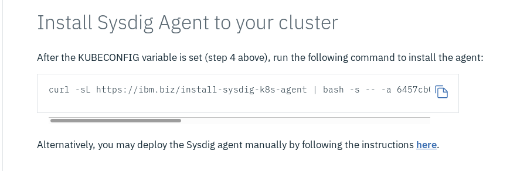
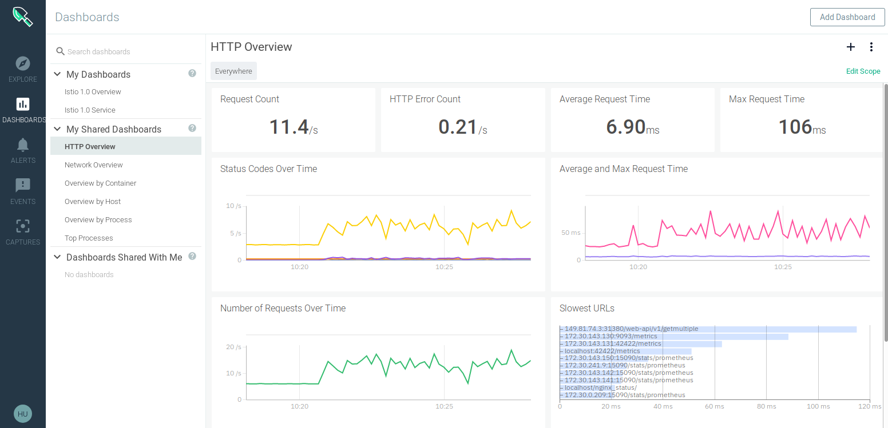

## Demo: Distributed Logging and Monitoring

IBM Cloud offers LogDNA as a service for logging and Sysdig for monitoring. Both are excellent for the distributed requirements of Kubernetes and microservices architectures. Both directly support Kubernetes clusters and work with IBM Cloud Kubernetes Service and Minikube so we can use them for both our local and IBM Cloud deployments.

In order to use them you need an IBM Cloud account, you can register for a free account [here](http://ibm.biz/nheidloff). 

There is a free (lite) version of LogDNA available with limited capabilities. Sysdig offers a trial version which you can use for 30 days. 

### Log on to IBM Cloud

[Log on to IBM Cloud](https://cloud.ibm.com) and from the "burger" menu (3 vertical dashes) in the upper left corner select the entry "Observability".

### LogDNA

In the "Observability" menu select "Logging" then click on "Create instance". LogDNA is available in the IBM Cloud datacenters Frankfurt (eu-de) and Dallas (us-south). If you use Minikube for our example, I would select the location closest to your own locaton. If you use IBM Cloud Kubernetes Service for our example, select the location closest to your cluster.

The Lite plan is restricted in functionality, the other plans require a paid IBM Cloud account.

When you click "Create" an instance of LogDNA is prepared.

<kbd></kbd>

Click on "Edit log sources" to see the instructions to add a Kubernetes cluster as a log source:

<kbd></kbd>

Then simply copy&paste and execute the 2 kubectl commands:

```
$ kubectl create secret generic logdna-agent-key --from-literal=logdna-agent-key=XYZ
$ kubectl create -f https://repo.logdna.com/ibm/prod/logdna-agent-ds-eu-de.yaml
```

The first command creates a Kubernetes secret that holds the ingestion key specific to your LogDNA isntance. The second command creates a Kubernetes daemonset for the LogDNA agents, it starts a pod on every Kubernetes worker node of your cluster, this takes a couple of seconds. No more configuration is required. You can open the LogDNA dashboard by clicking on "View LogDNA". Create some traffic in the Cloud Native Starter web app and you will see the services (web-app, web-api, artictles, authors) in the "App" selector:

<kbd></kbd>

### Sysdig

This is very similar to setting up LogDNA. In the "Observability" menu select "Monitoring" then click on "Create instance". Sysdig is available in the IBM Cloud datacenters Frankfurt (eu-de), London (eu-uk), and Dallas (us-south). If you use Minikube for our example, I would select the location closest to your own locaton. If you use IBM Cloud Kubernetes Service for our example, select the location closest to your cluster.

The free trial plan is limited to 30 days, the other plans require a paid IBM Cloud account.

When you click "Create" a Sysdig instance is prepared.

<kbd></kbd>

Click on "Edit sources" to see the instructions to add a Kubernetes cluster as a source:

<kbd></kbd>

There are instructions explaining how to access the IBM Cloud and a Kubernetes cluster on IBM Cloud which you only need when you deployed Cloud Native Starter to IBM Cloud Kubernetes Service. For Minikube, the last command to install Sysdig Agent to your cluster is sufficient:

```
curl -sL https://ibm.biz/install-sysdig-k8s-agent | bash -s -- -a XXX -c ingest.eu-de.monitoring.cloud.ibm.com -ac 'sysdig_capture_enabled: false'
```

The command contains the ingestion key (-a XXX) that is specific for your Sysdig instance. Once this command completes it takes a couple of seconds until the Sysdig pod starts in Kubernetes namespace ibm-observe. You can open the Sysdig dashboard with "View Sysdig":

<kbd></kbd>

The two Istio dashboards you can see in my screenshot are only available to the paid plans of Sysdig.


