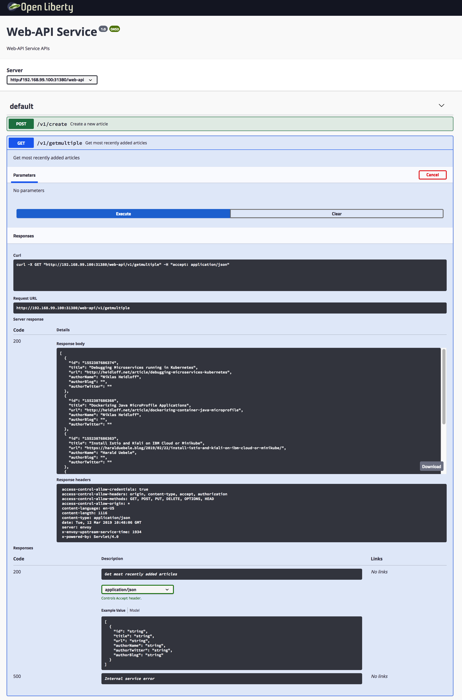

## Demo: Expose REST APIs

MicroProfile supports defining REST APIs via JAX-RS.

The following sample shows the ‘web-api/v1/getmultiple‘ endpoint:

```
package com.ibm.webapi.apis;
 
import javax.ws.rs.*;
import org.eclipse.microprofile.openapi.annotations.*;
 
@RequestScoped
@Path("/v1")
@OpenAPIDefinition(info = @Info(title = "Web-API Service", version = "1.0", description = "Web-API Service APIs", contact = @Contact(url = "https://github.com/nheidloff/cloud-native-starter", name = "Niklas Heidloff"), license = @License(name = "License", url = "https://github.com/nheidloff/cloud-native-starter/blob/master/LICENSE")))
public class GetArticles {
   @Inject
   com.ibm.webapi.business.Service service;
   @Inject
   ArticleAsJson articleAsJson;
 
   @GET
   @Path("/getmultiple")
   @Produces(MediaType.APPLICATION_JSON)
   @APIResponses(value = { 
      @APIResponse(responseCode = "200", description = "Get most recently added articles", content = @Content(mediaType = "application/json", schema = @Schema(type = SchemaType.ARRAY, implementation = Article.class))),          
      @APIResponse(responseCode = "500", description = "Internal service error") })
   @Operation(summary = "Get most recently added articles", description = "Get most recently added articles")
   public Response getArticles() {
      JsonArray jsonArray;
      try {
         List<Article> articles = service.getArticles();
         Stream<Article> streamArticles = articles.stream();
         Stream<JsonObject> streamJsonObjects = streamArticles.map(article -> {
            JsonObject output = articleAsJson.createJsonArticle(article);
              return output;
         });
         jsonArray = streamJsonObjects.collect(JsonCollectors.toJsonArray());
         return Response.ok(jsonArray).build();
      } catch (NoDataAccess e) {
         e.printStackTrace();
         return Response.status(Response.Status.INTERNAL_SERVER_ERROR).build();
      }  
   }
}
```

When using Open Liberty to run the MicroProfile code, you get an the OpenAPI explorer out of the box:

<kbd></kbd>

Invoke the following commands to set up the demo. Skip the commands you've already executed.

```
$ cd $PROJECT_HOME
$ scripts/check-prerequisites.sh
$ scripts/delete-all.sh
$ scripts/deploy-articles-java-jee.sh
$ scripts/deploy-web-api-java-jee.sh
$ scripts/deploy-istio-ingress-v1.sh
$ scripts/show-urls.sh
```

Invoke the curl command of the 'web-api' microserivce which is displayed as output of 'scripts/show-urls.sh' to get ten articles, for example 'http://192.168.99.100:31380/web-api/v1/getmultiple'.

Check out the article [Implementing and documenting REST APIs with JavaEE](http://heidloff.net/article/rest-apis-microprofile-javaee-jaxrs) for more details.


