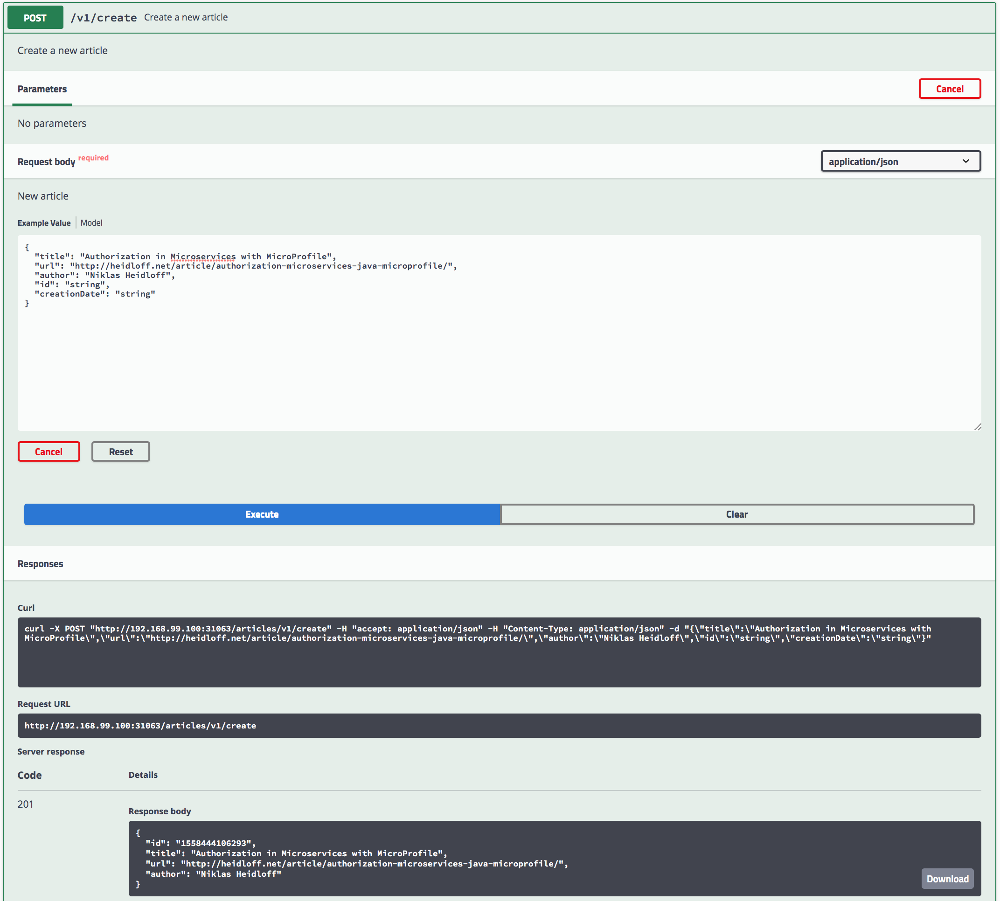
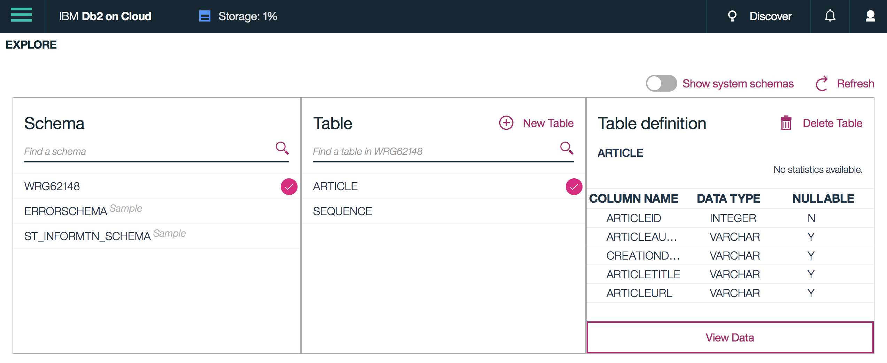
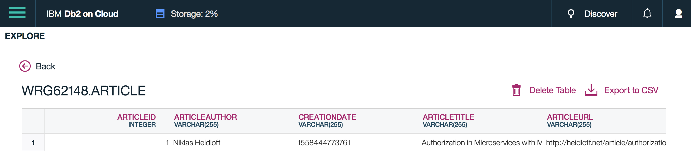

## Demo: JPA (Java Persistence API)

The articles service stores articles in memory by default. Alternatively SQL databases can be used via JPA. The sample shows how to use the 'Db2 on Cloud' service on the IBM Cloud.

Before running the scripts below, make sure you can [access the IBM Cloud](SetupIBMCloudAccess.md). In [local.env](../local.env) you also need to define your Cloud Foundry configuration: IBM_CLOUD_CF_ORG, IBM_CLOUD_CF_SPACE and IBM_CLOUD_CF_API.

**Create new Db2 service instance**

Run the following command to create the 'Db2 on Cloud' service instance:

```
$ ibm-scripts/create-db2.sh
```

**Set up the Demo**

Invoke the following commands to set up the demo. 

```
$ cd $PROJECT_HOME
$ scripts/check-prerequisites.sh
$ scripts/delete-all.sh
$ scripts/deploy-articles-java-jee-jpa.sh
$ scripts/show-urls.sh
```


**Run the Demo**

Open the API Explorer of the Articles Service. You find the URL in the output of 'show-urls.sh', for example 'http://192.168.99.100:31063/openapi/ui/'.

Enter a new article and invoke the /create endpoint.

<kbd></kbd>

Open the console of 'Db2 on Cloud' from the [IBM Cloud dashboard](https://cloud.ibm.com) and from there the 'Explore' page. The table 'Article' is created automatically.

<kbd></kbd>

Here is the one article, you just created:

<kbd></kbd>