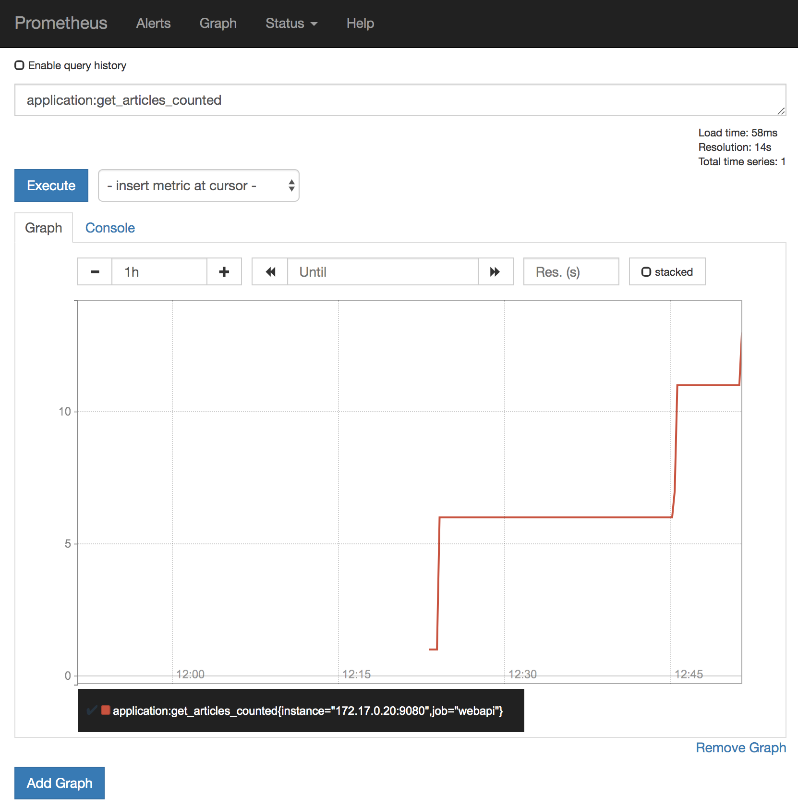
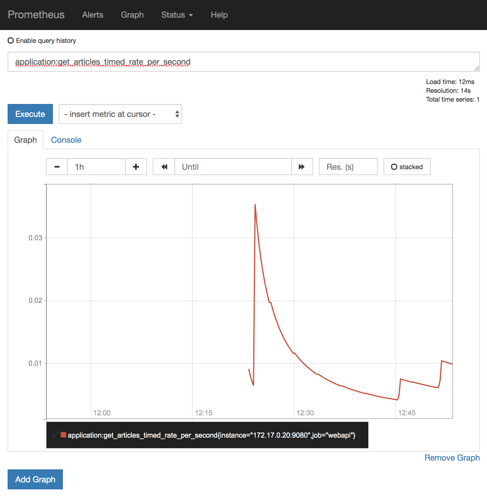

## Demo: Metrics

The web-api service [produces](https://github.com/nheidloff/cloud-native-starter/blob/master/web-api-java-jee/src/main/java/com/ibm/webapi/apis/GetArticles.java) some application specific metrics. 

Run 'scripts/show-urls.sh' to get the URL to display the [unformatted](images/prometheus-3.png) metrics of this microservice as well as the URL to generate load. 

Run the following commands to install the microservices:

```
$ cd $PROJECT_HOME
$ scripts/check-prerequisites.sh
$ scripts/delete-all.sh
$ scripts/deploy-articles-java-jee.sh
$ scripts/deploy-web-api-java-jee.sh
$ scripts/deploy-authors-nodejs.sh
$ scripts/deploy-web-app-vuejs.sh
$ scripts/deploy-istio-ingress-v1.sh
$ scripts/show-urls.sh
```

In order to display the metrics with the Prometheus UI, Prometheus needs to be configured first:

```
$ scripts/configure-prometheus.sh
```

After this wait until the Prometheus pod has been restarted: 

```
$ kubectl get pod -n istio-system | grep prometheus
```

Then run the command to forward the Prometheus port which is displayed as result of 'scripts/configure-prometheus.sh'.

The metrics are displayed in the Prometheus UI (http://localhost:9090) when you search for 'web-api' or 'articles'.

For example the [amount](../images/prometheus-1.png) of times /web-api/v1/getmultiple has been invoked can be displayed:

<kbd></kbd>

The next chart displays the the [duration](../images/prometheus-2.png) of the 'getmultiple' requests.

<kbd></kbd>