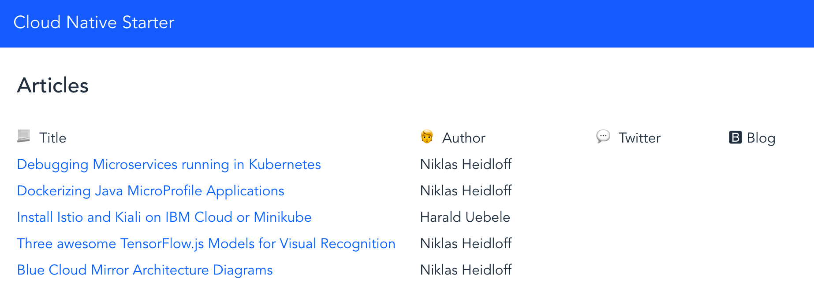

## Demo: Resiliency

Resiliency is part of the code: if an API call is not answered because of an error ar a timeout, the business logic must have some form of fallback. Istio helps to test resiliency by introducing faults into the mesh without changing the application code. 

In order to demonstrate resiliency you can run the following commands to create a working set of services:

```
$ cd $PROJECT_HOME
$ scripts/check-prerequisites.sh
$ scripts/delete-all.sh
$ scripts/deploy-articles-java-jee.sh
$ scripts/deploy-web-api-java-jee.sh
$ scripts/deploy-authors-nodejs.sh
$ scripts/deploy-web-app-vuejs.sh
$ scripts/deploy-istio-ingress-v1.sh
$ scripts/show-urls.sh
```

After this the Web Application shows articles together with the author information:

<kbd></kbd>

The next script disables the Authors service by using Istio Fault Injection:

```
$ kubectl apply -f istio/fault-authors-500.yaml
```

It defines a rule in the Istio virtual service for Authors that responds with an HTTP Error 500 on every request (100 percent).

The articles are still displayed, but without author information. The fallback logic is: if the authors service doesn't work, show no authors information but also don't show an error. 

<kbd></kbd>

The following command disables the articles service, too, again using Istio Fault Injection:

```
$ kubectl apply -f istio/fault-articles-500.yaml
```

Now every request to the articles services gets an HTTP error 500 as response. The same five articles are displayed, since they are cached in the web-api service. This is the fallback logic for the articles service.

<kbd></kbd>

To remove the Istio Fault Injection rules execute these commands:

```
$ kubectl apply -f istio/nofault-authors.yaml
$ kubectl apply -f istio/nofault-articles.yaml
```


