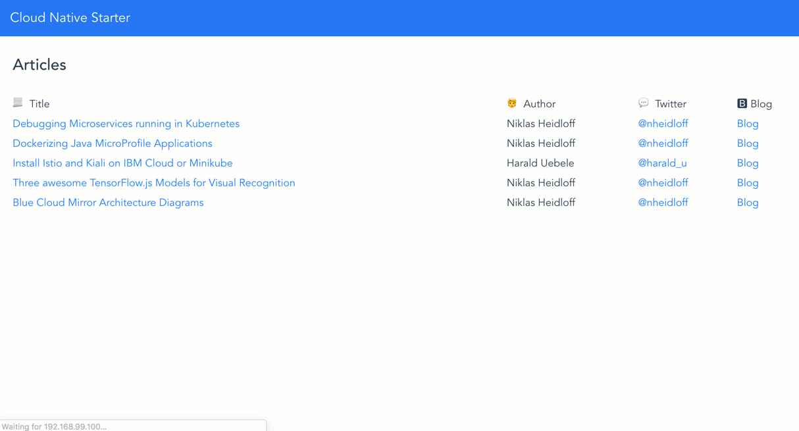

## Demo: Traffic Routing

In order to demonstrate traffic routing you can run the following commands. 20 % of the web-api API request to read articles will now return 10 instead of 5 articles which is version 2. 80 % of the requests are still showing only 5 articles which is version 1. 

```
$ cd $PROJECT_HOME
$ scripts/check-prerequisites.sh
$ scripts/delete-all.sh
$ scripts/deploy-articles-java-jee.sh
$ scripts/deploy-authors-nodejs.sh
$ scripts/deploy-web-app-vuejs.sh
$ scripts/deploy-web-api-java-jee.sh
$ scripts/deploy-web-api-java-jee-v2.sh
$ scripts/deploy-istio-ingress-v1-v2.sh
$ scripts/show-urls.sh
```

<kbd></kbd>

Check out the [animated gif](../images/traffic-management.gif) to see traffic management in action.

<kbd></kbd>