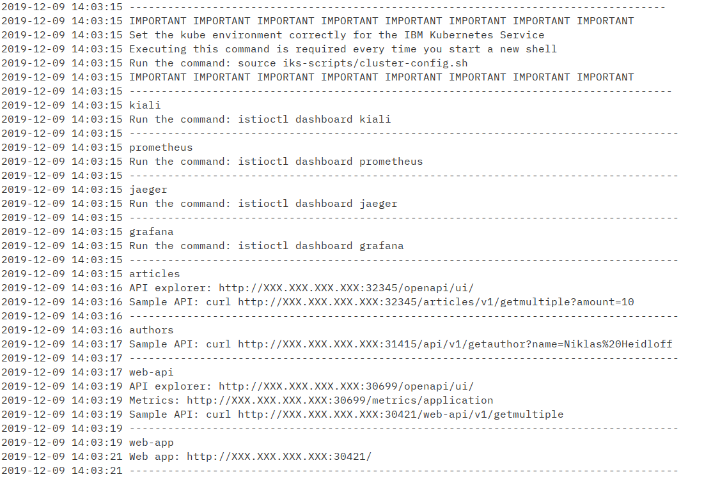

## Deployment on IBM Cloud using IBM Cloud Kubernetes Service

If you want to deploy the Cloud Native Starter on IBM Cloud Kubernetes Service (IKS), the IBM managed Kubernetes offering, then follow these steps. They will create a Kubernetes Lite Cluster with Istio enabled and a namespace in the IBM Container Registry (ICR) where the container images of the microservices will be created, stored, and made available for Kubernetes deployments. By default, deployment is in Dallas, USA (us-south). If you already have a lite cluster in Dallas, these scripts will not work because only one lite cluster is allowed. 

A Kubernetes lite cluster itself is free of charge but it can not be created in a IBM Cloud Lite account. In order to create one either a credit card needs to be entered into the IBM Cloud account or you need a promo code which you can sometimes get at conferences where IBM is present. Or contact us, Harald or Niklas, our Twitter links are in the README, and we'll try to get one for you. 


### Get the code:

```
$ git clone https://github.com/nheidloff/cloud-native-starter.git
$ cd cloud-native-starter
```
### Prerequisites:
Most important: an IBM Cloud account, you can register for a free account [here](http://ibm.biz/nheidloff).

* [git](https://git-scm.com/book/en/v2/Getting-Started-Installing-Git) 
* [curl](https://curl.haxx.se/download.html)
* [docker](https://docs.docker.com/install/) requires not only the code but also permission to run docker commands
* [kubectl](https://kubernetes.io/docs/tasks/tools/install-kubectl/)
* [ibmcloud CLI](https://cloud.ibm.com/docs/home/tools)  including plugins `kubernetes-service` and `container-registry`

Run this script to check the prerequisites:

```
$ iks-scripts/check-prerequisites.sh
```

### To prepare the deployment on IBM Cloud:

This creates an API key for the scripts.


```
$ ibmcloud login
$ ibmcloud iam api-key-create cloud-native-starter \
  -d "cloud-native-starter" \
  --file cloud-native-starter.json
$ cat cloud-native-starter.json
$ cp template.local.env local.env 
```

From the output of `cloud-native-starter.json` copy the apikey without " " into IBMCLOUD_API_KEY= in file local.env.

The file local.env has preset values for region, cluster name, and image registry namespace in local.env. You can change them of course if you know what you are doing.

Example local.env:

```
IBMCLOUD_API_KEY=AbcD3fg7hIj65klMn9derHHb9zge5
IBM_CLOUD_REGION=us-south
CLUSTER_NAME=cloud-native
REGISTRY_NAMESPACE=cloud-native
IBM_CLOUD_CF_API=https://api.ng.bluemix.net
IBM_CLOUD_CF_ORG=
IBM_CLOUD_CF_SPACE=dev
AUTHORS_DB=local
CLOUDANT_URL=
```


### Create IBM Kubernetes Service Environment

This step creates a lite Kubernetes cluster on IBM Cloud. 

```
$ iks-scripts/create-iks-cluster.sh
```

Creating a cluster takes some time. Please wait at least 20 minutes before you continue with the next step!

### Add Istio

IBM Kubernetes Service has an option to install a managed Istio into a Kubernetes cluster. Unfortunately, the Kubernetes Lite Cluster we created in the previous step does not meet the hardware requirements for managed Istio. Hence we do a manual install of the Istio demo or evaluation version.

First check if the cluster is available:

```
$ iks-scripts/cluster-add-istio.sh
```

If the cluster isn't ready, the script will tell you. Then just wait a few more minutes and try again.

**NOTE:** You **MUST** run this command to check for completion of the cluster provisioning and it must report that the cluster is ready for Istio installation! This command also retrieves the cluster configuration which is needed in other scripts. But this configuration can only be retrieved from a cluster that is in ready state.  

These are the instructions to install Istio. We use Istio 1.1.5 for this project.

1. Download Istio 1.1.5   
   ```
   curl -L https://git.io/getLatestIstio | ISTIO_VERSION=1.1.5 sh -
   ```
    
2. Follow the instructions displayed at completion of this command to add the istio-1.1.5/bin directory to your PATH environment variable

3. Change into the extracted directory: `cd istio-1.1.5`

4. Install Istio:

    ```
    $ for i in install/kubernetes/helm/istio-init/files/crd*yaml; do kubectl apply -f $i; done
    ```
    
    Wait a few seconds before issuing the next command:

    ```
    $ kubectl apply -f install/kubernetes/istio-demo.yaml
    ```

Check that all pods are running or completed before continuing.

```
$ kubectl get pod -n istio-system
```

Enable automatic sidecar injection:

```
$ kubectl label namespace default istio-injection=enabled
```


Once complete, the Kiali dashboard can be accessed with this command:

```
$ kubectl -n istio-system port-forward $(kubectl -n istio-system get pod -l app=kiali -o jsonpath='{.items[0].metadata.name}') 20001:20001
```
Then open http://localhost:20001/kiali in your browser, log in with Username: admin, Password: admin

### Create Container Registry

When Istio is installed and all Istio pods are started, create a namespace in the IBM Cloud Container Registry:

```
$ iks-scripts/create-registry.sh
```

The container images we will build next are stored in the Container Registry as `us.icr.io/cloud-native/<imagename>:<tag>` if you didn't change the defaults.


### Initial Deployment of Cloud Native Starter

To deploy (or redeploy) run these scripts:

```
$ iks-scripts/deploy-articles-java-jee.sh
$ iks-scripts/deploy-web-api-java-jee.sh
$ iks-scripts/deploy-authors-nodejs.sh
$ iks-scripts/deploy-web-app-vuejs.sh
$ scripts/deploy-istio-ingress-v1.sh
$ iks-scripts/show-urls.sh
```
After running all (!) the scripts above, you will get a list of all URLs in the terminal. All these commands use kubectl which requires that the kube environment is set with `source iks-scripts/cluster-config.sh`. This is required every time you start a new shell.

<kbd></kbd>

### Demo Traffic Routing

Run these scripts to deploy version 2 of the web-api and then apply Istio traffic routing to send 80% of the traffic to version 1, 20% to version 2:

```
$ iks-scripts/deploy-web-api-java-jee-v2.sh
$ scripts/deploy-istio-ingress-v1-v2.sh
``` 

Create some load and view the traffic distribution in the Kiali console.

### Cleanup

Run the following command to delete all cloud-native-starter components from IKS:

```
$ scripts/delete-all.sh
```

You can also delete single components:

```
$ scripts/delete-articles-java-jee.sh
$ scripts/delete-articles-java-jee-quarkus.sh
$ scripts/delete-web-api-java-jee.sh
$ scripts/delete-authors-nodejs.sh
$ scripts/delete-web-app-vuejs.sh
$ scripts/delete-istio-ingress.sh
```


