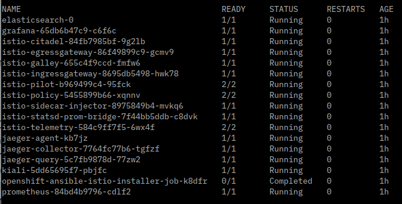

## Running the Cloud Native Starter on OKD (OpenShift)

For this environment we will use Minishift. Similar to Minikube it runs Kubernetes as a single node cluster in a VM, for example Virtualbox. Minishift uses the Origin Community Distribution of Kubernetes (OKD, okd.io) which is the basis for Red Hats OpenShift.

To use Minishift, you must be able to reserve at least 4 CPUs (or to be exact 4 CPU threads on an Intel CPU) and 8 GB of RAM. Minishift and specifically Istio on Minishift will not work with less resources, you would be wasting your time! And "reserve" means your workstation must have more than 4 CPUs threads and much more than 8 GB of RAM to leave room for your host operating system otherwise your workstation gets unusable when you try to start the installation!

### 1. Get Minishift

Like `minikube`, `minishift` first of all is a CLI. Instructions for download and installation can be found [here](
https://docs.okd.io/latest/minishift/getting-started/installing.html).

Download the version that corresponds to your OS, unpack it, then add `minishift` to your PATH. To test if it works, run

```
$ minishift version
```

### 2. Create a Minishift cluster 

These instructions are based on Kamesh Sampath's blog ["3 steps to your Istio Installation on Kubernetes"](https://medium.com/@kamesh_sampath/3-steps-to-your-istio-installation-on-openshift-58e3617828b0).

You can create the Minishift cluster via script or <a href="SetupMinishiftManually.md" target="_blank">manually</a>. This script will setup a Minishift cluster with 4 CPUs and 8 GB RAM:

```
$ minishift-scripts/setup-minishift.sh
```

Setup will take somewhere between 10 and 20 minutes. Be patient, even after the setup completed it can take a while until it is useable!

Also please note: Minishift is pushing the single VM concept of Minikube to the extreme. A workstation with 16 GB of RAM is the absolute minimum system to run it with 8 GB RAM set aside for Minishift. And still we have seen the setup fail! It will help, too, if you can close all other applications (especially known memory and CPU hogs) while you use Minishift.

Instead of trying to fix a failed install just wipe it and start new (thats why we have a script). To wipe a Minishift setup use these commands:

```
$ minishift stop
$ minishift delete
$ rm -rf ~/.minishift
```

There is a [Troubleshooting](#Troubleshooting) section at the end of this document, too.

After the setup is complete and Minishift is started, you are logged in as user `developer` in the command line.

### 3. oc

`oc` is the OpenShift CLI, it is required to interact with the OpenShift (OKD) cluster. The Minishift cluster setup we just performed placed a copy of `oc`into the directory `~/.minishift/cache/oc/v3.10.0/xxx`. This should have been added to your PATH temporarily.

Check if it works with

```
$ oc version
```

The command

```
$ eval $(minishift oc-env)
```

will add `oc` temporarily to the PATH, too. To make this permanent, add the oc path from the output of `minishift oc-env` (e.g. /home/XXX/.minishift/cache/oc/v3.10.0/YYY) to your PATH variable.

`oc` contains a copy of `kubectl`so there is no need to install it separately. See [here](https://docs.openshift.com/container-platform/3.10/cli_reference/differences_oc_kubectl.html) for details.

### 4. Install Istio

We are installing Istio as a Minishift add-on. It uses a Kubernetes Operator and is based on [Maistra](https://maistra.io/). This results in an older Istio version (1.0.2) but is well integrated into Minishift.

Installation is quite simple:

```
$ git clone https://github.com/minishift/minishift-addons
$ minishift addon install ./minishift-addons/add-ons/istio
$ minishift addon enable istio
$ minishift addon apply istio 
```

Installation will take some time, check the status of the Istio pods with:

```
$ watch oc get pods -n istio-system
```
If installation finished successful it should look like this:



There were a couple of instructions displayed at the end of the cluster setup. Ignore these instructions. The `minishift-scripts/setup-project.sh` script in the next step will setup everything correctly. It will also disable mTLS for our project which is the default for Maistra/Istio on Minishift but currently not supported by Cloud Native Starter.

Now open the OpenShift dashboard (`minishift console`), login as admin/admin, open the 'istio-system' project (you may need to click on "View All" to see it), then search for application "Kiali".

Click on the route for Kiali, it looks like 'https://kiali-istio-system.192.168.99.100.nip.io'. This will open the Kiali console. Log into Kiali with user 'admin' and password 'admin'.


### 5. Initial Deployment of Cloud Native Starter

To deploy (or redeploy) run these scripts:

```
$ minishift-scripts/check-prerequisites.sh
$ minishift-scripts/setup-project.sh
$ minishift-scripts/deploy-articles-java-jee.sh
$ minishift-scripts/deploy-authors-nodejs.sh
$ minishift-scripts/deploy-web-api-java-jee.sh
$ minishift-scripts/deploy-web-app.sh
$ minishift-scripts/deploy-istio-ingress-v1.sh
$ minishift-scripts/show-urls.sh
```

After running all (!) the scripts above, you will get a list of all URLs in the terminal:


### 67. Istio Demo: Traffic Routing

Run these scripts to deploy version 2 of the web-api and then apply Istio traffic routing to send 80% of the traffic to version 1, 20% to version 2:

```
$ minishift-scripts/deploy-web-api-java-jee-v2.sh
$ minishift-scripts/deploy-istio-ingress-v1-v2.sh
```

Create some load and view the traffic distribution in the Kiali console.

### 7. Cleanup

Run the following command to delete all cloud-native-starter components from Minishift:

$ oc delete project cloud-native-starter

You can also delete single components:

```
$ minishift-scripts/delete-articles-java-jee.sh
$ minishift-scripts/delete-web-api-java-jee.sh
$ minishift-scripts/delete-authors-nodejs.sh
$ minishift-scripts/delete-web-app-vuejs.sh
$ minishift-scripts/delete-istio-ingress.sh
$ minishift-scripts/delete-istio-ingress.sh
```


## Troubleshooting 

### Elasticsearch and Jaeger pods not starting

If you find that in the Istio environment (OpenShift dashboard, project "istio-system") the applications "elasticsearch", "jaeger-collector", and "jaeger-query" are in error, check the logs for Elasticsearch. Most likely you'll find:

```
ERROR: [1] bootstrap checks failed
[1]: max virtual memory areas vm.max_map_count [65530] is too low, increase to at least [262144]
```

This should have been set by the installtion/activation of the Istio addon but I have seen it fail now on two different installations. 

Remedy:

```
$ minishift ssh
$ sudo sysctl vm.max_map_count=262144
$ sudo sysctl -p 
$ sudo echo 'vm.max_map_count = 262144' | sudo tee /etc/sysctl.d/99-elasticsearch.conf > /dev/null
$ exit
```

And then wait a while. When the pods restart, they should come up OK.

### Cannot push images into Openshift Registry (connection refused)

This could be a known [Openshift issue](https://github.com/openshift/origin/issues/20576#issuecomment-413422503).

Open the Minishift Console:

```
$ minishift console
```

and login as user 'admin' with password 'admin'.

The docker-registry is in the "default" project. Most likely the pod is not started. You could try to start a deployment from here.


