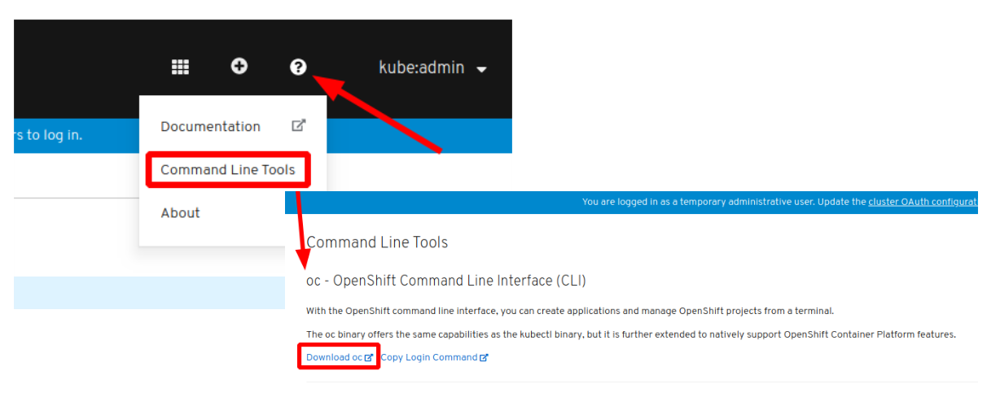

# Running the Cloud Native Starter on OpenShift 4.2

Before you start with the actual Cloud Native Starter project on OpenShift, you need to go through these 2 documents:

1. [Get access to an OpenShift cluster](OS4Cluster.md)
2. [Installing Istio aka Service Mesh on your OpenShift cluster](OS4ServiceMesh.md)

## `oc` Command Line Tool

Using OpenShift from the command line requires the `oc` CLI. Once you have access to the OpenShift web console (e.g. with `crc console`) you can find the download link for different operating systems in the Help menu in the upper right corner:

 