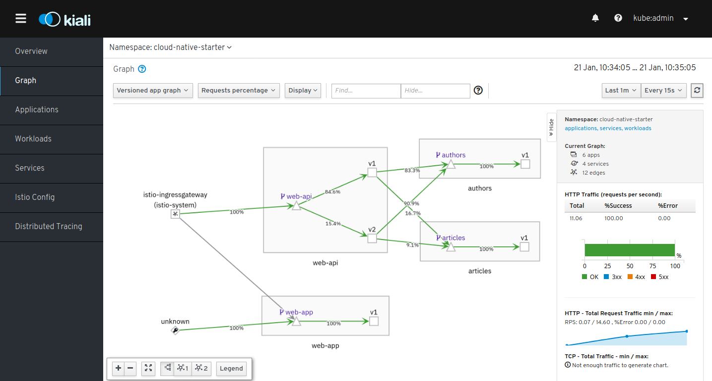

# Running the Cloud Native Starter on OpenShift 4.2

Before you start with the actual Cloud Native Starter project on OpenShift you must go through all of these 3 documents:

1. [Get access to an OpenShift cluster](OS4Cluster.md)
2. [Installing Istio aka Service Mesh on your OpenShift cluster](OS4ServiceMesh.md)
3. [Requirements for Cloud Native Starter on OpenShift](OS4Requirements.md)


To following commands deploy the base project.

**Note:** If you get an error "The token provided is invalid or expired" then the value for APITOKEN in file local.env is no longer valid. This typically happens when you restart CRC. Follow the instructions to obtain the API token in [Requirements for Cloud Native Starter on OpenShift](https://github.com/IBM/cloud-native-starter/blob/master/documentation/OS4Requirements.md#access-openshift-via-cli) in section "Access OpenShift via CLI". 


```
$ os4-scripts/check-prerequisites.sh
$ os4-scripts/deploy-articles-java-jee.sh
$ os4-scripts/deploy-authors-nodejs.sh
$ os4-scripts/deploy-web-api-java-jee.sh
$ os4-scripts/deploy-web-app-vuejs.sh
$ os4-scripts/deploy-istio-ingress-v1.sh
$ os4-scripts/show-urls.sh
```

## Istio Demo: Traffic Routing

Run these scripts to deploy version 2 of the web-api and then apply Istio traffic routing to send 80% of the traffic to version 1, 20% to version 2:

```
$ os4-scripts/deploy-web-api-java-jee-v2.sh
$ os4-scripts/deploy-istio-ingress-v1-v2.sh
```

Create some load and view the traffic distribution in the Kiali console (Kiali URL is displayed by show-urls.sh script).




## Cleanup

Cloud Native Starter:

```
$ oc delete project cloud-native-starter
```

Istio (OpenShift Service Mesh):

```
$ oc delete project istio-system
```


 