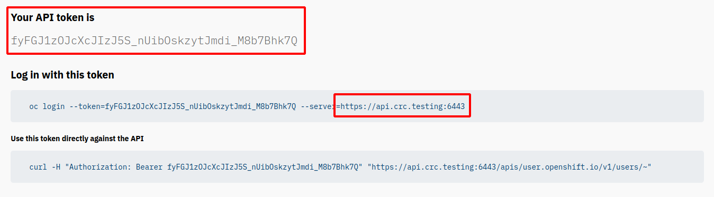
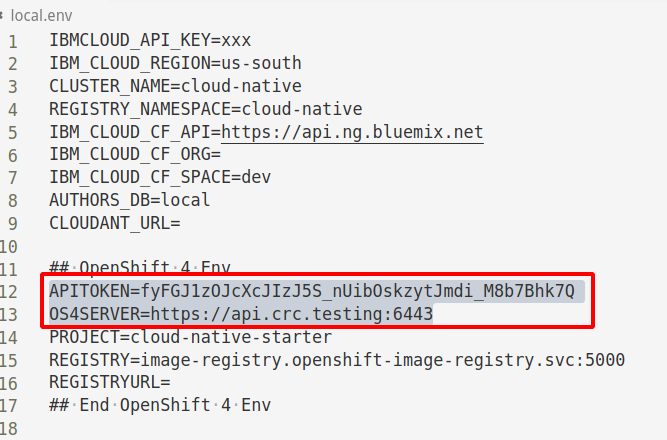

# Requirements for Cloud Native Starter on OpenShift

If you haven't already done so get the code from GitHub:

```
$ git clone https://github.com/IBM/cloud-native-starter.git
$ cd cloud-native-starter
$ ROOT_FOLDER=$(pwd) 
```

Check if you already have a copy of `local.env`:

```
$ cat local.env
```

If the file doesn't exist, create it:

```
$ cp template.local.env local.env 
```

## Required Tools

We will use scripts to install our microservices. You need to have these tools locally installed on your workstation:

* [git](https://git-scm.com/book/en/v2/Getting-Started-Installing-Git) 
* [curl](https://curl.haxx.se/download.html)
* [sed](https://www.gnu.org/software/sed/)
* [docker](https://docs.docker.com/install/) requires not only the code but also permission to run docker commands
* `oc`

    Using OpenShift from the command line and in scripts requires the `oc` CLI. In the OpenShift web console (e.g. with `crc console`) you can find the download link for different operating systems in the Help menu in the upper right corner:

    

**Note:** Docker always needs to be installed locally. 

The tools git, curl, sed, and oc can be installed locally or you can use a [Docker image](https://github.com/IBM/cloud-native-starter/blob/master/workshop-one-service/1-prereqs.md#tools) that comes with these tools. Using the Docker image is an **option for Windows users** since many of our scripts will not run unmodified on Windows.

```
$ cd ${ROOT_FOLDER}
$ docker run -v $ROOT_FOLDER/:/cloud-native-starter -it --rm tsuedbroecker/cns-workshop-tools:v1
```

## Access OpenShift via CLI

1. Access the OpenShift Web Console
2. In the upper right corner, click on the name of the logged in user (e.g. kube:admin), then click on 'Copy Login Command'
3. If required, log in again, then click 'Display Token'
4. Open the file 'local.env' (created in the very beginning of this document)
5. From the 'Display Token' page, copy
   * the API token to APITOKEN in local.env
   * the server URL (including https:// and portnumber!) from the Log in command to OS4SERVER in local.env

   
   
   Save the local.env, it should now look similar to this:

   

## Access the OpenShift Internal Image Registry

The container images for applications deployed on Kubernetes/OpenShift must be stored in a place where they can be accessed during the rollout of an application. This can be Docker Hub, the IBM Container Registry, Quay.io, or any other repository on the Internet you have access to. It can also be the image repository deployed within OpenShift.

For this project we will use the OpenShift internal repository. We will build our images locally on your workstation, then tag them with a name for the internal repository, and then push them into the internal repository. 

**Accessing the Image Registry is different for CRC or OpenShift on IBM Cloud! Continue with section A or B depending on your environment.**

### A. Access OpenShift Image Registry of CRC with `docker` CLI

**Note:** This section applies to CRC only!

Simply logging on to the Registry is not possible with CRC. The `docker` CLI will refuse to connect with a x509 error about an unknown certificate because in CRC the certificate is self-signed.

#### Obtain the CA certificate from OpenShift.

Execute these commands, they require that you created the local.env file in the previous step:

```
$ source local.env
$ oc login --token=$APITOKEN --server=$OS4SERVER
$ oc extract secret/router-ca --keys=tls.crt -n openshift-ingress-operator --confirm
```

This will extract the CA certificate from OpenShift and store it in file tls.crt in the current directory on your workstation.

The following are the steps to add the OpenShift certificate to Docker. They differ between operating systems. 

#### Linux

Thanks to Sandip Gupta, IBM, for pointing this out on [CRC Github Issues](https://github.com/code-ready/crc/issues/775).

Execute these commands:

```
$ sudo mkdir -p  /etc/docker/certs.d/default-route-openshift-image-registry.apps-crc.testing/
$ sudo cp tls.crt /etc/docker/certs.d/default-route-openshift-image-registry.apps-crc.testing/
$ sudo systemctl restart docker
```

I am running Fedora, the path and the command to restart the Docker daemon may be different on other distributions.

#### Mac

You can find these instructions at [https://docs.docker.com/docker-for-mac/#adding-tls-certificates](https://docs.docker.com/docker-for-mac/#adding-tls-certificates).

To manually add a custom, self-signed certificate, start by adding the certificate to the macOS keychain, which is picked up by Docker Desktop. Execute this command:

```
$ sudo security add-trusted-cert -d -r trustRoot -k /Library/Keychains/System.keychain tls.crt
```

Or, if you prefer to add the certificate to your own local keychain only (rather than the one for all users), run this command instead:

```
$ security add-trusted-cert -d -r trustRoot -k ~/Library/Keychains/login.keychain tls.crt
```

You need to restart Docker Desktop after making any changes in order for the changes to take effect.

#### Windows

If you are using the Docker image as suggested in the "Required Tools" section above, just follow the instructions for Linux.

If you are running everything locally on Windows please note: I have no access to a Windows workstation running Docker Desktop which means I cannot test and support Windows, but I found these instructions:

[https://success.docker.com/article/how-to-install-dtr-ca-on-windows](https://success.docker.com/article/how-to-install-dtr-ca-on-windows)

I believe that step "1. Get necessary CA certificate" is equivalent to 'oc extract secret/router-ca --keys=tls.crt -n openshift-ingress-operator' in the instructions above. 

#### Obtain the Image Registry URL

1. Enter the following command:

    ```
    $ oc get route default-route -n openshift-image-registry --template='{{ .spec.host }}'
    ```

2. Copy and paste the default route URL into REGISTRYURL in local.env:

    ```
    REGISTRYURL=default-route-openshift-image-registry.apps-crc.testing
    ```

    Don't forget to save local.env!

### B. Access OpenShift Image Registry with docker CLI on the IBM Cloud

**Note:** This section applies to OpenShift on IBM Cloud only!

OpenShift on the IBM Cloud uses Let's Encrypt cerificates which are automatically trusted by your browser and the `docker` CLI. This makes accessing the Registry a lot simpler.

The following information can be found in the [OpenShift 4.3 documentation](https://docs.openshift.com/container-platform/4.3/registry/securing-exposing-registry.html#registry-exposing-secure-registry-manually_securing-exposing-registry).

1. In the command line expose the registry using 'DefaultRoute':

    ```
    $ oc patch configs.imageregistry.operator.openshift.io/cluster --patch '{"spec":{"defaultRoute":true}}' --type=merge
    ```

2. Get the URL of the route:

    ```
    $ oc get route default-route -n openshift-image-registry --template='{{ .spec.host }}'
    ```

    The URL looks like this:

    ```
    default-route-openshift-image-registry.harald-uebele-os43-1234567890-0000.us-south.containers.appdomain.cloud
    ```

3. Copy and paste the default route URL into REGISTRYURL in local.env and save the file.    

### Test access to the OpenShift Image Registry:

```
$ source local.env
```

For **CRC** test with:

```
$ docker login -u kubeadmin -p $(oc whoami -t) $REGISTRYURL
```

For **OpenShift 4.3 on IBM Cloud** test with:

```
$ docker login -u $(oc whoami) -p $(oc whoami -t) $REGISTRYURL
```


This should result in a few warnings and in the end show '**Login Succeeded**'.

---


**Continue** with the [Cloud Native Starter on OpenShift](OS4Deployment.md)