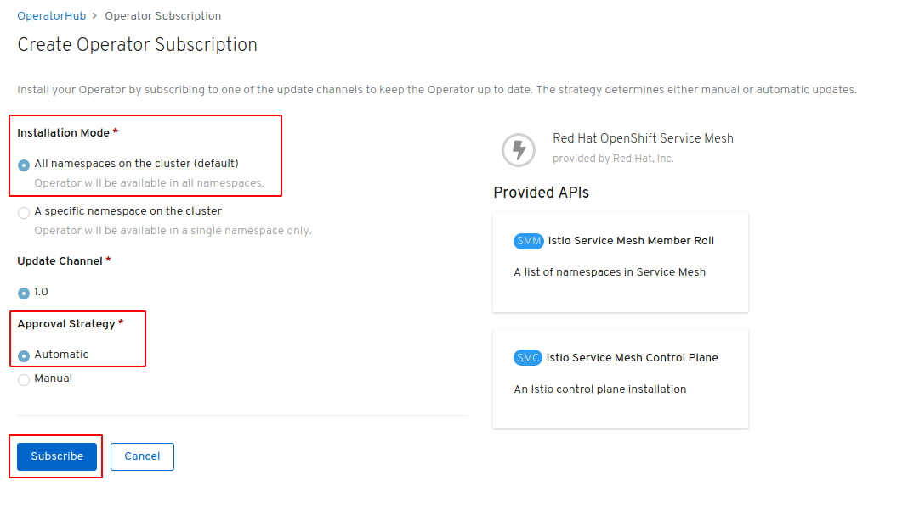

# Installing Istio aka OpenShift Service Mesh on your OpenShift Cluster

## Install Istio on OpenShift 4

Istio is installed with the help of multiple operators and is called "Red Hat OpenShift Service Mesh". We need to install 4 operators in sequence:

* Elasticsearch
* Jaeger
* Kiali
* OpenShift Service Mesh (= Istio)

Follow these steps:

1. In the OpenShift dashboard, switch to the Adminstrator view, then open Operators and OperatorHub. This will show the OperatorHub catalog (could take a moment):

   

2. Enter "elasticsearch" in the search field, and select the "Elasticsearch Operator provided by Red Hat, Inc".

3. Click "Install"

4. Keep the defaults for Installation Mode, Update Channel, and Approval Strategy and click "Subscribe"

   

5. The dashboard switches to the "Installed Operators" view. Wait a few minutes until the status shows "InstallSucceeded".

   

6. Go back to the "OperatorHub" view.

7. Repeat steps 2 to 6 for Jaeger, Kiali, and Service Mesh, in this sequence. 

    Always make sure to select the operator "provided by Red Hat, Inc" and not the Community one. 
    
    Always use the defaults for the subcription.

7. In the end you should see these 4 operators:

   

   This shows that we have the required operators in place. Next we will create the Istio / Service Mesh control plane.

In upstream Kubernetes you install (upstream) Istio or its control plane only once. In OpenShift you can install multiple Service Mesh control planes with different configurations that control different projects/namespaces. 

1. Create a project for the Service Mesh control plane. I will call it "istio-system" to be consistent with my other Istio installations.

   Use the OpenShift Console (Administrator view -> Home -> Projects -> "Create Project") or the `oc` CLI for this.

2. Go to the "Installed Operators" view and make sure that project: istio-system is selected. It may take a moment for the operators to show up, they are copied into this namespace.

3. Click on the "Red Hat OpenShift Service Mesh" operator and select the "Istio Service Mesh Control Plane" API:

   

4. Click on "Create instance" and have a look at the YAML definition:
   * Name is "basic-install" into namespace "istio-system"
   * auto scaling is off, traceSampling 100 (which is OK for a demo)
   * jaeger is using the "all-in-one" template

   Click "Create". This will take several minutes to complete, it took some 10 minutes when I last tried.

5. Go to Administrator -> Home -> Projects, and open the "istio-system" project. 

   In the project view, open the "Workloads" tab.

   You will see 3 applications: istio, jaeger, and kiali

   Click on the kiali deployment (D) and open the Resources tab of the kiali deployment:

   

   Click on the route, accept the self-signed certificate.

   When using `crc`, log in with user "kubeadmin" and the password displayed when you started `crc` or use `crc console --credentials` to redisplay them for you.

   You should see the Kiali console now.

Next, we add an Istio Service Mesh Member Roll which is basically just a list of namespaces/projects that belong to our Service Mesh control plane.

1. Create a new project "cloud-native-starter". It will hold our sample application later.

2. Go to "Installed Operators", Project: istio-system, and click on "Red Hat OpenShift Service Mesh"

   

3. Click on "Create instance" for "Istio Service Mesh Member Roll" API

4. As members, add "cloud-native-starter" and "default", click "Create": 

   

Istio aka OpenShift Service Mesh is now installed and functional in your OpenShift cluster.

With upstream Istio you would add a label to the cloud-native-starter namespace to enable Istio sidecar auto injection. This is not available in OpenShift. Instead, you need to opt in and add an annotation to each of your deployment YAML files to add [sidecar auto injection](https://docs.openshift.com/container-platform/3.11/servicemesh-install/servicemesh-install.html#automatic-sidecar-injection). "Opting in ensures the sidecar injection does not interfere with other OpenShift features such as builder pods used by numerous frameworks within the OpenShift ecosystem."

---

**Continue** with the [Requirements for OpenShift](OS4Requirements.md)