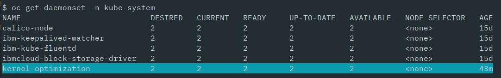
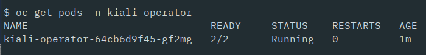
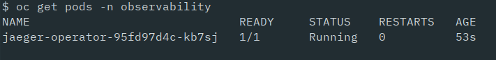
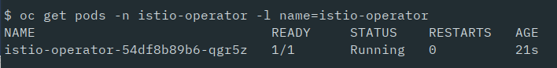
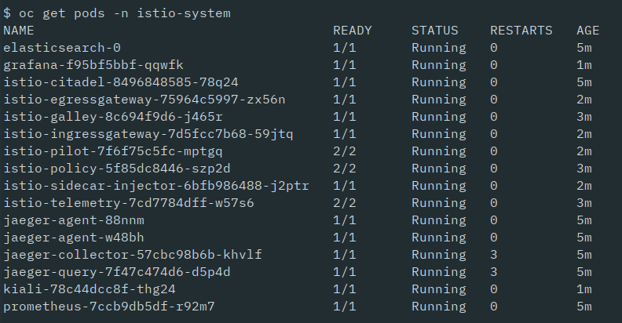

__PRELIMINARY UNTIL ADMISSION-WEBHOOKS ARE ENABLED__

You can login to your OpenShift Cluster on IBM Cloud with 

```
$ openshift-scripts/oc-login.sh
```


## Istio on OpenShift

Istio on OpenShift will be a Red Hat supported product called 'Red Hat OpenShift Service Mesh'. It is currently only available as [Technology Preview](https://docs.openshift.com/container-platform/3.11/servicemesh-install/servicemesh-install.html#install_chapter_1) which means it is unsupported and not recommended for production. 

An important information on this site: "An installation of Red Hat OpenShift Service Mesh differs from upstream Istio community installations in multiple ways. The modifications to Red Hat OpenShift Service Mesh are sometimes necessary to resolve issues, provide additional features, or to handle differences when deploying on OpenShift."

"Upstream" Istio (which we used on Minikube and IKS) is typically set to automatically inject the envoy sidecar to namespaces that have been labeled for automatic injection. Red Hat OpenShift Service Mesh does not automatically inject the sidecar to any namespaces, but requires you to specify the sidecar.istio.io/inject annotation into a Deployment yaml. This annotation is present in all of our yaml files and ignored by the other Istio platforms (Minikube, IKS).

To install Istio on OpenShift on IBM Cloud we are going to use [Maistra](https://maistra.io) which is the community upstream release of OpenShift Service Mesh and currently on Version 0.12 which is Technology Preview 12 as of this writing. We will mostly follow the [instructions](https://maistra.io/docs/getting_started/install/) on the Maistra website.

### Preparation

The Maistra instructions have a topic "Updating the Master". These instructions will enable the so-called admission-webhooks in Kubernetes which is a requirement for Istio sidecar injection on OpenShift. On the IBM Cloud, the master nodes are managed by IBM, which means we have no access to them. But admission-webhooks are enabled on the master nodes already by IBM.

Several Istio components require Elasticsearch which is part of the Istio installation. Elasticsearch needs setting of a kernel parameter (vm.max_map_count=262144) on the worker nodes. On the IBM Cloud this can be done with a daemonset which is defined in [openshift-scripts/es-daemonset.yaml](../openshift-scripts/es-daemonset.yaml). Create the daemonset with:


```
$ oc apply -f openshift-scripts/es-daemonset.yaml
```

Check that the daemonset runs with this command:

```
$ oc get daemonset -n kube-system 
```

and check for the name 'kernel-optimization'. In our OpenShift example setup we have 2 worker nodes, so you should see number 2 for all states. 



### Installation

Maistra is using multiple Operators to install Istio and its components.

#### 1. Installing the Kiali Operator

Kiali Operator needs to be installed first:

```
$ bash <(curl -L https://git.io/getLatestKialiOperator) --operator-image-version v1.0.0 --operator-watch-namespace '**' --accessible-namespaces '**' --operator-install-kiali false
```

Check that the Operator runs with:

```
$ oc get pods -n kiali-operator
```




#### 2. Installing the Jaeger Operator

Jaeger is the Distributed Tracing tool used in Istio. Install the Jaeger Operator with:

```
$ oc new-project observability # create the project for the jaeger operator
$ oc create -n observability -f https://raw.githubusercontent.com/jaegertracing/jaeger-operator/v1.13.1/deploy/crds/jaegertracing_v1_jaeger_crd.yaml
$ oc create -n observability -f https://raw.githubusercontent.com/jaegertracing/jaeger-operator/v1.13.1/deploy/service_account.yaml
$ oc create -n observability -f https://raw.githubusercontent.com/jaegertracing/jaeger-operator/v1.13.1/deploy/role.yaml
$ oc create -n observability -f https://raw.githubusercontent.com/jaegertracing/jaeger-operator/v1.13.1/deploy/role_binding.yaml
$ oc create -n observability -f https://raw.githubusercontent.com/jaegertracing/jaeger-operator/v1.13.1/deploy/operator.yaml
```

Check that the Operator runs with:

```
$ oc get pods -n observability
```




#### 3. Installing the Istio Operator

"The Maistra installation process introduces a Kubernetes operator to manage the installation of the Istio control plane within the istio-system namespace. This operator defines and monitors a custom resource related to the deployment, update and deletion of the Istio control plane."

```
$ oc new-project istio-operator
$ oc apply -n istio-operator -f https://raw.githubusercontent.com/Maistra/istio-operator/maistra-0.11/deploy/maistra-operator.yaml
```

To verify the operator is installed correctly, wait for the operator to reach the running state:

```
$ oc get pods -n istio-operator -l name=istio-operator
```



#### 4. Deploy Istio Control Plane

We perform a Single Tenant Installation and for this we require a custom resource which is defined in [openshift-scripts/servicemesh-cr.yaml](../openshift-scripts/servicemesh-cr.yaml). We use the default from the Maistra website.

Deploy the Istio Control Plane with:
```
$ oc new-project istio-system
$ oc create -n istio-system -f openshift-scripts/servicemesh-cr.yaml
```

This installation takes a couple of minutes. Verify installation with:

```
$ oc get pods -n istio-system
```

The list of pods should look similar to this:




