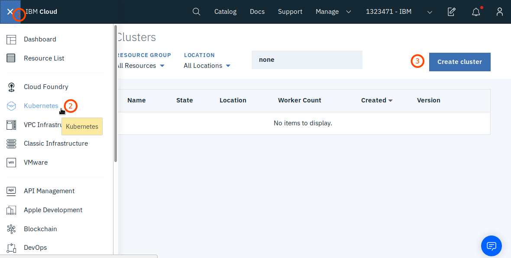
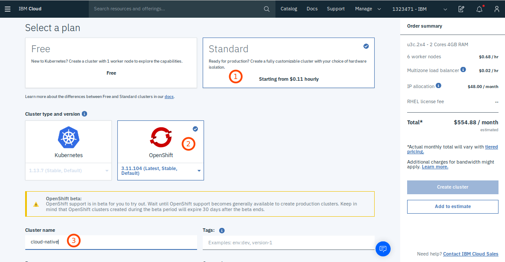

## Deploy Cloud Native Starter on OpenShift on IBM Cloud

While the rest of this project is based on open source and mostly free offerings this part is no longer free of charge. Setting up an OpenShift cluster on the IBM Cloud requires a paid IBM Cloud account and will generate costs even during the OpenShift beta. During the beta there will be no licence fees for OpenShift, but you still need to pay for the hardware of the cluster. When you create the cluster, the "Order summary" will estimate the cost per month. In this setup we use virtual shared hardware which is charged by the hour. Your incurring costs will therefore depend on how long you run the cluster.

### 1. Preparation 

**Get the code**

```
$ git clone https://github.com/nheidloff/cloud-native-starter.git
$ cd cloud-native-starter
$ ROOT_FOLDER=$(pwd)
```

**Prerequisites**

Make sure you have the following prerequisites installed:

* [git](https://git-scm.com/book/en/v2/Getting-Started-Installing-Git) 
* [curl](https://curl.haxx.se/download.html)
* [ibmcloud CLI](https://cloud.ibm.com/docs/home/tools) 

Run this script to check the prerequisites:

```
$ ibm-scripts/IKS-check-prerequisites.sh
```

**Create an API Key**

Note that API keys are only valid for one data center. Right now OpenShift can be used in North America ('us-east') and Europe ('eu-gb').

```
$ ibmcloud login
$ ibmcloud iam api-key-create cloud-native-starter \
  -d "cloud-native-starter" \
  --file cloud-native-starter.json
$ cat cloud-native-starter.json
$ cp template.local.env local.env 
```

From the output of `cat cloud-native-starter.json` copy the apikey without " " into IBMCLOUD_API_KEY= in file local.env.

The file local.env has values for region and cluster name. Define your cluster name and region here.

Example local.env:

```
IBMCLOUD_API_KEY=AbcD3fg7hIj65klMn9derHHb9zge5
IBM_CLOUD_REGION=us-east
CLUSTER_NAME=cloud-native
```

### 2. Setup OpenShift on IBM Cloud

Our normal approach throughout this project is to script as much as possible. 

We could script the OpenShift cluster creation, too, but have decided against because only when you create the cluster manually in the IBM Cloud Dashboard will you see an estimate of the costs.

Create an OS Cluster in the IBM Cloud Dashboard

1. Logon to the IBM Cloud
2. From the IBM Cloud Menu (upper left corner) select "Kubernetes"
3. Click "Create cluster"

4. Select plan: "Standard"
5. Cluster type and version: "OpenShift"
6. Cluster name: "cloud-native"

7. Resource group: "default", Geography "North America"
8. Availability: "Single zone"
9. Worker zone: select any of the available zones, e.g. "Washington DC 06"
10. Master service endpoint: "Public endpint only" 
11. Default worker pool/Flavor: "4 Cores 16 GB RAM, Virtual Shared, b3c.4x16"
12. Worker nodes: 2

Click on "Create Cluster", this will take approximately 15 to 20 minutes.

Note: If you decide to name your cluster differently in step 6. above, please also change the value of CLUSTER_NAME in file local.env!

Once your cluster is started, you can open the OpenShift Console by clicking on the "OpenShift web console" button within your clusters view on the IBM Cloud Dashboard.

### 3. oc

The OpenShift CLI tool can be found [here](https://www.okd.io/download.html). The OKD version works with OpenShift, too. The CLI Reference link on the Download page leads you to instructions on how to install and use it.

### 4. Istio

Istio is currently not supported on OpenShift ("As the initialization of the Envoy sidecar still requires privileged access during the Technology Preview, any OpenShift cluster with Istio installed may not receive production support from Red Hat."). There is a Technology Preview but we are still missing an important element (admission-webhooks) on the OpenShift Master Nodes on IBM Kubernetes Service.

For the time being we will deploy the Cloud Native Starter without Istio. Once admission-webhooks are enabled, we will start testing the Technology Preview and if we are successful, update our OpenShift setup scripts and documentation.

### 5. Deploy Cloud Native Starter

For the time being (until Istio support has been finalized) we are deploying the sample without Istio. To deploy the sample run the following commands:

```
$ openshift-scripts/check-prerequisites.sh
$ openshift-scripts/setup-project.sh
$ openshift-scripts/deploy-articles-java-jee.sh
$ openshift-scripts/deploy-authors-nodejs.sh
$ openshift-scripts/deploy-web-api-java-jee.sh
$ openshift-scripts/deploy-web-app.sh
$ openshift-scripts/create-k8s-ingress.sh
$ openshift-scripts/show-urls.sh

```
Note: The 'create-k8s-ingress.sh' makes the web-app available via the Kubernetes Ingress that is part of a standard (paid) Kubernetes cluster.

You can use this script to login to your OpenShift cluster on IBM Cloud:

```
$ openshift-scripts/oc-login.sh
```

### 7. Cleanup

Run the following command to delete all cloud-native-starter components from OpenShift on IBM Cloud:

$ oc delete project cloud-native-starter

You can also delete single components:

```
$ openshift-scripts/delete-articles-java-jee.sh
$ openshift-scripts/delete-authors-nodejs.sh
$ openshift-scripts/delete-web-api-java-jee.sh
$ openshift-scripts/delete-web-app.sh

```


