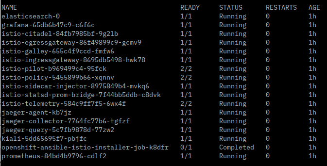

## Running the Cloud Native Starter on OKD (OpenShift)

For this environment we will use Minishift. Similar to Minikube it runs Kubernetes as a single node cluster in a VM, for example Virtualbox. Minishift uses the Origin Community Distribution of Kubernetes (OKD, okd.io) which is the basis for Red Hats OpenShift.

To use Minishift, you must be able to reserve at least 4 CPUs (or to be exact 4 CPU threads on an Intel CPU) and 8 GB of RAM. Minishift and specifically Istio on Minishift will not work with less resources, you would be wasting your time! 

### 1. Get Minishift

Like `minikube`, `minishift` first of all is a CLI. Instructions for download and installation can be found [here](
https://docs.okd.io/latest/minishift/getting-started/installing.html).

Download the version that corresponds to your OS, unpack it, then add `minishift` to your PATH. To test if it works, run

```
$ minishift version
```

### 2. Create a Minishift cluster 

These instructions are mainly based on Kamesh Sampath's blog ["3 steps to your Istio Installation on Kubernetes"](https://medium.com/@kamesh_sampath/3-steps-to-your-istio-installation-on-openshift-58e3617828b0).

Create a profile called "istio":

```
$ minishift profile set istio
```

Use Virtualbox (see other [choices](https://docs.okd.io/latest/minishift/getting-started/setting-up-virtualization-environment.html))

```
$ minishift config set vm-driver virtualbox
```

Give the profile at least 8GB of memory, this is the minimum, the more the better:

```
$ minishift config set memory 8GB 
```

Give the profile at least 4 CPUs:

```
$ minishift config set cpus 4
```

Adding container image caching to allow faster profile setup:

```
$ minishift config set image-caching true 
```

Pinning OpenShift version to be 3.10.0 (required by Minishift Istio Addon):

```
$ minishift config set openshift-version v3.10.0
``` 

Add a user with cluster-admin role:

```
$ minishift addon enable admin-user
```

Allows to run containers with uid 0 on Openshift:

```
$ minishift addon enable anyuid
```

Start the profile:

```
$ minishift start
```

Setup will take somewhere between 10 and 20 minutes. 

After the setup is complete and Minishift is started, you are logged in as user `developer` in the command line.

### 3. oc

`oc` is the OpenShift CLI, it is required to interact with the OpenShift (OKD) cluster. The Minishift cluster setup we just performed placed a copy of `oc`into the directory `~/.minishift/cache/oc/v3.10.0/xxx`. Either add this directory to your PATH or copy `oc`into a directory in your PATH.

Check if it works with

```
$ oc version
```

### 4. OpenShift Dashboard or Console

To access the graphical dashboard or console run:

```
$ minishift console
```

Login as user 'developer' with password 'developer'.

'developer' has no admin rights and profile 'system:admin' cannot login to the dashboard. To gain full access to the dashboard go back to the command line and run these commands:

```
$ oc login -u system:admin
$ oc adm policy add-cluster-role-to-user cluster-admin admin
$ oc login -u admin -p admin
```

Now logout from the dashboard and re-login as user 'admin' with password 'admin'.

### 5. Install Istio

We are installating Istio as a Minishift add-on. It uses a Kubernetes Operator and is based on [Maistra](https://maistra.io/). It results in an older Istio version (1.0.2) but is well integrated into Minishift.

Installation is quite simple:

```
$ git clone https://github.com/minishift/minishift-addons
$ minishift addon install ./minishift-addons/add-ons/istio
$ minishift addon enable istio
$ minishift addon apply istio 
```

Installation will take some time, check the status of the Istio pods with:

```
$ watch oc get pods -n istio-system
```
If installation finished successful it should look like this:



There were a couple of instructions displayed at the end of the cluster setup. Ignore the instructions for admin-user and anyuid, we have enabled those when we created the Minishift cluster.

But **enter these commands** ([Background](https://maistra.io/docs/getting_started/application-requirements/)):

```
$ oc adm policy add-scc-to-user anyuid -z default -n myproject
$ oc adm policy add-scc-to-user privileged -z default -n myproject
```

Should you decide to create the Cloud Native Starter in its own OpenShift project, you have to issue these commands for that project, too!

Now open the OpenShift dashboard (`minishift console`), login as admin/admin, open the 'istio-system' project (you may need to click on "View All" to see it), then search for application "Kiali".

Click on the route for Kiali, it looks like 'https://kiali-istio-system.192.168.99.100.nip.io'. This will open the Kiali console. Log into Kiali with user 'admin' and password 'admin'.

**One more step to do.** Our Cloud Native Starter demo does not currently use mTLS but the Maistra based Istio we just installed uses mTLS per default. As long as we haven't updated our sample for mTLS, any application of Istio DestinationRules to your Istio configuration will result in 503 Upstream Errors. To disable mTLS on the "myproject" project (or the myproject namespace to be precise), create a no-mtls.yaml file with the following content:

```
apiVersion: "authentication.istio.io/v1alpha1"
kind: "Policy"
metadata:
  name: "default"
  namespace: "myproject"
spec:
  peers:
    - mtls:
        mode: PERMISSIVE
```

AFAIK, the name must be "default".

Apply the policy with 

```
$ oc apply -f no-mtls.yaml
```

## Example: Manually deploying the Authors service to Minishift

This is an example how to deploy an application by building a Docker image, pushing it to the OpenShift internal Docker registry (within Minishift), and deploying an application using yaml files and kubectl/oc.

Internal address of the registry:
$ minishift openshift registry
Result (e.g.): 172.30.1.1:5000

Which OpenShift project am I working on:
$ oc project
Result (e.g.): Using project "myproject" from context named "istio" on server "https://192.168.99.100:8443".

### Build the image

These instructions are based on the default project "myproject".

Need to be admin to create Istio config

```
$ oc login -u admin -p admin
$ cd authors-nodejs
```

Switch to the Minishift Docker environment

```
$ eval $(minishift docker-env)
```

Login to the OpenShift internal Docker Registry

```
$ docker login -u admin -p $(oc whoami -t) $(minishift openshift registry)
```

Create the Container Image in the Minishift Docker environment

```
$ docker build -f Dockerfile -t authors:1 .
```

Tag the image with the OpenShift Docker registry and Imagestream (= Project Name)

```
$ docker tag authors:1 $(minishift openshift registry)/myproject/authors:1
```

List the images

```
$ docker images

-->
REPOSITORY                                   TAG                 IMAGE ID            CREATED              SIZE
172.30.1.1:5000/myproject/authors            1                   fc626936153f        About a minute ago   91.9MB
authors                                      1                   fc626936153f        About a minute ago   91.9MB
...
```

Push the image into the OpenShift Registry

```
$ docker push $(minishift openshift registry)/myproject/authors:1
```

In the OpenShift dashboard, open project "My Project", select "Builds" -> "Images". You should see the "authors:1" image.

### Deploy the application 

We need to modify the deployment.yaml file.

```
$ cd deployment
$ cp deployment.yaml.template deployment-minishift.yaml
```

Change the container - image name to refelct the OpenShift Repository

Example:

```
    spec:
      containers:
      - image: 172.30.1.1:5000/myproject/authors:1
        name: authors
        env:
        - name: DATABASE
          value: 'local'
        - name: CLOUDANT_URL
          value: 'local'
        ports:
        - containerPort: 3000
          name: authors
      restartPolicy: Always    
```

Deploy the application (Deployment and Service)

TODO: How do we get istioctl????

```
$ oc apply -f <(istioctl kube-inject -f deployment-minishift.yaml)
$ oc apply -f istio.yaml
```

### Istio Ingress

Create the Istio Ingress Gateway definition

istio-ingress-gateway.yaml:

```
apiVersion: networking.istio.io/v1alpha3
kind: Gateway
metadata:
  name: default-gateway-ingress-http
spec:
  selector:
    istio: ingressgateway # use Istio default gateway implementation
  servers:
  - port:
      number: 80
      name: http
      protocol: HTTP
    hosts:
    - "istio-ingressgateway-istio-system.192.168.99.100.nip.io"
--- 
```

```
$ oc apply -f istio-ingress-gateway.yaml
```

Create a VirtualService for authors

istio-ingress-service-authors.yaml:

```
apiVersion: networking.istio.io/v1alpha3
kind: VirtualService
metadata:
  name: virtualservice-ingress-web-api-web-app
spec:
  hosts:
  - "*"
  gateways:
  - default-gateway-ingress-http
  http:
  - match:
    - uri:
        prefix: /health
    route:
    - destination:
        host: authors
        port:
          number: 3000
  - match:
    - uri:
        prefix: /api/v1/getauthor
    route:
    - destination:
        host: authors
        subset: v1
---
```

```
$ oc apply -f istio-ingress-service-authors.yaml
```

Login to the OpenShift dashboard as admin/admin
Select project "istio-system"
Search for application "istio-ingressgateway", note its route, e.g. http://istio-ingressgateway-istio-system.192.168.99.100.nip.io

Open http://istio-ingressgateway-istio-system.192.168.99.100.nip.io/health
Result should be {"status":"UP"}

Open http://istio-ingressgateway-istio-system.192.168.99.100.nip.io/api/v1/getauthor?name=Harald%20Uebele
Result: {"name":"Harald Uebele","twitter":"@harald_u","blog":"https://haralduebele.blog"}


## Troubleshooting

If you find that in the Istio environment (OpenSHift dashboard, project "istio-system") the applications "elasticsearch", "jaeger-collector", and "jaeger-query" are in error, check the logs for Elasticsearch. Most likely you'll find:

```
ERROR: [1] bootstrap checks failed
[1]: max virtual memory areas vm.max_map_count [65530] is too low, increase to at least [262144]
```

This should have been set by the installtion/activation of the Istio addon but I have seen it fail now on two different installations. 

Remedy:

```
$ minishift ssh
$ sudo sysctl vm.max_map_count=262144
$ sudo sysctl -p 
$ sudo echo 'vm.max_map_count = 262144' | sudo tee /etc/sysctl.d/99-elasticsearch.conf > /dev/null
$ exit
```

And then wait a while. When the pods restart, they should come up OK.
