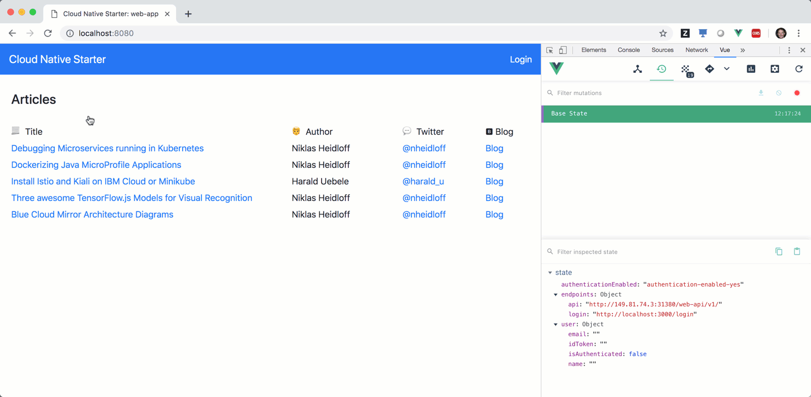

## Demo: Authentication and Authorization

In order to authenticate users, you need an OpenID identity provider. 

You can you [IBM App ID](https://console.bluemix.net/catalog/services/appid) or you can use an OpenID identity provider of your choice.

Before running the scripts below, make sure you can [access the IBM Cloud](setup-ibm-cloud-access.md).


**Create new App ID service instance**

Run the following command to create these artifacts:

* App ID service instance 'app-id-serverless'
* App ID Cloud Foundry alias 'app-id-serverless'
* App ID credentials
* App ID test user 'user@demo.email, verysecret'

```
$ ibm-scripts/create-app-id.sh
```


**Reuse an existing App ID service instance**

The IBM Cloud lite plan only allows one App ID instance in your organization. If you have an App ID instance, you can use it rather than creating a new one. 

In this case paste the App ID credentials in [authentication-nodejs/.env](../authentication-nodejs/.env). Check out [authentication-nodejs/.env.template](../authentication-nodejs/.env.template) for an example.


**Use another OpenID identify provider**

You can you any OpenID identity provider. In this case paste the endpoint URLs in [authentication-nodejs/.env](../authentication-nodejs/.env). Check out [authentication-nodejs/.env.template](../authentication-nodejs/.env.template) for an example.


**Set up the Demo**

Invoke the following commands to set up the demo. Skip the commands you've already executed.

```
$ git clone https://github.com/nheidloff/cloud-native-starter.git
$ cd cloud-native-starter
$ scripts/check-prerequisites.sh
$ scripts/delete-all.sh
$ scripts/deploy-articles-java-jee.sh
$ scripts/deploy-web-api-java-jee.sh
$ scripts/deploy-authors-nodejs.sh
$ scripts/deploy-authentication-nodejs.sh
$ scripts/deploy-web-app-vuejs-authentication.sh
$ scripts/deploy-istio-ingress-v1.sh
$ scripts/show-urls.sh
```

Open the web application with the URL that is displayed as output of 'scripts/show-urls.sh'. When you click 'Login', use the credentials of the demo user.

After the login, the Vue.js application stores the id_token if the Vuex state.

<kbd></kbd>

Check out the [animated gif](../images/login.gif) to see the authentication flow.

<kbd></kbd>