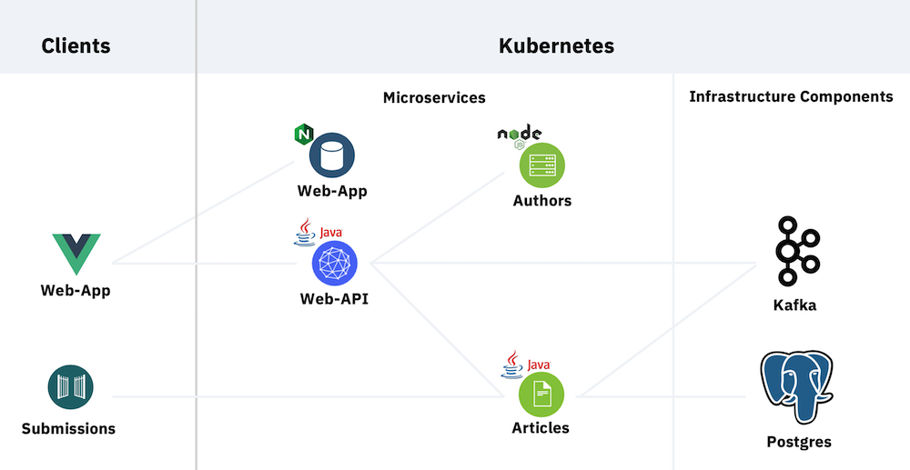

## Reactive Java Microservices 

This part of the cloud-native-starter project describes how to implement reactive microservices with Quarkus, MicroProfile, Vert.x, Kafka and Postgres.

The project comes with a sample application which displays articles with author information in a simple web application. The web application invokes the web-api service which implements a backend-for-frontend pattern and invokes the articles and authors service. The articles service stores data in a Postgres database. Messages are sent between the microservices via Kafka.

This diagram describes the high level architecture.

<kbd></kbd>

Jump to the part of the documentation you are interested in:

* [Scenario 1 - Reactive Messaging](#scenario-1---reactive-messaging)
* [Scenario 2 - Reactive REST Endpoints for higher Efficiency](#scenario-2---reactive-rest-endpoints-for-higher-efficiency)
* [Blogs](#blogs)
* [Setup in Minikube](#setup-in-minikube)
* [Server-side Setup in IBM Cloud Kubernetes Service](https://github.com/nheidloff/cloud-native-starter-reactive-toolchain)
* [Client-side Setup in IBM Cloud Kubernetes Service](documentation/IKS.md)
* [Setup in CodeReady Containers (local OpenShift) or Red Hat OpenShift on IBM Cloud](documentation/OpenShift4.md)
* [Setup of local Development Environment](#setup-of-local-development-environment)
* [Technologies](#technologies)

### Setup in Minikube

The setup is pretty straight forward. Once Minikube is installed it takes only 10 minutes to deploy everything.

**1. Install Minikube**

See the [instructions](https://kubernetes.io/docs/tasks/tools/install-minikube/).

**2. Get the code**

```
$ git clone https://github.com/IBM/cloud-native-starter.git
$ cd cloud-native-starter/reactive
$ ROOT_FOLDER=$(pwd)
```

**3. Install prerequisites**

```
$ cd ${ROOT_FOLDER}
$ sh scripts/check-prerequisites.sh
```

**4. Start Minikube and deploy Kafka and Postgres**

After every step follow the instructions in the output of the commands to check when the components have been started before moving on. It's also recommended to doublecheck whether all components in all namespaces have the 'green' status in the Minikube dashboard ($ minikube dashboard).

```
$ cd ${ROOT_FOLDER}
$ sh scripts/start-minikube.sh
$ sh scripts/deploy-kafka.sh
$ sh scripts/deploy-postgres.sh
$ sh scripts/deploy-postgres-admin.sh
```

The script [deploy-kafka.sh](scripts/deploy-kafka.sh) performs the following actions:
1. Create a namespace 'kafka'
2. Install the Kafka operator [strimzi-cluster-operator](https://strimzi.io/docs/master/)
3. Deploy the 'my-cluster-entity-operator'
4. Deploy Kafka (3 pods my-cluster-zookeeper, 3 pods my-cluster-kafka)

The script [deploy-postgres.sh](scripts/deploy-postgres.sh) deploys a simple Postgres database which doesn't require a persistent volume.

The script [deploy-postgres-admin.sh](scripts/deploy-postgres-admim.sh) is optional only and installs the Postgres admin tool [pgAdmin](https://www.pgadmin.org/).

**5. Deploy Microservices**

```
$ cd ${ROOT_FOLDER}
$ sh scripts/deploy-articles-reactive-postgres.sh
$ sh scripts/deploy-authors.sh
$ sh scripts/deploy-web-api-reactive.sh
$ sh scripts/deploy-web-app-reactive.sh
$ sh scripts/show-urls.sh
```
 Once the web application has been deployed open the URL that is displayed in the output of the last command in a browser. Five articles with author information are displayed.

### Scenario 1 - Reactive Messaging

One benefit of reactive models is the ability to update web applications by sending messages, rather than pulling for updates. This is more efficient and improves the user experience.

Articles can be created via REST API. The web application receives a notification and adds the new article to the page.

<kbd></kbd>

This diagram explains the flow.

<kbd></kbd>

To try this functionality yourself, create a new article either via the API explorer or curl. Open either the web application or only the stream endpoint in a browser. See the output of 'show-urls.sh' for the URLs.

This scenario uses the following reactive functionality:

* Sending events from a microservice to a web application via Server Sent Events
* Sending in-memory messages via MicroProfile
* Sending in-memory messages via Vertx event bus
* Sending and receiving Kafka messages via MicroProfile
* Sending Kafka messages via Kafka API

### Scenario 2 - Reactive REST Endpoints for higher Efficiency

Another benefit of reactive systems and reactive REST endpoints is efficiency. This scenario describes how to use reactive systems and reactive programming to achieve faster response times. Especially in public clouds where costs depend on CPU, RAM and compute durations this model saves money.

The project contains the endpoint '/articles' of the web-api service in two different versions, one uses imperative code, the other one reactive code.

The reactive stack of this sample provides response times that take less than half of the time compared to the imperative stack: Reactive: 793 ms - Imperative: 1956 ms.

Read the [documentation](documentation/LoadTests.md) for details.

This diagram explains the flow.

<kbd></kbd>

This is the result of the imperative version after 30000 invocations:

<kbd></kbd>

This is the result of the reactive version after 30000 invocations:

<kbd></kbd>

To try this functionality yourself, open the API explorer of the web-api service and invoke the '/articles' endpoint. See the output of 'show-urls.sh' for the URL. To run load tests, check out the [documentation](documentation/LoadTests.md).

This scenario uses the following reactive functionality:

* Reactive REST endpoints via CompletionStage
* Exception handling in chained reactive invocations
* Timeouts via CompletableFuture
* Resiliency of reactive microservices
* Reactive REST invocations via Vertx Axle Web Client
* Reactive REST invocations via MicroProfile REST Client
* Reactive CRUD operations for Postgres


**Persistence Performance Tests** 

There is also another test which compares the performance of accessing the Postgres database.

The reactive stack of this sample provides response times that take less than half of the time compared to the imperative stack: Reactive: 142 ms (0:42 min total) - Imperative: 265 ms (1:20 min total).

Read the [documentation](documentation/PersistencePerformanceTests.md) for details.

### Setup of local Development Environment

You can run single services locally, but there are some restrictions:

* Kafka always run in Minikube
* Only one of the services can be run locally at the same time since they all use the same port
* When running the articles or the web-api service locally, the web application doesn't work
* When running the web-api service locally, the messaging works, but not the REST invocations

Here is an example how to run the web-api service locally:

*First terminal*

```
$ cd ${ROOT_FOLDER}
$ sh scripts/deploy-articles-reactive-postgres.sh
$ sh scripts/run-locally-web-api-reactive.sh
```

*Browser*

Open the stream endpoint in a browser.

*Second terminal*

```
$ cd ${ROOT_FOLDER}
$ sh scripts/show-urls.sh
$ curl -X POST "http://localhost:8080/v1/articles" ...
```

### Blogs

* [Development of Reactive Applications with Quarkus](http://heidloff.net/article-development-reactive-applications-quarkus/)
* [Accessing Apache Kafka from Quarkus](http://heidloff.net/article/accessing-apache-kafka-from-quarkus/)
* [Accessing PostgreSQL in Kubernetes from Quarkus](http://heidloff.net/article/accessing-postgresql-from-quarkus/)
* [Reactive Messaging Examples for Quarkus](http://heidloff.net/article/reactive-messaging-examples-quarkus/)
* [Developing reactive REST APIs with Quarkus](http://heidloff.net/article/developing-reactive-rest-apis-with-quarkus/)
* [Invoking REST APIs asynchronously with Quarkus](http://heidloff.net/article/invoking-rest-apis-asynchronously-with-quarkus/)
* [Comparing synchronous and asynchronous Access to Postgres](http://heidloff.net/article/comparing-synchronous-asynchronous-access-postgresql/)
* [Deployment to the IBM Cloud Kubernetes Service](https://suedbroecker.net/2020/02/03/deploy-the-reactive-cloud-native-starter-example-to-ibm-cloud/)
* [Deployment to Red Hat OpenShift](https://haralduebele.blog/2020/02/03/cloud-native-and-reactive-microservices-on-red-hat-openshift-4/)
* [Using the OpenJ9 JVM for Quarkus Applications](http://heidloff.net/article/openj9-jvm-for-quarkus-applications/)

### Technologies

This part of the cloud-native-starter project describes how to implement reactive microservices with the following technologies:

* [Quarkus](https://quarkus.io/)
* [Eclipse MicroProfile](https://microprofile.io/)
* [Eclipse Vert.x](https://vertx.io/)
* [Eclipse OpenJ9](https://www.eclipse.org/openj9/)
* [Kubernetes](https://kubernetes.io/)
* [Minikube](https://minikube.sigs.k8s.io/)
* [Apache Kafka](https://kafka.apache.org/)
* [PostgreSQL](https://www.postgresql.org/)