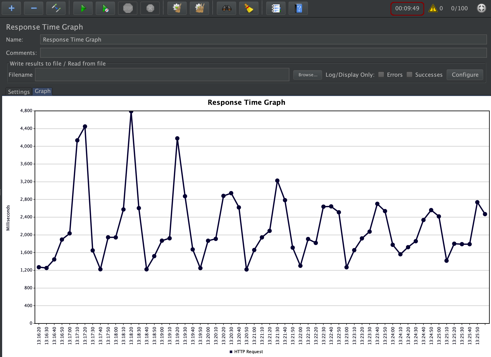
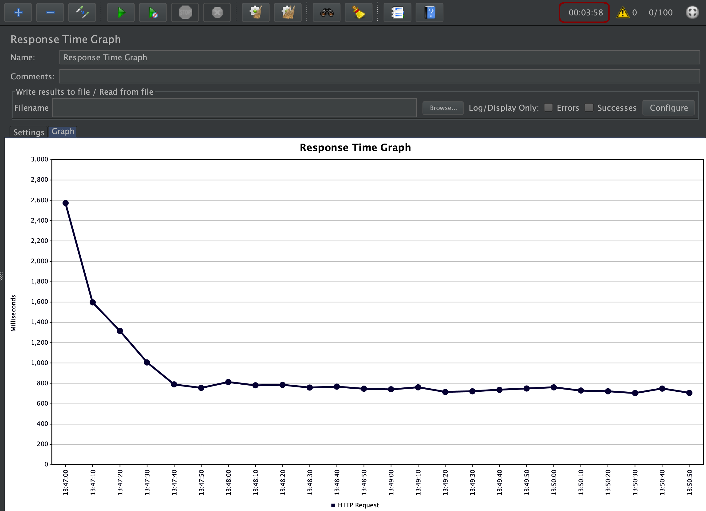

## Efficient Reactive Programming

This page describes the results of load tests to compare the efficiency of reactive programming with imperative programming. 

**TL;DR**

The reactive stack of this sample provides responsive times that take less than half of the time compared to the imperative stack: Reactive: 793 ms - Imperative: 1956 ms.

### Scenario

The project contains the endpoint '/articles' of the web-api service in two different versions, one uses imperative code, the other one reactive code.

**Version 1: Imperative / Synchronous**

* The REST endpoints of the articles and the web-api service have been implemented with JAX-RS synchronously
* The web-api service invokes the articles service via MicroProfile Client synchronously
* The articles service reads ten articles from Postgres via Panache
* Aftert this, the web-api service invokes five times in parallel the authors service, again with the synchronous MicroProfile client
* The results are merged and sent back to the API client

**Version 2: Reactive / Aynchronous**

* The REST endpoints of the articles and the web-api service have been implemented with Vert.x, CompletionStage and CompletableFuture asynchronously
* The web-api service invokes the articles service via MicroProfile Client asynchronously
* The articles service reads ten articles asynchronously from Postgres via Vert.x Axle
* Aftert this, the web-api service invokes five times in parallel the authors service with the asynchronous Vertx Axle Web Client
* The results are merged and sent back to the API client

JMeter is used to generate load. In both cases 100 threads (users) invoke 300 times the 'articles' endpoint of the web-api service (30.000 requests in total).

### Running the tests with JMeter

**Version 1: Imperative / Synchronous**

```
$ cd ${ROOT_FOLDER}
$ minikube delete
$ sh scripts/start-minikube.sh
$ sh scripts/deploy-kafka.sh
$ sh scripts/deploy-postgres-operator.sh
$ sh scripts/deploy-postgres-database.sh
$ sh scripts/deploy-articles-reactive-postgres.sh
$ sh scripts/deploy-authors.sh
$ sh scripts/deploy-web-api-reactive.sh
```

Test and warm up '/v2/articles'.

Open jmeter.jmx and enter 1. Minikube IP, 2. web-api port and 3. endpoint '/v2/articles'.

**Version 2: Reactive / Aynchronous**

```
$ cd ${ROOT_FOLDER}
$ minikube delete
$ sh scripts/start-minikube.sh
$ sh scripts/deploy-kafka.sh
$ sh scripts/deploy-postgres-operator.sh
$ sh scripts/deploy-postgres-database.sh
$ sh scripts/deploy-articles-synch-postgres.sh
$ sh scripts/deploy-authors.sh
$ sh scripts/deploy-web-api-reactive.sh
```

Test and warm up '/v1/articles'.

Open jmeter.jmx and enter 1. Minikube IP, 2. web-api port and 3. endpoint '/v1/articles'.

### Results

**Version 1: Imperative / Synchronous**

<kbd></kbd>

<kbd></kbd>


**Version 2: Reactive / Aynchronous**

<kbd></kbd>

<kbd></kbd>