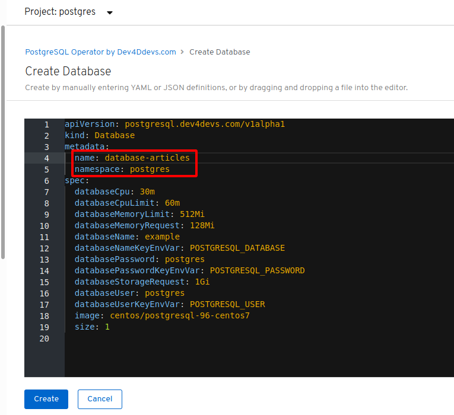

## Reactive Java Microservices on OpenShift 4

This documentation has been tested on CRC (CodeReady Containers) Version 1.7 which includes OpenShift 4.3.1, and on Red Hat OpenShift 4.3 on IBM Cloud (currently in Beta).

---

### 1. Create an OpenShift 4 cluster

Start with these 2 documents to create and get access to an OpenShift 4 environment, but make sure to come back here. Do not follow the links at the end of these instructions ("Continue with ...")!

1. [Get access to an OpenShift cluster](../../documentation/OS4Cluster.md)
    **Note:** Don't continue with the Istio installation, Istio is currently not required! Continue here:
2. [Requirements for Cloud Native Starter on OpenShift](../../documentation/OS4Requirements.md)
    **Note:** Don't follow the "Continue with ..." link at the end of this document, instead return here and continue with the next section!

### 2. Install Prerequisites

The following script will inform about missing tools:

```
$ cd ${ROOT_FOLDER}/reactive
$ ROOT_FOLDER=$(pwd)
$ sh os4-scripts/check-prerequisites.sh
```

### 3. Install Kafka

We will install Kafka via a script using the Strimzi operator:

```
$ sh os4-scripts/deploy-kafka.sh
```
This script will
1. Create a project kafka in OpenShift
1. Install the "strimzi-cluster-operator"
1. Deploy the "my-cluster-entity-operator"
1. Deploy Kafka (3 pods my-cluster-zookeeper, 3 pods my-cluster-kafka)

### 4. Install PostgreSQL

We will install PostgreSQL using the Dev2Devs operator in the OpenShift Web Console

1. Login to/open the OpenShift Web Console (`crc console`).
1. In the 'Administrator' view, in 'Home' -> 'Projects' create a new project 'postgres'.
1. In the 'Administrator' view, in 'Operators' -> 'OperatorHub' filter for 'postgres'.
    Note: If you don't see the 'Operator' menu, refresh your browser.
    
1. Click on 'PostgreSQL Operator by Dev4Ddevs.com', continue on the 'Show Community Operator' dialog, then click 'Install'.
1. 'Installation Mode' is 'A specific namespace on the cluster', namespace is the 'postgres' project. All else should remain default. Click 'Subscribe'.
    
1. In the 'Installed Operators' view in project 'postgres' wait until the status of the 'PostgreSQL Operator by Dev4Ddevs.com' shows a green checkmark and 'InstallSucceeded'. 
    
1. Click on the operator name, then click 'Create Instance' for the 'Database Database' API.
1. In the YAML file change 'metadata.name' from 'database' to 'database-articles'. Make sure 'metadata.namespace' is 'postgres'. Click 'Create'.
    
1. Go to 'Administrator' view, 'Workloads' -> 'Pods' and check that you see two Running pods, one for database and one for the operator.

### 5. Deploy and run the sample 

```
$ cd ${ROOT_FOLDER}
$ sh os4-scripts/deploy-articles-reactive-postgres.sh
$ sh os4-scripts/deploy-authors.sh
$ sh os4-scripts/deploy-web-api-reactive.sh
$ sh os4-scripts/deploy-web-app-reactive.sh
$ sh os4-scripts/show-urls.sh
```
- To see an example, open the web-app service in your browser. 
- Then create a new article, either with the API explorer of the articles-reactive service or the respective curl command. (See the output of 'show-urls.sh' for the URL and the curl sample.) 
Every time you create a new article, the articles list of the web app will automatically show the newest 5 articles. 


## Cleanup

To delete the project including Kafka and Postgres from OpenShift, run:


```
$ cd ${ROOT_FOLDER}
$ sh os4-scripts/cleanup.sh
```
