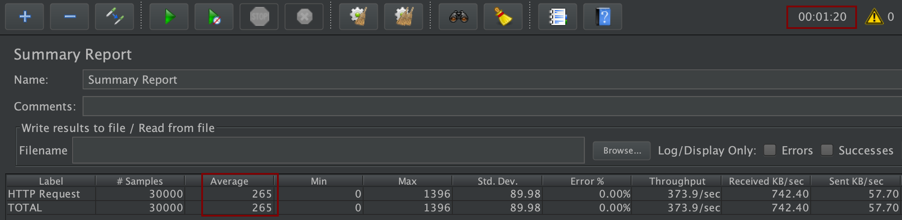
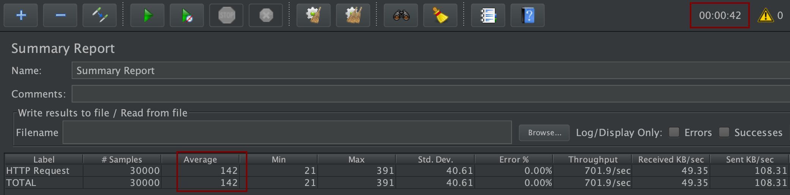

## Persistence Performance Tests

This page describes the results of load tests to compare the efficiency of reactive programming with imperative programming when reading data from a Postgres database.

**TL;DR**

The reactive stack of this sample provides responsive times that take less than half of the time compared to the imperative stack: Reactive: 142 ms (0:42 min total) - Imperative: 265 ms (1:20 min total).

### Scenario

The project contains the endpoint '/articles' of the articles service in two different versions, one uses imperative code, the other one reactive code.

**Version 1: Imperative / Synchronous**

* The REST endpoints of the articles service has been implemented with JAX-RS (synchronous)
* The articles service reads ten articles from Postgres via Panache (see Quarkus guide [Simplified Hibernate ORM with Panache](https://quarkus.io/guides/hibernate-orm-panache)).

**Version 2: Reactive / Aynchronous**

* The REST endpoints of the articles service has been implemented with Vert.x, CompletionStage and CompletableFuture asynchronously
* The articles service reads ten articles asynchronously from Postgres via Vert.x Axle (see Quarkus guide [Reactive SQL Clients](https://quarkus.io/guides/reactive-sql-clients))

JMeter is used to generate load. In both cases 100 threads (users) invoke 300 times the 'articles' endpoint of the articles service (30.000 requests in total).

### Running the tests with JMeter

**Version 1: Imperative / Synchronous**

```
$ cd ${ROOT_FOLDER}
$ minikube delete
$ sh scripts/start-minikube.sh
$ sh scripts/deploy-kafka.sh
$ sh scripts/deploy-postgres.sh
$ sh scripts/deploy-articles-synch-postgres.sh
```

Test and warm up '/v1/articles'.

Open [persistence.jmx](persistence.jmx) and enter 1. Minikube IP, 2. web-api port and 3. endpoint '/v1/articles'.

**Version 2: Reactive / Aynchronous**

```
$ cd ${ROOT_FOLDER}
$ minikube delete
$ sh scripts/start-minikube.sh
$ sh scripts/deploy-kafka.sh
$ sh scripts/deploy-postgres.sh
$ sh scripts/deploy-articles-reactive-postgres.sh
```

Test and warm up '/v2/articles'.

Open [persistence.jmx](persistence.jmx) and enter 1. Minikube IP, 2. web-api port and 3. endpoint '/v2/articles'.

### Results

**Version 1: Imperative / Synchronous**

<kbd></kbd>

**Version 2: Reactive / Aynchronous**

<kbd></kbd>