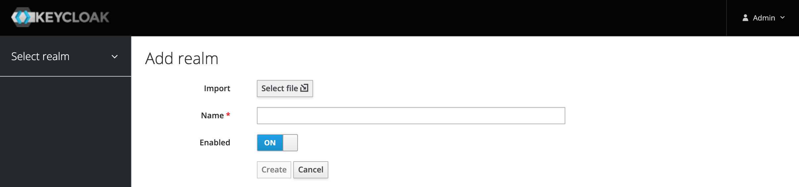
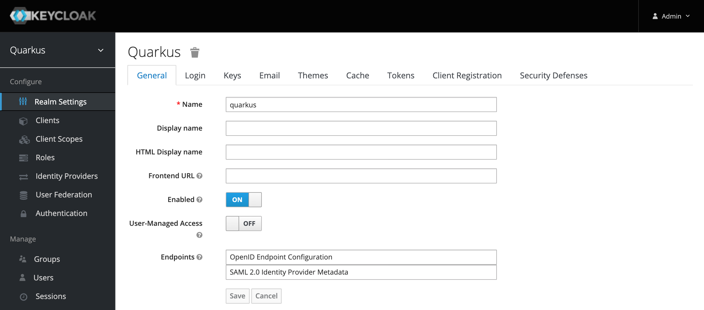

# Setup Keycloak

## Import the existing realm configuration

### STEP 1: Create new realm

### STEP 2: Import file `quarkus-realm.json`

### STEP 3: Verify the name `quarkus`of the imported realm

### STEP 4: Verify the imported realm settings

## Users and role mappings in existing realm

### STEP 1: Press `view all users`

You should see following users: `admin`, `alice`, `jdoe`

### STEP 2: Verify the role mapping

