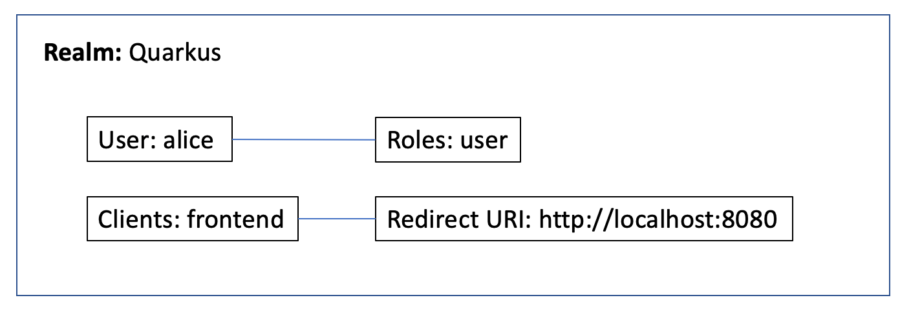
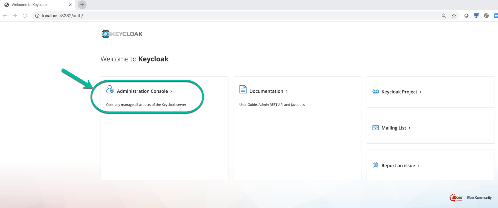
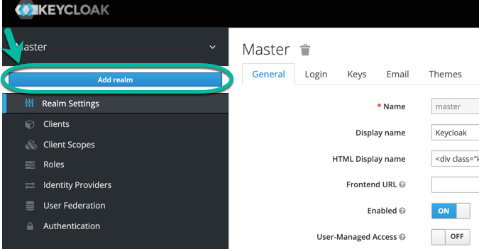
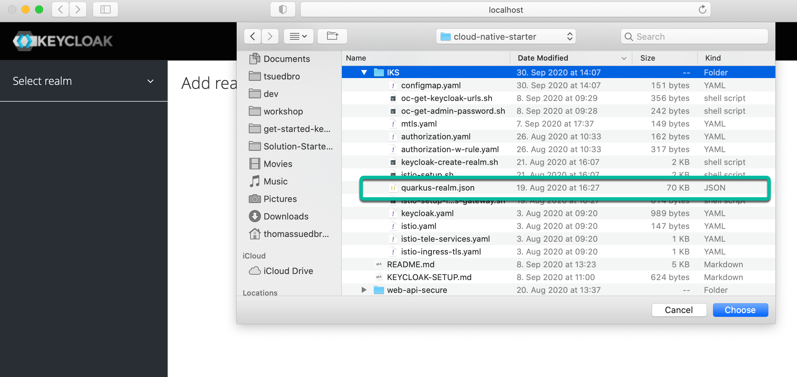
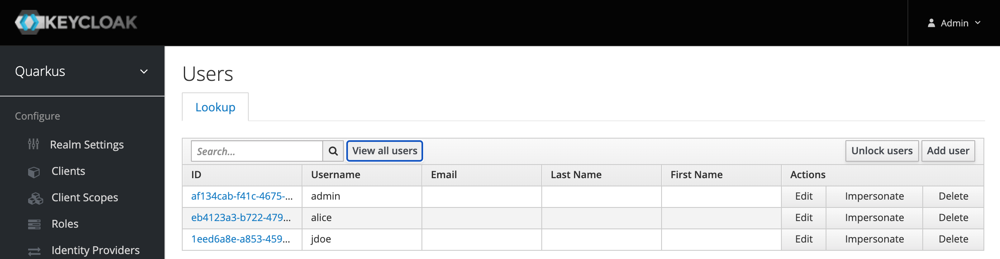
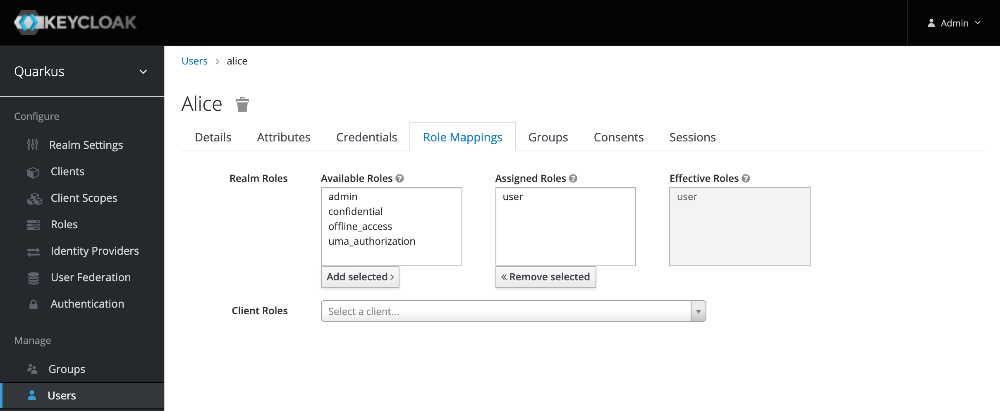

# Setup Keycloak

In this part we will setup Keycloak. We will run a local Keycloak Docker container and reuse an existing realm configuration.

The image below shows the relevant elements we will use later.



---

### Step 1: Start Keycloak Docker image local

Open a terminal session and enter:

```sh
$ docker run -it -e KEYCLOAK_USER=admin -e KEYCLOAK_PASSWORD=admin -p 8282:8080 jboss/keycloak:9.0.2
```
### Step 2: Import the existing realm configuration

1. Open the Keycloak in a browser select the Administration Console

Use following URL:

```sh
http://localhost:8282/
```



2. Login to using the URL in your browser with `user/admin` and `password/admin`

3. Select _Add realm_



3. Choose for import _Select file_ and open the `quarkus-realm.json`.



## Users and role mappings in existing realm

### STEP 1: Press `view all users`

You should see following users: `admin`, `alice`, `jdoe`



### STEP 2: Verify the role mapping


