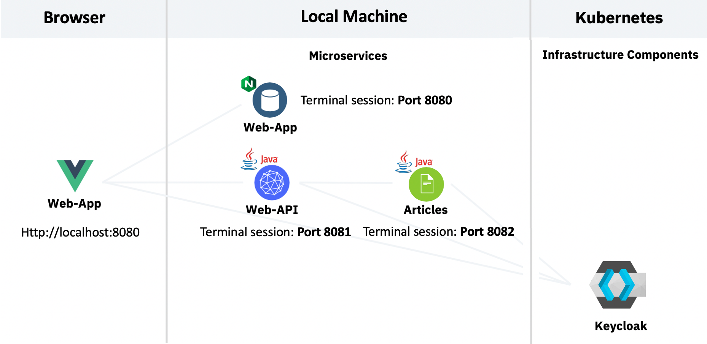
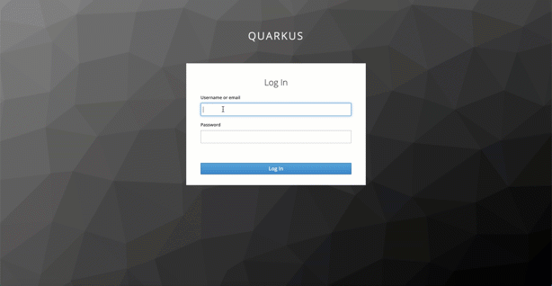

## Authentication and Authorization

This part of the project demonstrates how to do authentication and authorization in Quarkus applications and web applications. [Keycloak](https://www.keycloak.org/) is used as OpenID Connect provider.

### Documentation

There are blog entries and a workshop that describe how this project has been implemented:

* [Setting up Keycloak in OpenShift](http://heidloff.net/article/setting-up-keycloak-openshift/)
* [Security in Quarkus Applications via Keycloak](http://heidloff.net/article/security-quarkus-applications-keycloak/)
* [Securing Vue.js Applications with Keycloak](http://heidloff.net/article/securing-vue-js-applications-keycloak/)
* [Hands on Workshop (GitBook)](https://ibm-developer.gitbook.io/get-started-with-security-for-your-java-microservi//)

The workshop linked above is a description on how to use the code.

### Scenario

In order to demonstrate the security features, a sample application is used which displays links to articles in a web application only when a user is logged in and has the role 'user'.

The web application invokes the web-api service and then invokes the articles service. The web-api service also provides an endpoint to read the current user name.

This diagram shows the architecture:

<kbd></kbd>

This is a gif of the web application:

<kbd></kbd>

### Setup

At this point the code is run locally which means you need a JVM and Maven. For the web application you also need yarn. In this setup, Keycloak is installed on a Red Hat OpenShift cluster on IBM Cloud.

#### Step 0: Clone the Repo

```sh
$ git clone https://github.com/IBM/cloud-native-starter.git
$ cd security
```

#### Step 1: Create an OpenShift cluster, e.g. on the IBM Cloud

https://cloud.ibm.com/kubernetes/catalog/create?platformType=openshift

#### Step 2: Login in a Terminal

Get the login command from the OpenShift Web Console, e.g.

```sh
$ oc login --token=OnMwHZ4FLgZnWdcxxxxxxxxxxxxxxx --server=https://c107-e.us-south.containers.cloud.ibm.com:30058
```

#### Step 3: Install the Keycloak Operator

Follow these steps to install the operator via the OpenShift Web Console: [documentation](
https://www.keycloak.org/getting-started/getting-started-operator-openshift
).

Alternatively you can install it programmatically:

```sh
$ oc new-project keycloak
$ oc create -f keycloak-operator.yaml
```

#### Step 4: Create a Keycloak Cluster

You can create the Keycloak cluster either in the OpenShift Web Console or programmatically:

```sh
$ oc create -f keycloak.yaml
$ oc get keycloak/example-keycloak -o jsonpath='{.status.ready}'
```

#### Step 5: Get the admin password and Keycloak URLs

* Get admin password:

```sh
$ oc get secret credential-example-keycloak -o go-template='{{range $k,$v := .data}}{{printf "%s: " $k}}{{if not $v}}{{$v}}{{else}}{{$v | base64decode}}{{end}}{{"\n"}}{{end}}'
```

* Get Keycloak URLs:

```sh
$ KEYCLOAK_URL=https://$(oc get route keycloak --template='{{ .spec.host }}')/auth &&
echo "" &&
echo "Keycloak:                   $KEYCLOAK_URL" &&
echo "Keycloak Admin Console:     $KEYCLOAK_URL/admin" &&
echo "Keycloak Account Console:   $KEYCLOAK_URL/realms/myrealm/account" &&
echo "Keycloak [auth-server-url]: $KEYCLOAK_URL/realms/quarkus"
```

#### Step 6: Import Realm in Keycloak

Open the Keycloak console and log in as admin. Then import [quarkus-realm.json](quarkus-realm.json). Check the [setup Keycloak documentation](./BackupFiles/KEYCLOAK-SETUP.md) for how to import the realm.

#### Step 7: Configure articles-secure

Insert your the `auth-server-url` URL of your Keycloak instance in [application.properties](articles-secure/src/main/resources/application.properties). Therefore you use the Keycloak URL of the output in your terminal.

```sh
Keycloak [auth-server-url]: https://YOUR_URL/auth/realms/quarkus
```

#### Step 8: Configure web-api-secure

Insert your the `auth-server-url` URL you know from above in [application.properties](web-api-secure/src/main/resources/application.properties). 

#### Step 9: Configure web-app

Now insert following Keycloak URL output from your terminal session in [main.js](web-app/src/main.js). 

```sh
Keycloak: https://YOUR_URL/auth
```

Now insert `Keycloak URL`/auth in `main.js`.

```JavaScript
if (currentHostname.indexOf('localhost') > -1) {
  urls = {
    api: 'http://localhost:8081/',
    login: 'https://YOUR_URL/auth' // insert your http or https://<KeycloakURL>/auth
  }
  store.commit("setAPIAndLogin", urls);
}
```

#### Step 10: Run web-app

Run first terminal (on port 8080):

```sh
$ cd security/web-app
$ yarn install
$ yarn serve
```

#### Step 11: Run web-api

Run second terminal (on port 8081):

```sh
$ cd security/web-api-secure
$ mvn clean package quarkus:dev
```

#### Step 12: Run articles-secure

Run third terminal (on port 8082):

```sh
$ cd security/articles-secure
$ mvn clean package quarkus:dev
```

#### Step 13: Open Web App

http://localhost:8080

Log in with the test user: alice, alice
