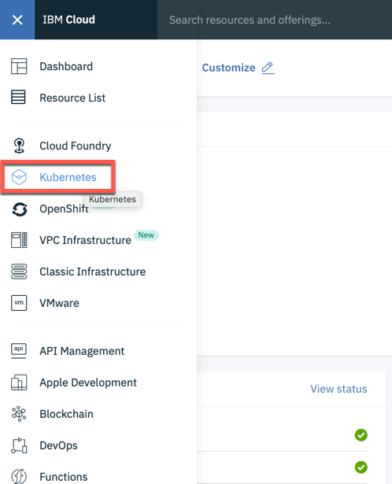
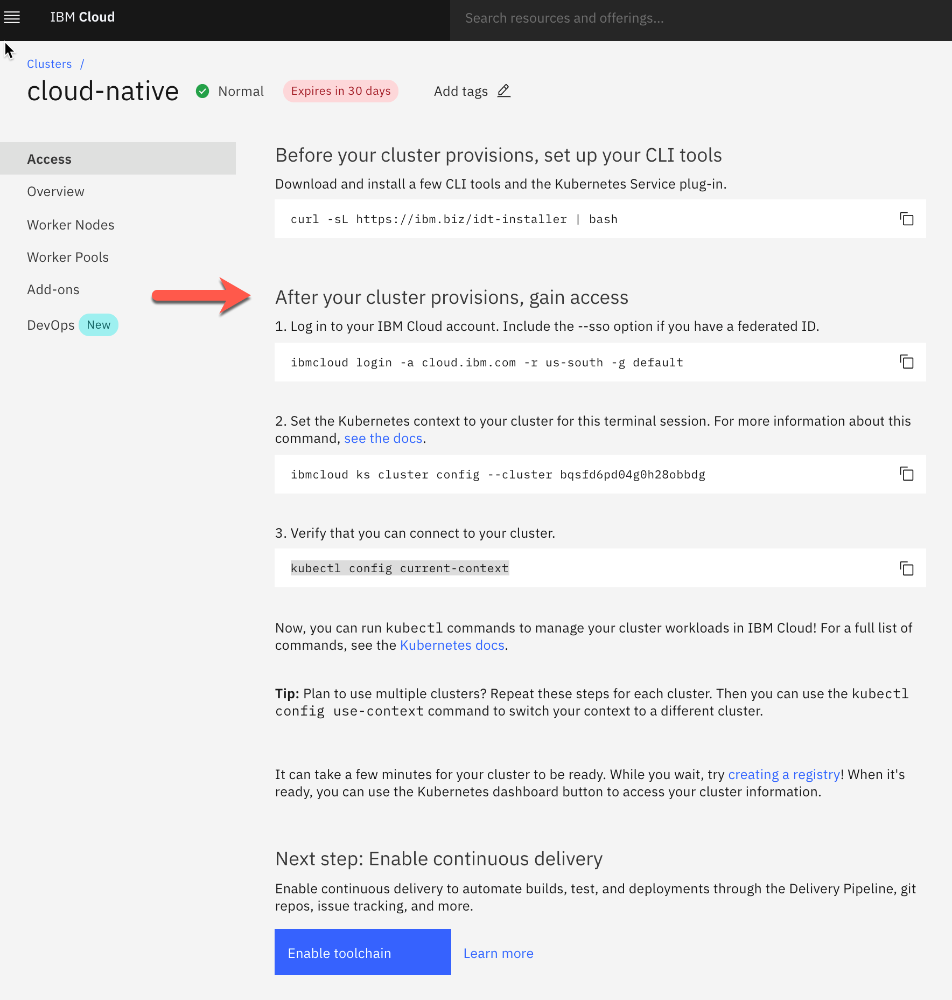

# Lab 1 - Install Prerequisites

## Access to the IBM Cloud

An [IBM Cloud account](https://cloud.ibm.com/registration) is needed. 

In order to run this workshop you have two options and in both options you will **create no cost**, when you follow the written instructions and you use the free Kubernetes Cluster.

1. You need a promo/feature code for a IBM Cloud **Trial** account. You will get such promo/feature code when you attend that hands-on workshop.

2. You create a IBM Lite Account and upgrade your account to a **Pay-As-You-Go** account by using your credit card. ([Account Types](https://cloud.ibm.com/docs/account?topic=account-accounts))

We will use the following IBM Cloud Services in this hands-on workshop:

* [IBM Cloud Kubernetes Service](https://cloud.ibm.com/docs/containers?topic=containers-getting-started#getting-started)
* [IBM Cloud Container Registry Service](https://cloud.ibm.com/docs/services/Registry?topic=registry-getting-started#getting-started)


Follow the [instructions](0-create-kubernetes-cluster.md) to set up a free Kubernetes cluster and configure the IBM Cloud Container Registry.

## Tools

In order to complete the workshop, you need to install [Docker Desktop](https://docs.docker.com/install/). Docker Desktop is available for Mac and Windows and the Docker Engine can be run natively on Linux.

Several other tools are needed. There are different options to install these tools.

---

### Tools - Option 1: Prebuilt Image with local Code

There is an image on DockerHub with all required tools. In order to use local IDEs and editors to modify code and configuraton files a Docker volume is used. This option  works only for Mac and Linux.

#### Step 1: Run these commands in a terminal

```
$ git clone https://github.com/IBM/cloud-native-starter
$ cd cloud-native-starter
$ ROOT_FOLDER=$(pwd)
$ docker run -v $ROOT_FOLDER/:/cloud-native-starter -it --rm tsuedbroecker/cns-workshop-tools:v1
```
_Note:_ With the `--rm` option in the docker run command the container is deleted once you exit. This is intended.

#### Step 2: Inside your running Docker image you can access your the local github project 

```
root@3f46c41f7303:/usr/local/bin# cd /cloud-native-starter/
root@3f46c41f7303:/cloud-native-starter# ls
root@3f46c41f7303:/cloud-native-starter# ROOT_FOLDER=$(pwd)
```

#### Step 3: Verfiy the tool prerequisites on for the workshop

```
root@3f46c41f7303:/cloud-native-starter# chmod u+x iks-scripts/*.sh
root@3f46c41f7303:/cloud-native-starter# chmod u+x scripts/*.sh
root@3f46c41f7303:/cloud-native-starter# ./iks-scripts/check-prerequisites.sh
```

#### Step 4: Move on with [Verify Access your free Kubernetes Cluster on the IBM Cloud](./1-prereqs.md#verify-access-to-kubernetes-on-the-ibm-cloud)


### Tools - Option 2: Prebuilt Image with Code in Container

There is an image on DockerHub with all required tools. This option works for Mac, Linux and Windows. To get started as quickly as possible, use this image.

#### Step 1: Run this command in a terminal

```
$ docker run -ti tsuedbroecker/cns-workshop-tools:v1
```
_Note:_ If you using Windows you also need to download or clone the project to your local workstation for the upcoming Docker and Java lab, because you can't use Docker in the 'cns-workshop-tools' Docker image.

#### Step 2: After the container has been started, run these commands inside your running Docker image to get the lastest version of the workshop:

```
root@3f46c41f7303:/usr/local/bin# cd /
root@3f46c41f7303:/usr/local/bin# git clone https://github.com/IBM/cloud-native-starter.git
root@3f46c41f7303:/usr/local/bin# cd cloud-native-starter
root@3f46c41f7303:/usr/local/bin# ROOT_FOLDER=$(pwd)
```

#### Step 3: Verfiy the tool prerequisites on for the workshop

```
root@3f46c41f7303:/cloud-native-starter# chmod u+x iks-scripts/*.sh
root@3f46c41f7303:/cloud-native-starter# chmod u+x scripts/*.sh
root@3f46c41f7303:/cloud-native-starter# ./iks-scripts/check-prerequisites.sh
```

#### Step 4: Move on with [Verify Access to Kubernetes on the IBM Cloud](./1-prereqs.md#verify-access-to-kubernetes-on-the-ibm-cloud)


### Tools - Option 3: Install Tools on your Notebook

This approach works only for Mac and Linux (see this [article](https://suedbroecker.net/2019/08/27/definition-of-a-dockerfile-to-use-bash-scripts-on-a-windows-10-machine-for-our-cloud-native-starter-workshop/) for more).

#### Step 1: Install the following tools:

- IDE or Editor: [Visual Studio Code](https://code.visualstudio.com/), for example 
- [git](https://git-scm.com/book/en/v2/Getting-Started-Installing-Git) 
- [curl](https://curl.haxx.se/download.html)
- [IBM Cloud CLI](https://cloud.ibm.com/docs/home/tools)
  [IBM Cloud CLI releases](https://github.com/IBM-Cloud/ibm-cloud-cli-release/releases)
- [Docker](https://docs.docker.com/v17.12/install/)
- [kubectl](https://kubernetes.io/docs/tasks/tools/install-kubectl/)


#### Step 2: Get the code:

```
$ git clone git clone https://github.com/IBM/cloud-native-starter
$ cd cloud-native-starter
$ ROOT_FOLDER=$(pwd)
```

#### Step 3: Verify the tool prerequisites on for the workshop

```
$ chmod u+x iks-scripts/*.sh
$ chmod u+x scripts/*.sh
$ ./iks-scripts/check-prerequisites.sh
```

#### Step 3: Move on with [Verify Access to Kubernetes on the IBM Cloud](./1-prereqs.md#verify-access-to-kubernetes-on-the-ibm-cloud)

---

## Verify Access to Kubernetes on the IBM Cloud

#### Step 1: After you've created a new free Kubernetes cluster

1. Logon to the IBM Cloud web console

2. Select **Kubernetes** in the menu



3. Chose **Clusters** and click on your **Kubernetes cluster**


4. Select the tab **Access**


5. Follow the steps in the **Access** tab, by starting from **After your cluster provision ..** and inserting the commands into your terminal session.



---

:star: __Continue with [Lab 2 - Running the Java Microservice locally](./2-docker.md#lab-2---running-the-java-microservice-locally)__ 