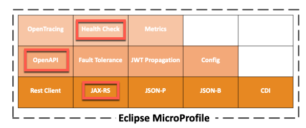
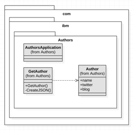
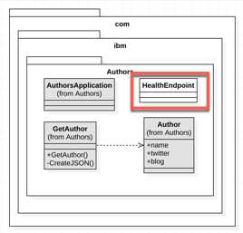
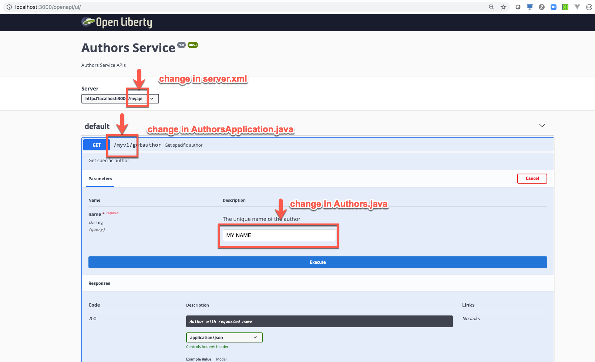
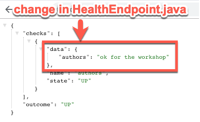

# Lab 3 - Understanding the Java Implementation

> _Note:_ This lab is structured in **understanding** and **hands-on tasks**. 
The hands-on tasks are starting from chapter [Hands-on tasks - Change the code of the authors microservice and run the service in a container **locally**](#lab-hands-on) in that lab.

## 1. Usage of Maven for Java

We begin with the [Maven](https://maven.apache.org/) part for our Java project.

> Maven Apache Maven is a software project management and comprehension tool. Based on the concept of a **project object model** (POM), Maven can manage a project's build, reporting and documentation from a central piece of information.

In the pom file we define the configuration of our Java project with dependencies, build, and properties including the compiler information as you can see in the [pom file](../authors-java-jee/pom.xml) below.

```xml
<project xmlns="http://maven.apache.org/POM/4.0.0"
	xmlns:xsi="http://www.w3.org/2001/XMLSchema-instance"
	xsi:schemaLocation="http://maven.apache.org/POM/4.0.0 http://maven.apache.org/xsd/maven-4.0.0.xsd">
	<modelVersion>4.0.0</modelVersion>
	<groupId>com.ibm.cloud</groupId>
	<artifactId>authors</artifactId>
	<version>1.0-SNAPSHOT</version>
	<packaging>war</packaging>

	<dependencies>
		<dependency>
			<groupId>org.eclipse.microprofile</groupId>
			<artifactId>microprofile</artifactId>
			<version>3.0</version>
			<scope>provided</scope>
			<type>pom</type>
		</dependency>
	</dependencies>

	<build>
		<finalName>authors</finalName>
	</build>

	<properties>
		<maven.compiler.source>1.8</maven.compiler.source>
		<maven.compiler.target>1.8</maven.compiler.target>
		<failOnMissingWebXml>false</failOnMissingWebXml>
		<project.build.sourceEncoding>UTF-8</project.build.sourceEncoding>
	</properties>
</project>
```

_REMEMBER:_ We use this pom file to build our Authors service with `RUN mvn -f /usr/src/app/pom.xml clean package` inside our **Build environment container**.

```dockerfile
FROM maven:3.5-jdk-8 as BUILD
 
COPY src /usr/src/app/src
COPY pom.xml /usr/src/app
RUN mvn -f /usr/src/app/pom.xml clean package
```

## 2. Configuration the Open Liberty Server

Our Authors microservice will run on an OpenLiberty Server in a container on Kubernetes.

We need to configure the OpenLiberty server with a [server.xml](../authors-java-jee/liberty/server.xml) file. For our Java implementation we decided to use MicroProfile and within the feature definition in the server.xml we provide this information to our server with the entry `microProfile-3`.
The server must be reached in the network. Therefore we define the httpEndpoint including httpPort we use for our microservice. For configuration details take a look into the [openliberty documentation](https://openliberty.io/docs/ref/config/).

_IMPORTANT:_ We should remember that this port (`httpPort="3000"`) must be exposed in the Dockerfile for our container and mapped inside the Kubernetes deployment configuration.

Also the name of the executable web application is definied in the server.xml.

```xml
<?xml version="1.0" encoding="UTF-8"?>
<server description="OpenLiberty Server">
	
    <featureManager>
        <feature>microProfile-3</feature>
    </featureManager>

    <httpEndpoint id="defaultHttpEndpoint" host="*" httpPort="3000" httpsPort="9443"/>

    <webApplication location="authors.war" contextRoot="api"/>

</server>
```

_Note:_ Later we will change the **contextRoot**.

## 3. Implementation of the REST GET endpoint with MicroProfile

### 3.1 MicroProfile basics

Some definitions:

> Microservice architecture is a popular approach for building cloud-native applications in which each capability is developed as an independent service. It enables small, autonomous teams to develop, deploy, and scale their respective services independently.

> Eclipse MicroProfile is a modular set of technologies designed so that you can write cloud-native Java™ microservices. MicroProfile utilizes some of existing tools (JAX-RS, CDI, JSON-P for example), and combine them with new ones to create a baseline platform optimized for a microservice architecture. 

In the following image you see a list of MicroProfile specifications, we will use the red marked ones.




### 3.2 Java classes needed to expose the Authors service

For the Authors service to expose the REST API we need to implement three classes:

* [AuthorsApplication](../authors-java-jee/src/main/java/com/ibm/authors/AuthorsApplication.java) class repesents our web application.
* [Author](../authors-java-jee/src/main/java/com/ibm/authors/Author.java) class repesents the data structure we use for the Author.
* [GetAuthor](../authors-java-jee/src/main/java/com/ibm/authors/GetAuthor.java) class repesents the REST API.




#### 3.2.1 **Class AuthorsApplication**

Our web application does not implement any business or other logic, it simply needs to run on a server with no UI. The AuthorsApplication class extends the [javax.ws.rs.core.Application](https://www.ibm.com/support/knowledgecenter/en/SSEQTP_9.0.0/com.ibm.websphere.base.doc/ae/twbs_jaxrs_configjaxrs11method.html) class to do this. 

The `AuthorsApplication` class provides access to the classes from the `com.ibm.authors` package at runtime.
The implementation of the interface class _Application_ enables the usage of easy REST implementation provided by MircoProfile. 

With `@ApplicationPath` from MicroProfile we define the base path of the application.

```java
package com.ibm.authors;

import javax.ws.rs.core.Application;
import javax.ws.rs.ApplicationPath;

@ApplicationPath("v1")
public class AuthorsApplication extends Application {
}
```

_Note:_ Later we will change the ApplicationPath in this class.

#### 3.2.2 Class Author

This class simply repesents the data structure we use for the [Author](../src/main/java/com/ibm/authors/Author.java). No MircoProfile feature is used here.

```java
package com.ibm.authors;

public class Author {
public String name;
public String twitter;
public String blog;
}
```

#### 3.2.3 Class GetAuthor

This class implements the REST API response for our Authors microservice. We implement the REST endpoint using the [MicroProfile REST Client](https://github.com/eclipse/microprofile-rest-client/blob/master/README.adoc). We use  `@Path` and `@Get` statements from [JAX-RS](https://jcp.org/en/jsr/detail?id=339) for the REST endpoint and for the [OpenAPI](https://www.openapis.org/) documentation we use `@OpenAPIDefinition` statements. When you add [MicroProfile with OpenAPI](https://github.com/eclipse/microprofile-open-api), OpenAPI always creates automatically an OpenAPI explorer for you.

_REMEMBER:_ In the server.xml configuration we added **MicroProfile** to the Open Liberty server as a feature, as you see in the code below.

```xml
<featureManager>
        <feature>microProfile-3</feature>
        ....
</featureManager> 
```

With the combination of the server.xml and our usage of MicroProfile features in the GetAuthor class we will be able to access an OpenAPI explorer with this URL `http://host:http_port/openapi` later.

This is the source code of the [GetAuthors class](../src/main/java/com/ibm/authors/GetAuthor.java) with the mentioned MicroProfile features:

```java
@ApplicationScoped
@Path("/getauthor")
@OpenAPIDefinition(info = @Info(title = "Authors Service", version = "1.0", description = "Authors Service APIs", contact = @Contact(url = "https://github.com/nheidloff/cloud-native-starter", name = "Niklas Heidloff"), license = @License(name = "License", url = "https://github.com/nheidloff/cloud-native-starter/blob/master/LICENSE")))
public class GetAuthor {

	@GET
	@APIResponses(value = {
		@APIResponse(
	      responseCode = "404",
	      description = "Author Not Found"
	    ),
	    @APIResponse(
	      responseCode = "200",
	      description = "Author with requested name",
	      content = @Content(
	        mediaType = "application/json",
	        schema = @Schema(implementation = Author.class)
	      )
	    ),
	    @APIResponse(
	      responseCode = "500",
	      description = "Internal service error"  	      
	    )
	})
	@Operation(
		    summary = "Get specific author",
		    description = "Get specific author"
	)
	public Response getAuthor(@Parameter(
            description = "The unique name of the author",
            required = true,
            example = "Niklas Heidloff",
            schema = @Schema(type = SchemaType.STRING))
			@QueryParam("name") String name) {
		
			Author author = new Author();
			author.name = "Niklas Heidloff";
			author.twitter = "https://twitter.com/nheidloff";
			author.blog = "http://heidloff.net";

			return Response.ok(this.createJson(author)).build();
	}

	private JsonObject createJson(Author author) {
		JsonObject output = Json.createObjectBuilder().add("name", author.name).add("twitter", author.twitter)
				.add("blog", author.blog).build();
		return output;
	}
}
```

_Note:_ Later we will change the return values for the response in the local source code.

### 3.3 Supporting live and readiness probes in Kubernetes with HealthCheck

We have added the class HealthEndpoint to the Authors package as you see in the following diagram.



We want to support this [Kubernetes function](https://github.com/OpenLiberty/guide-kubernetes-microprofile-health#checking-the-health-of-microservices-on-kubernetes):

> Kubernetes provides liveness and readiness probes that are used to check the health of your containers. These probes can check certain files in your containers, check a TCP socket, or make HTTP requests. MicroProfile Health exposes readiness and liveness endpoints on your microservices. Kubernetes polls these endpoints as specified by the probes to react appropriately to any change in the microservice’s status.

For more information check the [Kubernetes Microprofile Health documentation](https://openliberty.io/guides/kubernetes-microprofile-health.html) and the documentation on [GitHub](https://github.com/eclipse/microprofile-health).

This is the implementation of the Health Check for Kubernetes in the [HealthEndpoint class](../authors-java-jee/src/main/java/com/ibm/authors/HealthEndpoint.java) of the Authors service:

```java
@Readiness
public class HealthEndpoint implements HealthCheck {

    @Override
    public HealthCheckResponse call() {
        return HealthCheckResponse.named("authors").withData("authors", "ok").up().build();
    }
}
```

_Note:_ Later we will change return information of the **HealthCheckResponse**.

This HealthEndpoint is configured in the Kubernetes deployment yaml. In the following yaml extract we see the `livenessProbe` definition.

```yaml
    livenessProbe:
      exec:
        command: ["sh", "-c", "curl -s http://localhost:3000/"]
      initialDelaySeconds: 20
    readinessProbe:
      exec:
        command: ["sh", "-c", "curl -s http://localhost:3000/health | grep -q authors"]
      initialDelaySeconds: 40
```

## Hands-on tasks - Change the code of the authors microservice and run the service in a container locally <a name="lab-hands-on"></a>

#### Step 1:
That lab does only need Docker and a terminal session on your local machine.

```sh 
$ cd $ROOT_FOLDER/authors-java-jee
$ docker build -t authors .
$ docker run -i --rm -p 3000:3000 authors
```

#### Step 2: Change the contextRoot in [server.xml](../authors-java-jee/liberty/server.xml) to something similar like "myapi".

Open the file ```cloud-native-starter/authors-java-jee/liberty/server.xml``` in a editor and change the value.

```xml
<?xml version="1.0" encoding="UTF-8"?>
<server description="OpenLiberty Server">
	
    <featureManager>
        <feature>microProfile-3</feature>
    </featureManager>

    <httpEndpoint id="defaultHttpEndpoint" host="*" httpPort="3000" httpsPort="9443"/>

    <webApplication location="authors.war" contextRoot="myapi"/>

</server>
```

### Step 3: Change the @ApplicationPath in the class [AuthorsApplication.java](../authors-java-jee/src/main/java/com/ibm/authors/AuthorsApplication.java) something similar like "myv1".

Open the file ```cloud-native-starter/authors-java-jee/src/main/java/com/ibm/authors/AuthorsApplication.java``` in a editor and change the value.

```java
package com.ibm.authors;

import javax.ws.rs.core.Application;
import javax.ws.rs.ApplicationPath;

@ApplicationPath("myv1")
public class AuthorsApplication extends Application {
}
```

#### Step 4: In the class [GetAuthor.java](../authors-java-jee/src/main/java/com/ibm/authors/GetAuthor.java) change the returned author name to something similar like "MY NAME".

Open the file ```cloud-native-starter/authors-java-jee/src/main/java/com/ibm/authors/GetAuthor.java``` in a editor and change the value.

``` java
public Response getAuthor(@Parameter(
            description = "The unique name of the author",
            required = true,
            example = "MY NAME",
            schema = @Schema(type = SchemaType.STRING))
			@QueryParam("name") String name) {
		
			Author author = new Author();
			author.name = "MY NAME";
			author.twitter = "https://twitter.com/MY NAME";
			author.blog = "http://MY NAME.net";

			return Response.ok(this.createJson(author)).build();
	}
```

#### Step 5: In the class [HealthEndpoint.java](../authors-java-jee/src/main/java/com/ibm/authors/HealthEndpoint.java) change the returned information to something similar like "ok for the workshop".

```java
@Health
@ApplicationScoped
public class HealthEndpoint implements HealthCheck {

    @Override
    public HealthCheckResponse call() {
        return HealthCheckResponse.named("authors").withData("authors", "ok for the workshop").up().build();
    }
}
```

#### Step 6: To test and see how the code works you can run the code locally as a Docker container:

```
$ cd $ROOT_FOLDER/authors-java-jee
$ docker build -t authors .
$ docker run -i --rm -p 3000:3000 authors
```

#### Step 7: Open the swagger UI of the mircoservice in a browser and verfiy the changes

```http://localhost:3000/openapi/ui/```



#### Step 7: Open the health check of the mircoservice in a browser and verfiy the changes

```http://localhost:3000/health```



---

:star: __Continue with [Lab 4 - Deploying to Kubernetes](./4-kubernetes.md)__