# Lab 4 - Deploying to Kubernetes

In this lab we will work in the Kubernetes Web Console and with the Kubernetes CLI. The following image is a simplified overview of the topics of that lab.

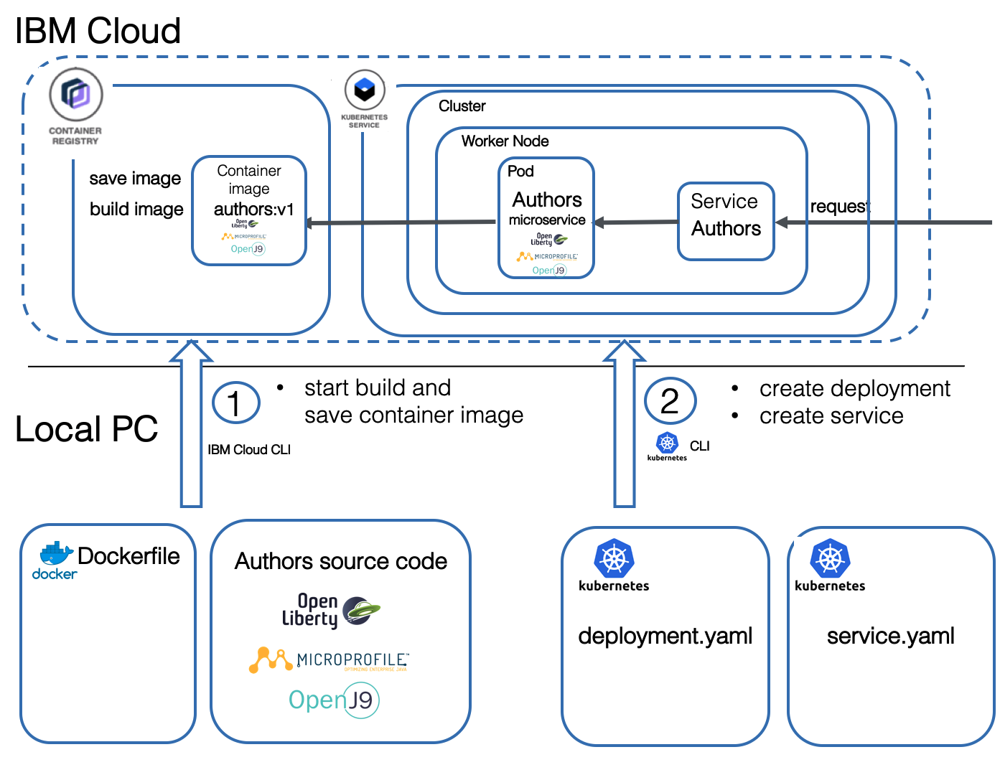

This lab has two parts: 

1. Start build and save the container image

2. Deploy the application and expose the service
    * We will define and apply a deployment configuration (yaml) to create a Pod with our microservice
    * We will define a service which routes requests to the Pod with our microservice

The following gif is an animation of the simplified steps above in a sequence.

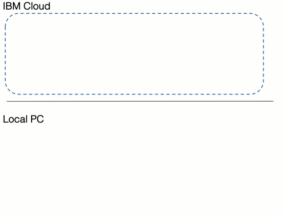


# 1. Build and save the container image

### [Tools - Option 1](./1-prereqs.md#tools---option-1-prebuilt-image-with-local-code)

Step |  |
--- | --- 
1 | Ensure you have downloaded the git first into the running Docker image. `$ git clone https://github.com/IBM/cloud-native-starter.git`
2 |  Ensure you have open Docker image in a interactive terminal session and navigate to the folder `cloud-native-starter/authors-java-jee`
3 | [Move on with the lab](./4-kubernetes.md#1-build-and-save-the-container-image).


### [Tools - Option 2](./1-prereqs.md#tools---option-2-prebuilt-image-with-code-in-container)

Step |  |
--- | --- 
1 | Ensure you have downloaded the git first into the running Docker image. `$ git clone https://github.com/IBM/cloud-native-starter.git` 
2 |  Ensure you have open Docker image in a interactive terminal session and navigate to the folder `cloud-native-starter/authors-java-jee` **REMINDER:** The code changes from lab 3 you on you local computer, don't exist inside the your running Docker image.
3 | [Move on with the lab](4-kubernetes.md#1-build-and-save-the-container-image).

---

## Step 1: Build and save the container image in the IBM Cloud Container Registry

Now we want to build and save a container image in the IBM Cloud Container Registry. 

1. Ensure you logon on to IBM Cloud.
   REMEMBER: I now from the prerequisites, you can follow the steps in the **Access** tab, by starting from **After your cluster provision ..** and inserting the commands into your terminal session.

    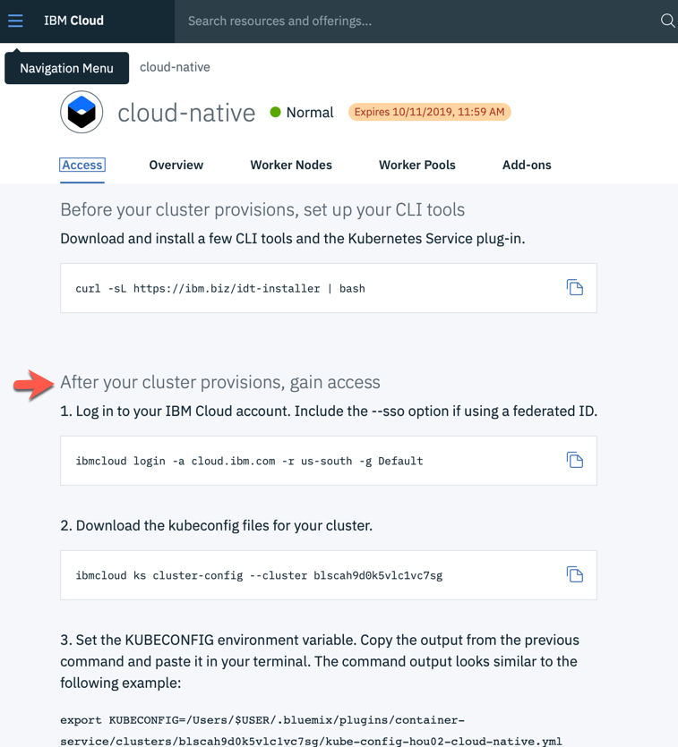

2. Logon to the IBM Cloud Container Registry 

    ```sh
    $ ibmcloud cr login
    ```

2. List you namespaces inside the IBM Cloud Container Registry 

    ```sh
    $ ibmcloud cr namespaces
    ```

    _Sample result outout:_

    ```sh
    $ Listing namespaces for account 'Thomas Suedbroecker's Account' in registry 'us.icr.io'...
    $
    $ Namespace   
    $ cloud-native-suedbro   
    ```

3. Now upload the code and build the container image inside IBM Cloud Container Registry. We use the upper information we got from listing the namespaces.

    ```sh
    $ ibmcloud cr build -f Dockerfile --tag $REGISTRY/$REGISTRY_NAMESPACE/authors:1 .
    ```

    _Sample result values:_

    ```sh
    $ ibmcloud cr build -f Dockerfile --tag us.icr.io/cloud-native-suedbro/authors:1 .
    ```

    _Optional:_ Verify the container upload in the IBM Cloud web UI.

    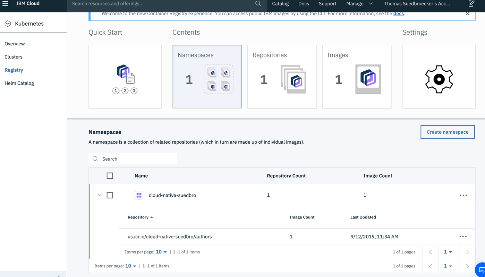

4. List the container images to verify the upload.

    ```sh
    $ ibmcloud cr images
    ```

    _Sample result output:_

    ```sh
    $ Listing images...
    $
    $ Repository                               Tag   Digest         Namespace              Created         Size     Security status   
    $ us.icr.io/cloud-native-suedbro/authors   1     5a86758f1056   cloud-native-suedbro   2 minutes ago   226 MB   3 Issues   
    $
    $ OK
    ```

5. Copy the REPOSITORY path for the uploaded **Authors** container image. In this sample case it would be: ```us.icr.io/cloud-native-suedbro/authors``` and save it somewhere, we need this later in the deployment.yaml configuration.

---

# 2. Apply the deployment.yaml

This deployment will deploy a container to a Pod in Kubernetes.
For more details we use the [Kubernetes documentation](https://kubernetes.io/docs/concepts/workloads/pods/pod-overview/) for Pods.

> A Pod is the basic building block of Kubernetes–the smallest and simplest unit in the Kubernetes object model that you create or deploy. A Pod represents processes running on your Cluster .

Here is a simplified image for that topic. The deployment.yaml file points to the container image that needs to be instantiated in the pod.

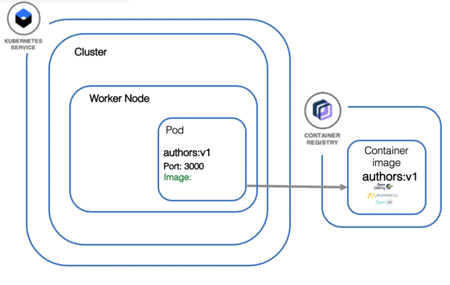

Let's start with the deployment yaml. For more details see the [Kubernetes documentation](https://kubernetes.io/docs/concepts/workloads/controllers/deployment/) for deployments.

Definition of `kind` defines this as a `Deployment` configuration.

```yml
kind: Deployment
apiVersion: apps/v1beta1
metadata:
  name: authors
```

Inside the `spec` section we specify an app name and version label.

```yml
spec:
  ...
  template:
    metadata:
      labels:
        app: authors
        version: v1
```

Then we define a `name` for the container and we provide the container `image` location, e.g. where the container can be found in the **Container Registry**. 

The `containerPort` depends on the port definition inside our Dockerfile and in our server.xml.

We have previously talked about the usage of the HealthEndpoint class for our Authors service and here we see it the `livenessProbe` definition.


```yml
spec:
      containers:
      - name: authors
        image: authors:1
        ports:
        - containerPort: 3000
        livenessProbe:
```

This is the full [deployment.yaml](../deployment/deployment.yaml) file.

```yaml
kind: Deployment
apiVersion: apps/v1beta1
metadata:
  name: authors
spec:
  replicas: 1
  template:
    metadata:
      labels:
        app: authors
        version: v1
    spec:
      containers:
      - name: authors
        image: us.icr.io/cloud-native-suedbro/authors:1
        ports:
        - containerPort: 3000
        livenessProbe:
          exec:
            command: ["sh", "-c", "curl -s http://localhost:3000/"]
          initialDelaySeconds: 20
        readinessProbe:
          exec:
            command: ["sh", "-c", "curl -s http://localhost:3000/health | grep -q authors"]
          initialDelaySeconds: 40
      restartPolicy: Always
```

### [Tools - Option 1](./1-prereqs.md#tools---option-1-prebuilt-image-with-local-code)

Step |  |
--- | --- 
1 | Ensure you have downloaded the git first into the running Docker image. `$ git clone https://github.com/IBM/cloud-native-starter.git`
2 |  Ensure you have open Docker image in a interactive terminal session and navigate to the folder `cloud-native-starter/authors-java-jee`
3 | [Move on with the lab](./4-kubernetes.md#1-build-and-save-the-container-image).


### [Tools - Option 2](./1-prereqs.md#tools---option-2-prebuilt-image-with-code-in-container)

Step |  |
--- | --- 
1 | Ensure you have downloaded the git first into the running Docker image. `$ git clone https://github.com/IBM/cloud-native-starter.git` 
2 |  Ensure you have open Docker image in a interactive terminal session and navigate to the folder `cloud-native-starter/authors-java-jee` **REMINDER:** The code changes from lab 3 you on you local computer, don't exist inside the your running Docker image.
3 | [Move on with the lab](4-kubernetes.md#1-build-and-save-the-container-image).

---

#### Step 1: Apply the deployment

1. Ensure you are in the ```$ROOT_FOLDER/authors-java-jee/deployment```

  ```
  $ cd $ROOT_FOLDER/authors-java-jee/deployment
  ```

2. Open the ```../authors-java-jee/deployment/deployment.yaml``` file with a editor and replace the value for the container image location with the path we got from the IBM Container Registry and just replace the ```authors:1``` text, and add following statement ```imagePullPolicy: Always``` and **save** the file.

_REMEMBER:_ You should have saved the IBM Container Registry information somewhere.

    Before:
    ```yml
    image: authors:1
    ```

    Sample change:
    ```yml
    ...
    image: us.icr.io/cloud-native-suedbro/authors:1
    imagePullPolicy: Always
    ports:
        - containerPort: 3000
    ...
    ```

3. Now we apply the deployment we will create the new **Authors** Pod.

    ```sh
    $ kubectl apply -f deployment.yaml
    ```

#### Step 2: Verify the deployment with kubectl

1. Insert this command and verify the output.

    ```sh
    $ kubectl get pods
    ```

    Sample output:

    ```sh
    $ NAME                      READY   STATUS    RESTARTS   AGE
    $ authors-7b6dd98db-wl9wc   1/1     Running   0          6m9s
    ```

#### Step 3: Verify the deployment with the **Kubernetes dashboard** 

1. Open your Kubernetes Cluster in the IBM Cloud web console

2. Open the Kubernetes dashbord
   
   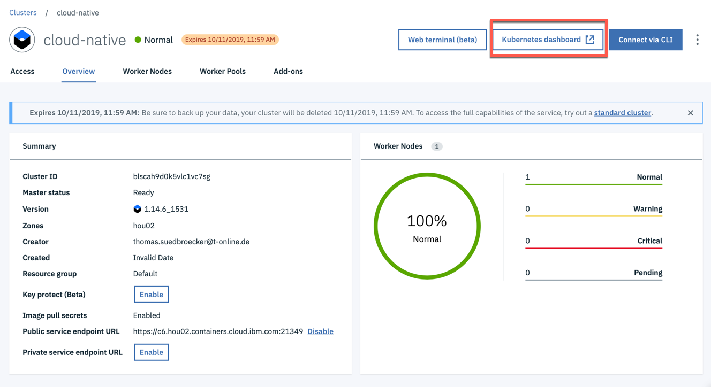

3. In the overview you see the created deployment and the pod

  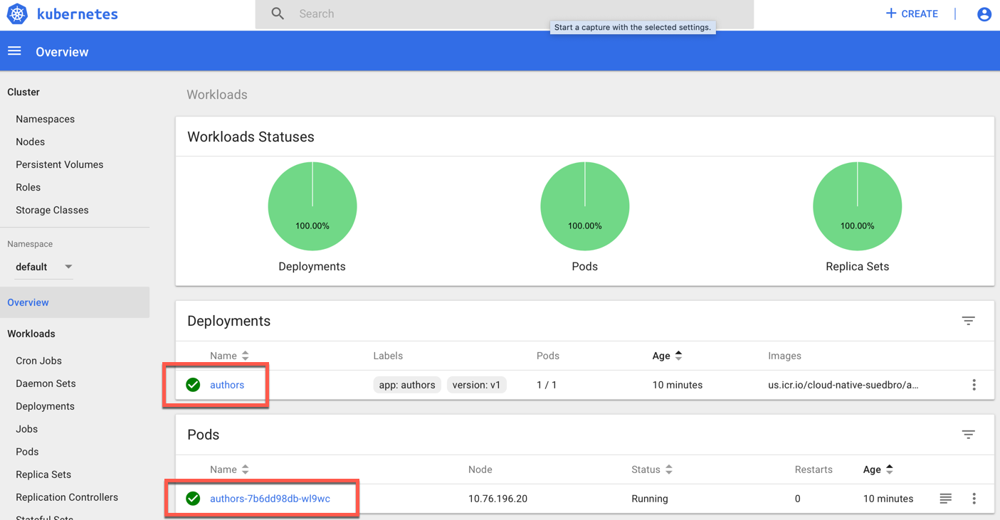


# 3. Apply the service.yaml

After the definition of the Pod we need to define how to access the Pod. For this we use a service in Kubernetes. For more details see the [Kubernetes documentation](https://kubernetes.io/docs/concepts/services-networking/service/) for service.

> A Kubernetes Service is an abstraction which defines a logical set of Pods and a policy by which to access them - sometimes called a micro-service. The set of Pods targeted by a Service is (usually) determined by a Label Selector.

In the service we map the NodePort of the cluster to the port 3000 of the Authors microservice running in the authors Pod, as we can see in the following picture.

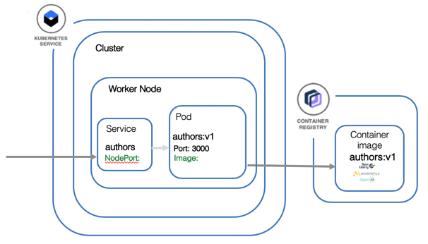

In the [service.yaml](../deployment/service-os.yaml) we see a selector of the pod using the label 'app: authors'. 

```yaml
kind: Service
apiVersion: v1
metadata:
  name: authors
  labels:
    app: authors
spec:
  selector:
    app: authors
  ports:
    - port: 3000
      name: http
  type: NodePort
---
```

### [Tools - Option 1](./1-prereqs.md#tools---option-1-prebuilt-image-with-local-code)

Step |  |
--- | --- 
1 | Ensure you have downloaded the git first into the running Docker image. `$ git clone https://github.com/IBM/cloud-native-starter.git`
2 |  Ensure you have open Docker image in a interactive terminal session and navigate to the folder `cloud-native-starter/authors-java-jee`
3 | [Move on with the lab](./4-kubernetes.md#step-1-ensure-you-are-in-the-root_folderauthors-java-jeedeployment).


### [Tools - Option 2](./1-prereqs.md#tools---option-2-prebuilt-image-with-code-in-container)

Step |  |
--- | --- 
1 | Ensure you have downloaded the git first into the running Docker image. `$ git clone https://github.com/IBM/cloud-native-starter.git` 
2 |  Ensure you have open Docker image in a interactive terminal session and navigate to the folder `cloud-native-starter/authors-java-jee` **REMINDER:** The code changes from lab 3 you on you local computer, don't exist inside the your running Docker image.
3 | [Move on with the lab](4-kubernetes.md#step-1-ensure-you-are-in-the-root_folderauthors-java-jeedeployment).

---

#### Step 1: Ensure you are in the ```$ROOT_FOLDER/authors-java-jee/deployment```

    ```
    $ cd $ROOT_FOLDER/authors-java-jee/deployment
    ```

#### Step 2: Apply the service specification

    ```sh
    $ cd 
    $ kubectl apply -f deployment/service.yaml
    ```

#### Step 3: Verify the service in Kubernetes with kubectl

    ```sh
    $ kubectl get services
    ```

    Sample output:
    ```sh
    $ NAME         TYPE        CLUSTER-IP       EXTERNAL-IP   PORT(S)          AGE
    $ authors      NodePort    172.21.107.135   <none>        3000:31347/TCP   22s
    $ kubernetes   ClusterIP   172.21.0.1       <none>        443/TCP          28h
    ``` 

#### Step 4: Verify the service in the **Kubernetes dashboard** 

1. Open your Kubernetes Cluster in the IBM Cloud web console

2. Open the Kubernetes dashbord
   

3. In the overview scroll down until you see the created service
   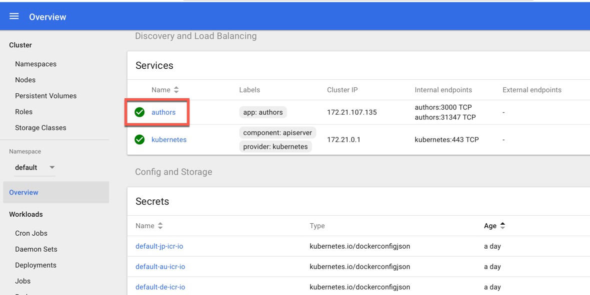


#### Step 5: Verify the running microservice on Kubernetes 

1. Get cluster (node) IP address

    ```sh
    $ clusterip=$(ibmcloud ks workers --cluster cloud-native | awk '/Ready/ {print $2;exit;}')
    $ echo $clusterip
    $ 184.172.247.228
    ```

2. Get nodeport to access the service (do you remember the mapping?)

    ```sh
    $ nodeport=$(kubectl get svc authors --ignore-not-found --output 'jsonpath={.spec.ports[*].nodePort}')
    $ echo $nodeport
    $ 31347
    ```

3. Open API explorer.

    ```sh
    $ echo http://${clusterip}:${nodeport}/openapi/ui/
    ```

    Sample output:
    ```sh
    $ http://184.172.247.228:31347/openapi/ui/
    ```

    Copy and past the URL in a local browser on your PC:

    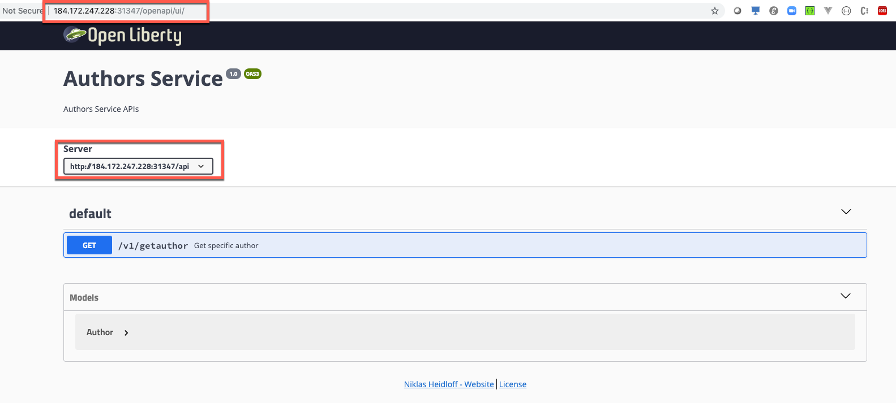


4. Execute curl to test the **Authors** service.

    ```sh
    $ curl http://${clusterip}:${nodeport}/api/v1/getauthor?name=Niklas%20Heidloff
    ```

    Sample result:
    ```
    $ {"name":"Niklas Heidloff","twitter":"@nheidloff","blog":"http://heidloff.net"}
    ```

5. Execute following curl command to test the **HealthCheck** implementation for the **Authors** service.

    ```sh
    $ curl http://${clusterip}:${nodeport}/health
    $ {"checks":[{"data":{"authors":"ok"},"name":"authors","state":"UP"}],"outcome":"UP"} 
    ```

    Optional: We can also verify that call in the browser.

    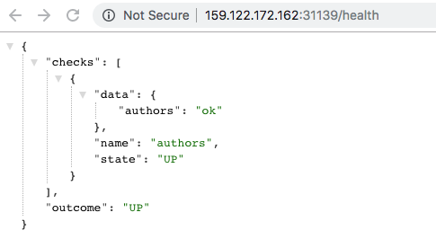

---

**Congratulations** :thumbsup: you have finished this **hands-on workshop :checkered_flag:.


