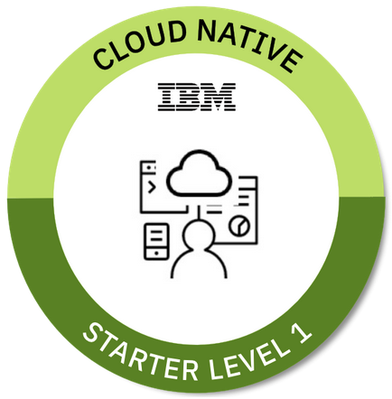

# Build a Java Microservice and deploy the Microservice to Kubernetes on IBM Cloud

This workshop demonstrates how to build a microservice with Java and how to deploy it to Kubernetes on the IBM Cloud. The microservice in this workshop is kept as simple as possible, so that it can be used as a starting point for other microservices. The microservice has been developed with Java EE and [Eclipse MicroProfile](https://microprofile.io/).

There are small variations of microservice definitions out there, here is one definition of [Gartner](https://www.gartner.com/en/information-technology/glossary/microservice):

> A microservice is a service-oriented application component that is tightly scoped, strongly encapsulated, loosely coupled, independently deployable and independently scalable.

[And here is additional information related to microservices, provided by IBM.](https://www.ibm.com/cloud/learn/microservices)

_Note:_ Useful YouTube playlist [Build and deploy a microservice to Kubernetes](https://ibm.biz/BdzVRY)

---
## Labs

This workshop has four labs. It should take between 60 and 90 minutues to complete the workshop.

1. Installing prerequisites: [lab](1-prereqs.md)
2. Running the Java microservice locally: [lab](2-docker.md) 
3. Understanding the Java implementation: [lab](3-java.md)
4. Deploying to Kubernetes: [lab](4-kubernetes.md)

> Lab 2 and 3 describe how to develop a microservice with Java EE and Eclipse MicroProfile. If you aren't a developer you can skip these two labs.

The last lab shows one way to deploy a microservice to Kubernetes on IBM Cloud.

_Note:_ If you want to deploy the authors microservice to IBM Cloud without touching any code or commandline, you can use these instructions [Use a IBM Cloud toolchain to deploy a Java Microservices to Kubernetes on IBM Cloud](https://thomassuedbroecker.github.io/cloud-native-starter-one-service-workshop-toolchain/) which do automate lab 4.

---
---
## Cloud Native Starter Badge - Level 1

> To request **Cloud Native Starter Badge - Level 1** you need to attend the face to face hands-workshop: "Build a Java Microservice and deploy the Microservice to Kubernetes on IBM Cloud", at a conference or event and you have to pass a test. 

_Registration link: At the moment no registration possible._

