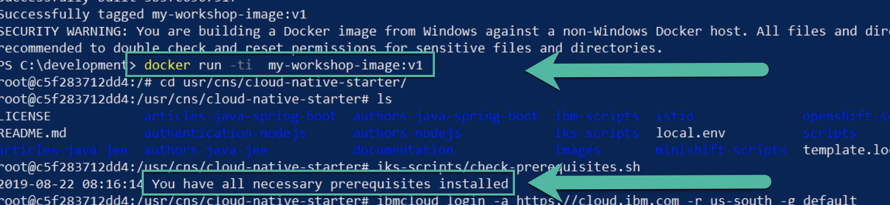

# Prerequisites for Windows 10

The easiest way to setup your Windows 10 machine for this workshop is using [Docker](https://www.docker.com/) and [Windows PowerShell](https://docs.microsoft.com/en-us/windows-server/administration/windows-commands/powershell).
We have defined a ```Dockerfile``` that with the needed configuration to setup a Docker image, that contains all tools and the Cloud-Native-Starter project on a **Ubuntu Linux Docker image**.

1. **Install** Docker by following the steps in the [Docker documentation](https://docs.docker.com/docker-for-windows/install/)


2. **Download** the Cloud Native Starter project as a zipfile to you computer and unzip it to a folder.
   https://github.com/IBM/cloud-native-starter

   

3. **Open** the **Windows PowerShell** as **Administrator**

4. **Navigate** to the folder ```[YOUR FOLDER]/cloud-native-starter/workshop```

5. **Execute** you can directly use the image from [dockerhub](https://hub.docker.com/r/tsuedbroecker/cns-workshop-tools) with the following cli command. That opens directly the Docker image in a **terminal session**.

```docker run -it --rm tsuedbroecker/cns-workshop-tools:v5```

6. **Navigate** to **cloud native starter** project inside the Docker image
    ```cd usr/cns/cloud-native-starter```

7. **Execute** the ```iks/scripts/check-prerequisites.sh``` to verify the setup.

    

_Optional:_ 
* You can build your own d
Docker image on your local PC with the command ```docker build -t my-workshop-image:v1 .```

* **Execute** the Docker image with the command ```docker run -ti  my-workshop-image:v1```. That opens directly the Docker image in a **terminal session**.

_Note:_ You can open [Dockerfile](./Dockerfile) in a editor, if you want to get familiar with the setup of the Docker image.

---

You are ready to go and you can move on to follow the steps in the [prerequisites](00-prerequisites.md).

_Note:_ You can find more detailed information in that blog post _"[definition of a dockerfile to use bash scripts on a Windows 10 machine for our Cloud-Native-Starter workshop](https://suedbroecker.net/2019/08/27/definition-of-a-dockerfile-to-use-bash-scripts-on-a-windows-10-machine-for-our-cloud-native-starter-workshop/)"_.


