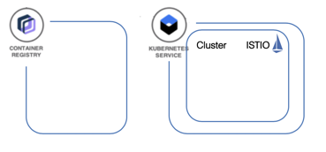

# Prerequisites

****** **UNDER CONSTRUCTION** ******

Here I will use 
iks-scripts/create-iks-cluster.sh
iks-scripts/cluster-add-istio.sh


## IBM Cloud Services

We will use following IBM Cloud Services in this workshop.



* [IBM Cloud Kubernetes Service](https://cloud.ibm.com/docs/containers?topic=containers-getting-started#getting-started) with ISTIO addon 
* [IBM Cloud Container Registry Service](https://cloud.ibm.com/docs/services/Registry?topic=registry-getting-started#getting-started)

## Tools on your laptop

Following tools have to be installed on your laptop, to perform the workshop.

- [git](https://git-scm.com/book/en/v2/Getting-Started-Installing-Git) 
- [curl](https://curl.haxx.se/download.html)
- [IBM Cloud CLI](https://cloud.ibm.com/docs/home/tools) 
- [Docker](https://docs.docker.com/v17.12/install/)
- [kubectl](https://kubernetes.io/docs/tasks/tools/install-kubectl/)
- on Windows, you need access to a Unix shell (Babun, [Cygwin](https://cygwin.com/install.html), etc.)

To verfiy the prerequisite on your machine, just execute following bash script.

```sh
[PROJECT ROOT]./iks-scripts/check-prerequisites.sh
```

## Setup IBM Cloud Kubernetes cluster<a name="home"></a>

1. [Register at IBM Cloud Account](#part-SETUP-00)
2. [Insert promo code](#part-SETUP-01)
3. [Setup the IBM Cloud CLI](#part-SETUP-02)
4. [Setup the IBM Cloud Kubernetes CLI](#part-SETUP-03)
5. [Create a IBM Cloud Kubernetes Service and add ISTIO](#part-SETUP-04)
6. [Access the Kubernetes cluster manually (optional)](#part-SETUP-05)
7. [Access the IBM Cloud Container Registry manually (optional)](#part-SETUP-06)


### Register at IBM Cloud Account <a name="part-SETUP-00"></a>

Open a browser window and navigate to [Registration page](https://ibm.biz/Bd2JHx).


Fill in the registration form and follow the link in the **validation email** when it arrives.


[Login into IBM Cloud](https://ibm.biz/Bd2JHx) using the account credentials you have registered.

NOTE: New IBM Cloud accounts set per default to the [lite account version](https://www.ibm.com/cloud/pricing).

This account type provides free access to a subset of IBM Cloud resources.
Lite accounts **do not need a credit-card** to sign up or expire after a set time period, i.e. 30 days.
Developers using lite accounts are restricted to use Kubernetes lite / free cluster for which they can use the provided promo codes.

### Insert promo code <a name="part-SETUP-01"></a>
[<home>](#home)

In order that you can easily execute the workshop, we're providing **promo codes** to create lite clusters, even if you don't want to provide your credit card details.
You apply the provided promo code under your [Cloud Account](https://cloud.ibm.com/account) ("`Manage`" -> "`Account`") by navigating to "`Account settings`".
Apply your personal Feature (Promo) Code there.

NOTE: Lite clusters expire after one month.

### Setup the IBM Cloud CLI <a name="part-SETUP-02"></a>
[<home>](#home)

Follow the steps listed under the [Install from shell](https://cloud.ibm.com/docs/cli/reference/bluemix_cli?topic=cloud-cli-install-ibmcloud-cli#shell_install) section to download and install the IBM Cloud CLI.

- MacOS: `curl -fsSL https://clis.ng.bluemix.net/install/osx | sh`
- Linux: `curl -fsSL https://clis.ng.bluemix.net/install/linux | sh`
- Windows (Powershell): `iex(New-Object Net.WebClient).DownloadString('https://clis.ng.bluemix.net/install/powershell')`

[Documentation install CLI](images/docs.gif)

### Setup the IBM Cloud Kubernetes CLI <a name="part-SETUP-03"></a>
[<home>](#home)

We log into the IBM Cloud CLI tool: `ibmcloud login`.
If you have a federated account, include the `--sso` flag: `ibmcloud login --sso`.

Install the IBM Cloud Kubernetes Service plug-in (`ks` sub command):

```sh
$ ibmcloud plugin install container-service
```

To verify that the plug-in is installed properly, run `ibmcloud plugin list`.
The Container Service plug-in is displayed in the results as `container-service/kubernetes-service`.

Initialize the Container Service plug-in and point the endpoint to your region:

```sh
$ ibmcloud ks region-set us-south
```

All subsequent CLI commands will operate in that region.

### Create a IBM Cloud Kubernetes Service and add ISTIO<a name="part-SETUP-04"></a>
[<home>](#home)

#### Automated creation of a Cluster with ISTIO for the workshop

Use following bash script to create a free Kubernetes Cluster on IBM Cloud:

```sh
[PROJECT ROOT]$ ./iks-scripts/create-iks-cluster.sh
```

Add the managed ISTIO to the free Kubernetes Cluster:
```sh
[PROJECT ROOT]$ ./iks-scripts/cluster-add-istio.sh
```

Configure the IBM Cloud Container Registry:
```sh
[PROJECT ROOT]$ ./iks-scripts/create-registry.sh
```

#### Manual creation of a Cluster
You can create IBM Cloud Kubernetes cluster (lite ) using the [IBM Cloud console](https://cloud.ibm.com/containers-kubernetes/catalog/cluster/create) or using the CLI. A lite / free cluster is sufficient for this workshop.

_NOTE:_ When you're using the CLI or the browser Cloud console, always make sure you're **viewing the correct region**, as your resources will only be visible in its region.

### Accessing the Kubernetes cluster manually <a name="part-SETUP-05"></a>

Now, we'll see how to set the context to work with our clusters by using the `kubectl` CLI, access the Kubernetes dashboard, and gather basic information about our cluster.

We set the context for the cluster in the CLI.
Every time you log in to the IBM Cloud Kubernetes Service CLI to work with the cluster, you must run these commands to set the path to the cluster's configuration file as a session variable.
The Kubernetes CLI uses this variable to find a local configuration file and certificates that are necessary to connect with the cluster in IBM Cloud.

List the available clusters: `ibmcloud ks clusters`.
This command should now show your cluster which is being created.

Download the configuration file and certificates for the cluster using the `cluster-config` command:

```sh
$ ibmcloud ks cluster-config <cluster-name>
```

Copy and paste the output command from the previous step to set the `KUBECONFIG` environment variable and configure the CLI to run `kubectl` commands against the cluster:

```sh
$ export KUBECONFIG=/<home>/.bluemix/plugins/container-service/clusters/mycluster/kube-config-<region>-<cluster-name>.yml
```

Get basic information about the cluster and its worker nodes.
This information can help you managing the cluster and troubleshoot issues.

Get the details of your cluster: `ibmcloud ks cluster-get <cluster-name>`

Verify the nodes in the cluster:

```sh
$ ibmcloud ks workers <cluster-name>
$ kubectl get nodes
```

View the currently available services, deployments, and pods:

```sh
$ kubectl get svc,deploy,po --all-namespaces
```

### Access the IBM Cloud Container Registry manually <a name="part-SETUP-06"></a>
[<home>](#home)

TODO: !!!! VERIFY REGION !!!! 

In order to build and distribute Container images, we need a Container registry.
We can use the IBM Container Registry which can be accessed right away from our Kubernetes cluster.

We log into the Container Registry service via the `ibmcloud` CLI and obtain the information about our registry:

```sh
$ ibmcloud plugin install container-registry
$ ibmcloud cr login
$ ibmcloud cr region-set us-south
$ ibmcloud cr region
You are targeting region 'us-south', the registry is 'registry.us-south.bluemix.net'.
```

We will the CLI inside bash script to create a unique namespace in the Container Registry service (`cr`) for our workshop.


Now, we've finished all preparations.
Let's get started with the TODO: !!!LINK TO INTRODUCTION!!!.
