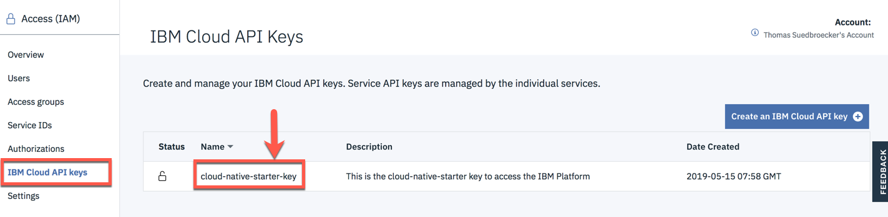
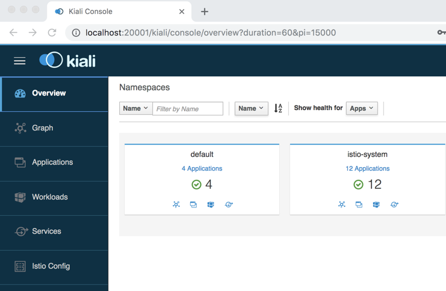

[home](README.md)
# Prerequisites

****** **UNDER CONSTRUCTION** ******

## 1. IBM Cloud Services

We will use the following IBM Cloud Services in this hands-on workshop.

* [IBM Cloud Kubernetes Service](https://cloud.ibm.com/docs/containers?topic=containers-getting-started#getting-started) with a custom **Istio** installation
* [IBM Cloud Container Registry Service](https://cloud.ibm.com/docs/services/Registry?topic=registry-getting-started#getting-started)


## 2. Tools on your laptop

Following tools have to be installed on your laptop, to perform the workshop.

- IDE or Editor for example: [Visual Studio Code](https://code.visualstudio.com/) 
- [git](https://git-scm.com/book/en/v2/Getting-Started-Installing-Git) 
- [curl](https://curl.haxx.se/download.html)
- [IBM Cloud CLI](https://cloud.ibm.com/docs/home/tools) 
- [Docker](https://docs.docker.com/v17.12/install/)
- [kubectl](https://kubernetes.io/docs/tasks/tools/install-kubectl/)
- on Windows, you need access to a Unix shell (Babun, [Cygwin](https://cygwin.com/install.html), etc.)

To verfiy the major prerequisite on your machine, you can execute following bash script on your machine.

```sh
$ git clone https://github.com/nheidloff/cloud-native-starter.git
$ chmod u+x iks-scripts/*.sh
$ ./iks-scripts/check-prerequisites.sh
```

## 3. Setup IBM Cloud Kubernetes cluster<a name="home"></a>

By default, deployment is in Dallas, USA (us-south). 

1. [Register at IBM Cloud Account](#part-SETUP-00)
2. [Insert promo code](#part-SETUP-01)
3. [Setup the IBM Cloud CLI](#part-SETUP-02)
4. [Get IBM platform key](#part-SETUP-08)
5. [Setup the IBM Cloud Kubernetes CLI](#part-SETUP-03)
6. [Create a IBM Cloud Kubernetes Service and add Istio](#part-SETUP-04)
7. [Access the Kubernetes cluster manually (optional)](#part-SETUP-05)
8. [Access the IBM Cloud Container Registry manually (optional)](#part-SETUP-06)

_Note:_ If you already have a lite cluster in Dallas, some of these scripts will not work, because only **one** lite cluster is allowed.

---

### 3.1 Register at IBM Cloud Account <a name="part-SETUP-00"></a>

1. Open a browser window and navigate to [Registration page](https://ibm.biz/Bd2JHx).


2. Fill in the registration form and follow the link in the **validation email** when it arrives.


3. [Login into IBM Cloud](https://ibm.biz/Bd2JHx) using the account credentials you have registered.

_NOTE:_ New IBM Cloud accounts set per default to the [lite account version](https://www.ibm.com/cloud/pricing).

This account type provides free access to a subset of IBM Cloud resources. Lite accounts **do not need a credit-card** to sign up or they **do not expire** after a set time period. 
With a **Lite account** on the IBM Cloud you **can not create Free** Kubernetes clusters. You need a Voucher with a **promo** or **feature code** to get access to create a **Free** Cluster.

---

### 3.2 Insert promo code <a name="part-SETUP-01"></a>
[<home>](#home)

In order that you can easily execute the workshop, we're providing **promo codes** to create free clusters, even if you don't want to provide your credit card details.
You apply the provided promo code under your [Cloud Account](https://cloud.ibm.com/account) ("`Manage`" -> "`Account`") by navigating to "`Account settings`".
Apply your personal Feature (Promo) Code there.

_NOTE:_ Free clusters expire after one month.

---

### 3.3 Setup the IBM Cloud CLI <a name="part-SETUP-02"></a>
[<home>](#home)

Follow the steps listed under the [Install from shell](https://cloud.ibm.com/docs/cli/reference/bluemix_cli?topic=cloud-cli-install-ibmcloud-cli#shell_install) section to download and install the IBM Cloud CLI.

- MacOS: `curl -fsSL https://clis.ng.bluemix.net/install/osx | sh`
- Linux: `curl -fsSL https://clis.ng.bluemix.net/install/linux | sh`
- Windows (Powershell): `iex(New-Object Net.WebClient).DownloadString('https://clis.ng.bluemix.net/install/powershell')`

[Documentation install CLI](images/docs.gif)

---

### 3.4 Get IBM platform key <a name="part-SETUP-08"></a>

To use the bash scripts automation later we need a IBM platform key. 

1. Logon to IBM Cloud use the **"us-south"** Region

```sh
ibmcloud login -r us-south
```

2. Create a IBM platform for your API key and name it (example **cloud-native-starter-key**) and provide a filename  (example **cloud-native-starter-key.json**).

```sh
$ ibmcloud iam api-key-create cloud-native-starter-key \
  -d "This is the cloud-native-starter key to access the IBM Platform" \
  --file cloud-native-starter-key.json
$ cat cloud-native-starter-key.json
```

_Optional:_ You can verify the key in the IBM Cloud, as you can see in the image below:




3. Create a copy of the **template.local.env** and add in the new **local.env** file the key to the IBMCLOUD_API_KEY variable.

```sh
$ cp template.local.env local.env 
```

4. Verify the entries inside the local.env file.

The file local.env has preset values for regions, cluster name, and image registry namespace in local.env. You can change them to your needs.

Example local.env:

```sh
IBMCLOUD_API_KEY=AbcD3fg7hIj65klMn9derHHb9zge5
IBM_CLOUD_REGION=us-south
CLUSTER_NAME=cloud-native
REGISTRY_NAMESPACE=cloud-native
IBM_CLOUD_CF_API=https://api.ng.bluemix.net
IBM_CLOUD_CF_ORG=
IBM_CLOUD_CF_SPACE=dev
AUTHORS_DB=local
CLOUDANT_URL=
```
---

### 3.5 Setup the IBM Cloud Kubernetes CLI <a name="part-SETUP-03"></a>
[<home>](#home)

We log into the IBM Cloud CLI tool: `ibmcloud login`.
If you have a federated account, include the `--sso` flag: `ibmcloud login --sso`.

Install the IBM Cloud Kubernetes Service plug-ins:

```sh
$ ibmcloud plugin install container-service
$ ibmcloud plugin install container-registry
```

To verify that the plug-in is installed properly, run `ibmcloud plugin list`.
The Container Service plug-in is displayed in the results as `container-service/kubernetes-service`.

Initialize the Container Service plug-in and point the endpoint to your region with the `ks` sub command:

```sh
$ ibmcloud ks region-set us-south
```

All subsequent CLI commands will operate in that region.

---

### 3.6 Create a IBM Cloud Kubernetes Service and add ISTIO<a name="part-SETUP-04"></a>
[<home>](#home)

For the following steps we use bash scripts from the github project.

---

#### 3.6.1 Automated creation of a Cluster with Istio for the workshop

* **create cluster**

1. Use following bash script to create a free Kubernetes Cluster on IBM Cloud:

```sh
$ ./iks-scripts/create-iks-cluster.sh
```

_Note:_ The creation of the cluster can take up to **20 minutes**.
You can verify the cluster in the IBM Cloud, as you can see in the image below:


* **add Istio**

IBM Kubernetes Service has an option to install a managed Istio into a Kubernetes cluster. Unfortunately, the Kubernetes Lite Cluster we created in the previous step does not meet the hardware requirements for managed Istio. Hence we do a manual install of the Istio demo or evaluation version.

These are the instructions to install Istio. We use **Istio 1.1.5** for this Lab.

1. First check if the cluster is available:

    ```sh
    $ ./iks-scripts/cluster-add-istio.sh
    ```
    If the cluster isn't ready, the script will tell you. Then just wait a few more minutes and try again.

    _NOTE:_ You **must** run this command to check for completion of the cluster provisioning and it **must** report that the cluster is **ready for Istio installation**! This command also retrieves the cluster configuration which is needed in other scripts. But this configuration can only be retrieved from a cluster that is in ready state.

2. Download Istio 1.1.5 directly from github into the **workshop** directory:

    ```sh
    cd workshop
    curl -L https://git.io/getLatestIstio | ISTIO_VERSION=1.1.5 sh -
    ```

    _Note:_ Please be aware that this does **not** work on Windows! 
    Windows users can download an istio-1.1.5-win.zip from here: https://github.com/istio/istio/releases/tag/1.1.5
    Unpack the ZIP file into the workshop directory and add the path to ```istio-1.1.5/bin``` your Windows **PATH**.

3. Add `istioctl` to the PATH environment variable, e.g copy paste in your shell and/or `~/.profile`:

    ```sh
    export PATH=$PWD/istio-1.1.5/bin:$PATH
    ```

4. Change into the extracted directory: 

    ```sh
    cd istio-1.1.5
    ```

5. Install Istio:

    ```sh
    $ for i in install/kubernetes/helm/istio-init/files/crd*yaml; do kubectl apply -f $i; done
    ```
    
    a. Wait a few seconds before issuing the next command:

    ```sh
    $ kubectl apply -f install/kubernetes/istio-demo.yaml
    ```

    b. Check that all pods are **running** or **completed** before continuing.

    ```sh
    $ kubectl get pod -n istio-system
    ```

    c. Enable automatic sidecar injection:

    ```sh
    $ kubectl label namespace default istio-injection=enabled
    ```

    d. Once complete, the Kiali dashboard can be accessed with this command:

    ```sh
    $ kubectl -n istio-system port-forward $(kubectl -n istio-system get pod -l app=kiali -o jsonpath='{.items[0].metadata.name}') 20001:20001
    ```
    e. Then open http://localhost:20001/kiali in your browser, logon with Username: admin, Password: admin

    

    In the following image we can see the installed Istio on the Kubernetes cluster. We also notice the **Istio Ingress gateway** and the **Istio-System** namespace, we will use later.
    
    

* **Configure the IBM Cloud Container Registry**

1. Ensure you are are in the project directory and execute the script.

```sh
$ cd ../..
$ pwd
$ ./iks-scripts/create-registry.sh
```

_Optional:_ You can find the created namespace here:


---

#### 3.6.2  Manual creation of a Cluster (optional)

You can create IBM Cloud Kubernetes cluster (lite ) using the [IBM Cloud console](https://cloud.ibm.com/containers-kubernetes/catalog/cluster/create) or using the CLI. A lite / free cluster is sufficient for this workshop.

_NOTE:_ When you're using the CLI or the browser Cloud console, always make sure you're **viewing the correct region**, as your resources will only be visible in its region.

---

### 3.7 Accessing the Kubernetes cluster manually (optional) <a name="part-SETUP-05"></a>

Now, we'll see how to set the context to work with our clusters by using the `kubectl` CLI, access the Kubernetes dashboard, and gather basic information about our cluster.

We set the context for the cluster in the CLI.
Every time you log in to the IBM Cloud Kubernetes Service CLI to work with the cluster, you must run these commands to set the path to the cluster's configuration file as a session variable.
The Kubernetes CLI uses this variable to find a local configuration file and certificates that are necessary to connect with the cluster in IBM Cloud.

List the available clusters: `ibmcloud ks clusters`.
This command should now show your cluster which is being created.

Download the configuration file and certificates for the cluster using the `cluster-config` command:

```sh
$ ibmcloud ks cluster-config <cluster-name>
```

Copy and paste the output command from the previous step to set the `KUBECONFIG` environment variable and configure the CLI to run `kubectl` commands against the cluster:

```sh
$ export KUBECONFIG=/<home>/.bluemix/plugins/container-service/clusters/mycluster/kube-config-<region>-<cluster-name>.yml
```

Get basic information about the cluster and its worker nodes.
This information can help you managing the cluster and troubleshoot issues.

Get the details of your cluster: `ibmcloud ks cluster-get <cluster-name>`

Verify the nodes in the cluster:

```sh
$ ibmcloud ks workers <cluster-name>
$ kubectl get nodes
```

View the currently available services, deployments, and pods:

```sh
$ kubectl get svc,deploy,po --all-namespaces
```

---

### 3.8 Access the IBM Cloud Container Registry manually (optional) <a name="part-SETUP-06"></a>
[<home>](#home)

In order to build and distribute Container images, we need a Container registry. We can use the **IBM Container Registry** which can be accessed right away from our Kubernetes cluster. We log into the Container Registry service via the `ibmcloud` CLI and obtain the information about our registry:

```sh
$ ibmcloud cr login
$ ibmcloud cr region-set us-south
$ ibmcloud cr region
You are targeting region 'us-south', the registry is 'You are targeting region 'us-south', the registry is 'us.icr.io'.'.
```

---

Now, we've finished all **preparations**.
Let's get started with the [introduction](01-introduction.md).
