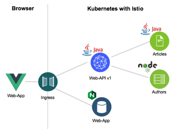
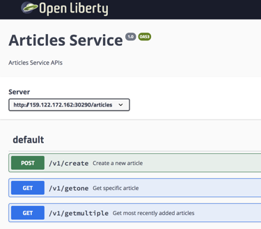

[home](README.md)
# Introduction

In this hands-on workshop, we will see how to develop cloud-native microservices using Jakarta EE and MicroProfile.

The definition of Cloud Native from the [Cloud Native Computing Foundation](https://www.cncf.io/)

> Cloud native technologies empower organizations to build and run scalable applications in **modern**, **dynamic environments** such as **public**, **private**, and **hybrid clouds**. **Containers**, **service meshes**, **microservices**, **immutable infrastructure**, and **declarative APIs exemplify** this approach.

> These techniques **enable loosely coupled systems** that are **resilient**, **manageable**, and **observable**. Combined with robust automation, they allow engineers to make high-impact changes frequently and predictably with minimal toil.


With this definition in mind, when developers are building [cloud-native](https://www.ibm.com/cloud/learn/cloud-native) applications, they are challenged to figure out topics like **building and deploying Containers**, **traffic routing**, **resiliency**, and **defining and exposing REST APIs**. Fortunately, most of these new challenges are handled by the orchestration platform Kubernetes and the service mesh Istio. This functionality works generically for microservices, regardless of the language they are implemented in and without changes to the application logic.

However **some functionality can not be covered by orchestration platforms** and service meshes. Instead, it must be handled in the business logic of the microservices, application specific failover functionality, metrics, and fine-grained authorizations, for example.

Java developers can leverage **Eclipse MicroProfile** to implement this functionality. MicroProfile is an extension to [Java EE (Enterprise Edition)](https://www.oracle.com/technetwork/java/javaee/overview/index.html) to build microservices-based architectures and it complements both [Kubernetes](https://kubernetes.io/de/) and [Istio](https://istio.io) capabilities. In addition to the application-specific logic which Kubernetes and Istio can't handle, it also comes with convenience functionality that you typically need when developing microservices, for example mechanisms to invoke REST APIs and functionality to implement REST APIs including their documentation.

---

## 1. The "Cloud Native Starter (CNS)" application

The **"Cloud Native Starter"** application we have developed is a simple use-case. The app can **show**, **add**, and **remove** articles with author information. The application is built on microservices with one frontend web application.



* **Web app** service provides a [Vue.js](https://vuejs.org/) web application to the browser. It's based on [Nginx](https://nginx.org/en/).
* **Web-API** is accessed by the Vue app and provides a list of blog articles and their authors
* **Articles** holds the list of blog articles
* **Authors** holds the blog authors details (blog URL and Twitter handle)

The **"Cloud Native Starter"** application follows these design principles:

* **Leverage platforms as much as possible – do as little as possible in language-specific frameworks**

> The great advantage of using Kubernetes and Istio for features like traffic management is that these features are language agnostic. Cloud-native applications can be, and often are, polyglot. This allows developers to **pick the best possible languages** for **specific tasks** (for example: ```JavaScript``` for the frontend and ```Java``` for the backend).

* **Only use open-source components for the core services of the application**

> Pretty much everyone loves open source, we certainly do. In our starter project for example: the Java stack leverages [OpenJ9](https://www.eclipse.org/openj9/), [OpenJDK](https://openjdk.java.net/) from [AdoptOpenJDK](https://adoptopenjdk.net/), [OpenLiberty](https://openliberty.io/) and [MicroProfile](https://microprofile.io/). [Kubernetes](https://kubernetes.io/) and [Istio](https://istio.io/) are obviously open source projects, too.

* **Make the first-time experience as simple as possible**

> The example application shows several features working together, see below for details. There are also scripts to deploy services very easily, basically one script per service, which is very similar to the **‘cf push’** [experience](https://www.youtube.com/watch?v=dvLCT19I4QY) for Cloud Foundry applications.

* **Ability to run the application in different environments**

> Fortunately, this is one of the main advantages of Kubernetes since you can run workloads on-premises, hybrid, or public cloud infrastructures. The repo has instructions for how to deploy the application to Minikube and to the managed IBM Cloud Kubernetes Service.

---

## 2. **Microservices and Web app**

These are the responsibilities of the different microservices and the Web app. The implementation and organization of these services follow the [clean architecture software design philosophy](https://whatis.techtarget.com/definition/clean-architecture).

---

### 2.1 **Web app**

The Web app is the UI, displays the given entries articles and is built with **VUE**.
Here you see a picture of the **Web app** UI.


---

### 2.2 ****Web API****

The objective of this microservice is to combine the information from the **Articles** and the **Authors** microservices. 

The **Web API** is business-related to be consumed by the **VUE** **Web app**. The Web app requires just **one** REST API and does not need any more APIs. The **Web API** service implements the **BFF** (backend for frontend pattern). 

The following image contains a sample instance of the **Web API** using the **Open API explorer**.


---

### 2.3 **Articles microservice**

The objective of this microservice is to **add** and **get** article information from a database. In this workshop we will use the default implementation, which just creates sample data values.

In the image blow you can see a sample instance of the Articles, using the **Open API explorer**.



---

### 2.4 **Authors microservice**

The objective of this microservice is to **get** author information from a database and it is built on Node.js.
In this workshop we will use the default implementation, which just creates sample data values.

Here you see a sample curl command to get author information from the **Authors** microservice.

```sh
$ curl http://159.122.172.162:31078/api/v1/getauthor?name=Niklas%20Heidloff
$ {"name":"Niklas Heidloff","twitter":"@nheidloff","blog":"http://heidloff.net"}
```

## 3 Technologies

### 3.1 Technologies of the microservices

The **'Articles'** and '**Web API**' microservices are based purely on open source components:

* [OpenJ9 0.12.1](https://projects.eclipse.org/projects/technology.openj9/releases/0.12.1/review)
* OpenJDK 8u202-b08 from AdoptOpenJDK
* [Open Liberty 18.0.0.4](https://openliberty.io/downloads/)
* [MicroProfile 2.1](https://projects.eclipse.org/projects/technology.microprofile/releases/microprofile-2.1)

To ensure that distributed tracing is supported, [zipkintracer](https://github.com/openzipkin/zipkin-ruby) is copied onto the image.  


_Note:_ Distributed tracing is not in scope of the current workshop material.

---

### 3.2 MicroProfile

For cloud-native applications, Kubernetes and Istio delivers a lot of important functionality straight out of the box, to ensure **resiliency** and **scalability**, for example. This functionality works generically for microservices, regardless of which language they have been implemented in and independent from the application logic.

However, some cloud-native functionality can't be handled by Kubernetes and Istio, since it needs to be handled in the business logic of the microservices: application specific failover functionality, metrics, and fine-grained authorization, for example.

That’s why we use **Eclipse MicroProfile**, a **JavaEE** extension, to build microservices-based architectures and a great programming model for **Istio**. In addition to the application specific logic that Istio can't handle, it also comes with convenience functionality that you typically need when developing microservices, for example invoking and implementing REST APIs,  including their documentation.

In the following image you see a list of MicroProfiles, we will use the  marked red in minimum.


Now, we've finished the **introduction**.
Let's get started with the [Lab - Building and deploying Containers](02-container.md).

---

Resources:

* ['Dockerizing Java MicroProfile Applications'](http://heidloff.net/article/dockerizing-container-java-microprofile)
* ['Example Java App running in the Cloud via Kubernetes'](http://heidloff.net/article/example-java-app-cloud-kubernetes)
* [Cloud Native Computing Foundation (CNCF) ](https://www.cncf.io/)
* [Cloud Native Definition (CNCF)](https://github.com/cncf/toc/blob/master/DEFINITION.md)
* [What is cloud-native? Here is a complete guide from IBM.](https://www.ibm.com/cloud/learn/cloud-native)