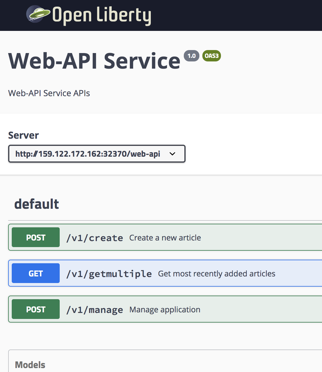

[home](README.md)
# Introduction
****** **UNDER CONSTRUCTION** ******

In this hands-on workshop, we will see, how to develop cloud-native microservices using Jakarta EE and MicroProfile.

We will use for the deployed the Docker CLI and run the microservices on Kubernetes, and Istio.
We'll examine the basics of modern cloud native Java micro-services development with container, REST APIS, traffic management, and resiliency.

When building cloud-native applications, developers are challenged to figure out how to address topics like **building and deploying Containers**, **traffic routing**, **resiliency** and **defining and exposing REST APIs**. Fortunately most of these new challenges are handled by the orchestration platform Kubernetes and the service mesh Istio. This functionality works generically for microservices, regardless of the language they are implemented in and without changes to the application logic.

However, **some functionality can not be covered by orchestration platforms** and service meshes. Instead it must be handled in the business logic of the microservices, for example application specific failover functionality, metrics, and fine-grained authorizations.

Java developers can leverage **Eclipse MicroProfile** to implement this functionality. MicroProfile is an extension to Java EE (Enterprise Edition) to build microservices-based architectures and it complements Kubernetes and Istio capabilities. In addition to the application specific logic which Kubernetes and Istio cannot handle, it also comes with convenience functionality that you typically need when developing microservices, for example mechanisms to invoke REST APIs and functionality to implement REST APIs including their documentation.

## 1. The "Cloud Native Starter" application

With the **"Cloud Native Starter"** application you can **show**, **add** and **remove** articles with authors information.

The application is built on microservices with one frontend web application.


* **Web-App** Is hosted on a Nginx server that provides a VUE **Web-App** to the browser
* **Web-API** is accessed by the Vue app and provides a list of blog articles and their authors
* **Articles** holds the list of blog articles
* **Authors** holds the blog authors details (blog URL and Twitter handle)

The **"Cloud Native Starter"** application follows these design principles:

* **Leverage platforms as much as possible – do as little as possible in language-specific frameworks**

The advantage of using Kubernetes and Istio for features like traffic management is, that these features are language agnostic. Cloud-native applications can be, and often are, polyglot. This allows developers to pick the best possible languages for the specific tasks.

* **Use open-source components for the core services of the application only**

Pretty much everyone loves open source. For example the Java stack leverages OpenJ9, OpenJDK from AdoptOpenJDK, OpenLiberty and MicroProfile. Kubernetes and Istio are obviously open source projects as well.

* **Make the first time experience as simple as possible**

The example application shows several features working together, see below for details. There are also scripts to deploy services very easily, basically one script per service, similar to the **‘cf push’** experience for Cloud Foundry applications.

* **Be able to run the application in different environments**

Fortunately this is one of the main advantages of Kubernetes since you can run workloads on-premises, hybrid or public cloud infrastructures. The repo has instructions how to deploy the application to Minikube and to the managed IBM Cloud Kubernetes Service.

## 2. **Microservices and Web-App**

These are the responsibilities of the different microservices and the web-app.

All mircoservices in this project built on Java are organized in following packages:

* apis
* business
* data

### 2.1 **Web-App**

The Web-App is the UI for the user and displays the given entries.
Here you can see a picture of the UI.


### 2.2 **Web-api**

The objective of this microservice is to combine the information from the **articals** and the **authors** microservice. 

The web-api is business related to be consumned by the VUE Web-App. So the Web-App can use just **one** REST API and doesn't need more APIs.

In the following image contains a sample instance of the Web-api.




### 2.3 **Articles microservice**

The objective of this microservice is to **add** and **get** article information from a database. 
In this workshop we will use the default implementation, which just creates sample data values.

In the image blow you can see a sample instance of the Articles.


### 2.4 **Authors microservice**

The objective of this microservice is to **add** and **get** author information from a database and is built on Node.JS.
In this workshop we will use the default implementation, which just creates sample data values.

Sample curl **getauthor** for Authors.

```sh
$ curl http://159.122.172.162:31078/api/v1/getauthor?name=Niklas%20Heidloff
$ {"name":"Niklas Heidloff","twitter":"@nheidloff","blog":"http://heidloff.net"}
```

## 3 Technologies

### 3.1 Technologies of the microservices

The **'articles'** and **'web-api'** microservices are based purly on open source components:

* [OpenJ9 0.12.1](https://projects.eclipse.org/projects/technology.openj9/releases/0.12.1/review)
* OpenJDK 8u202-b08 from AdoptOpenJDK
* [Open Liberty 18.0.0.4](https://openliberty.io/downloads/)
* [MicroProfile 2.1](https://projects.eclipse.org/projects/technology.microprofile/releases/microprofile-2.1)

To ensure that distributed tracing it supported [zipkintracer](https://github.com/openzipkin/zipkin-ruby) is copied onto the image.

### 3.2 MicroProfile

For cloud-native applications Kubernetes and Istio deliver a lot of important functionality out of the box, for example to ensure **resiliency** and **scalability**. This functionality works generically for microservices, no matter in which language they have been implemented and independent from the application logic.

Some cloud-native functionality however cannot be handled by Kubernetes and Istio, since it needs to be handled in the business logic of the microservices, for example application specific failover functionality, metrics and fine-grained authorization.

That’s why we use Eclipse MicroProfile, which is an extension to JavaEE to build microservices-based architectures and a great programming model for Istio. In addition to the application specific logic that Istio cannot handle, it also comes with convenience functionality that you typically need when developing microservices, for example invoking REST APIs and implementing REST APIs including their documentation.

Now, we've finished the **introduction**.
Let's get started with the [Lab - Building and deploying Containers](02-container.md).


---

Resources:

* ['Dockerizing Java MicroProfile Applications'](http://heidloff.net/article/dockerizing-container-java-microprofile)
* ['Example Java App running in the Cloud via Kubernetes'](http://heidloff.net/article/example-java-app-cloud-kubernetes)


