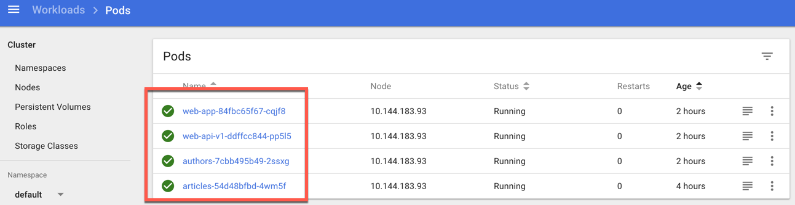
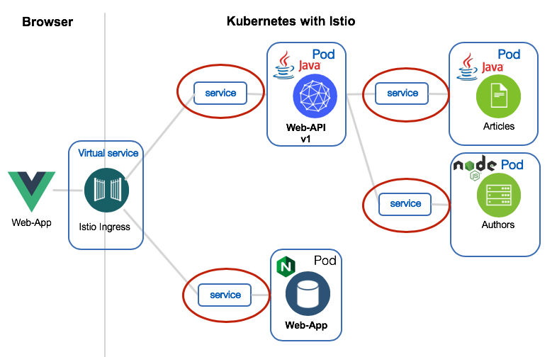
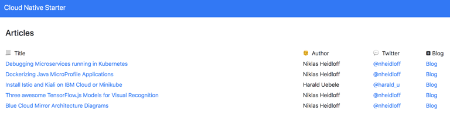

[home](README.md)
# Building and deploying Containers
****** **UNDER CONSTRUCTION** ******

In this Lab we build and deploy the containers with microservices to Kubernetes.

Along this way we inspect the **Dockerfiles** for the container images and we take a look into the configured **yaml files** to create the **deployment** for the microservices.

The following diagram shows a high level overview of steps which will be automated later with bash scripts.


1. Uploading container definition
2. Building and storing of theproduction container image inside the IBM Cloud Registry
3. Deploying the containers into the Kuberentes Cluster

Related blog posts:

* [Dockerizing Java MicroProfile Applications](http://heidloff.net/article/dockerizing-container-java-microprofile)

## 1. The container images

Before we will execute the bash scripts to build and upload the container images, we will take a look into the Dockerfiles to build these container images.

Later we can find for each container a related Pod inside Kubernetes. 



### 1.1 Java container images

The **articles** and the **authors** microservices are written in Java and they run on **OpenLiberty**.

#### 1.1.1 Articles container image definition

Let's take a look into the [Dockerfile](../articles-java-jee/Dockerfile.nojava) to create the articles service. Inside the Dockerfile we use **multiple stages** to build the container image. 
The reason for the two stages is, we have the objective to be **independed** of local environment settings, when we build the application for the container.

With this concept we don't have to ensure that **Java** and **Maven** (or wrong versions) is installed on the local machine of the developers.

One Container is only responsible to build the application let us call this container **Build environment container** and the other container we will call the **production** contrainer.

* Build environment container

Here we create our **build environment container** based on the maven 3.5 image from the [dockerhub](https://hub.docker.com/_/maven/).

```Dockerfile
FROM maven:3.5-jdk-8 as BUILD
COPY src /usr/src/app/src
COPY pom.xml /usr/src/app
```

Let's build the **articles.war** inside the container image, using the maven command **mvn -f pom.xml clean package** .

```Dockerfile
RUN mvn -f /usr/src/app/pom.xml clean package
```

* Production container

Here we create the **production container** based on the **openliberty** with **microProfile2**.
Then **zipkintracer** will be installed.

```Dockerfile
FROM openliberty/open-liberty:microProfile2-java8-openj9
ADD liberty-opentracing-zipkintracer-1.2-sample.zip /
RUN unzip liberty-opentracing-zipkintracer-1.2-sample.zip -d /opt/ol/wlp/usr/ \
 && rm liberty-opentracing-zipkintracer-1.2-sample.zip
COPY liberty/server.xml /config/
```

Now it is time to copy the build result **articles.war** from our **build environment container** into the correct place inside the **production container**.

```Dockerfile
COPY --from=BUILD /usr/src/app/target/articles.war /config/dropins/
```
If last step is executed of the **Dockerfile** the container is ready to be deployed to Kubernetes.

#### 1.1.2 Web-api-V1 container image definition

The web-api [Dockerfile](../web-apo-java-jee/Dockerfile.nojava) to create the web-api service, works in the same way as for the **articles container**. Inside the Dockerfile we use the same multiple stages to build the container image as in the for the **articles container**. 

### 1.2. Node.JS container images

The **web-app** and the **authors** services are written in Node.JS.

#### 1.2.1 Web-app container image definition

The web-app [Dockerfile](../web-app-vuejs/Dockerfile) to create the  web-app application, works in the same way as for **articles container**. Inside the Dockerfile we use the same multiple stages to build the container image as in the for the **articles container**.

Here is **build environment container** based on the alpine 8 image from the [dockerhub](https://hub.docker.com/_/alpine).

```Dockerfile
FROM node:8-alpine as BUILD
 
COPY src /usr/src/app/src
COPY public /usr/src/app/public
COPY package.json /usr/src/app/
COPY babel.config.js /usr/src/app/

WORKDIR /usr/src/app/
RUN yarn install
RUN yarn build
```

The **production container** is based on [nginx](https://hub.docker.com/_/nginx).

```Dockerfile
FROM nginx:latest
COPY nginx.conf /etc/nginx/conf.d/default.conf
COPY --from=BUILD /usr/src/app/dist /usr/share/nginx/html
```

If last step is executed of the **Dockerfile** the container is ready to be deployed to Kubernetes.

#### 1.2.2 Authors container image definition

The authors [Dockerfile](../authors/Dockerfile) to create the web-api service, does directly create the production image and is based on the alpine 8 image from the [dockerhub](https://hub.docker.com/_/alpine).

```Dockerfile
FROM node:8-alpine

# Create app directory
WORKDIR /usr/src/app

# Install app dependencies
COPY package*.json ./
RUN npm install

# Bundle app source
COPY . .

# Server listens on
EXPOSE 3000

CMD ["npm", "start"]
```
If last step is executed of the **Dockerfile** the container is ready to be deployed to Kubernetes.

## 1.3 YAML Configurations for the deployment to Kubernetes

Now we examine the deployment yamls to deploy the container to Pods and creating Services to access them in the Kubernetes Cluster.

### 1.3.1 Web-app

* Service and Deployment configuration for the micro service

With "[kind: Service](https://kubernetes.io/docs/concepts/services-networking/service/)" we define the access to your microservice inside Kubernetes and the "[kind: Deployment](https://kubernetes.io/docs/concepts/workloads/controllers/deployment/)" defines how we expose the microservice on a Pod in Kubernetes and even more configuration options you can find on the "[Kubernetes documentation](https://kubernetes.io/docs/concepts/workloads/controllers/deployment/)".

Here you can see the service and deployment configuration for the Kubernetes deployment.

```yaml
kind: Service
apiVersion: v1
metadata:
  name: web-app
  labels:
    app: web-app
spec:
  selector:
    app: web-app
  ports:
    - port: 80
      name: http
  type: NodePort
---

kind: Deployment
apiVersion: apps/v1beta1
metadata:
  name: web-app
spec:
  replicas: 1
  template:
    metadata:
      labels:
        app: web-app
        version: v1
    spec:
      containers:
      - name: web-app
        image: web-app:1
        ports:
        - containerPort: 80
      restartPolicy: Always
---

```

### 1.3.2 Web-api-V1

The deployment yaml for the Web-Api-V1. Here you can inspect the **Service** and the **Deployment** definition.

```yaml
kind: Deployment
apiVersion: apps/v1beta1
metadata:
  name: web-api-v1
spec:
  replicas: 1
  template:
    metadata:
      labels:
        app: web-api
        version: v1
    spec:
      containers:
      - name: web-api
        image: web-api:1
        ports:
        - containerPort: 9080
        livenessProbe:
          exec:
            command: ["sh", "-c", "curl -s http://localhost:9080/"]
          initialDelaySeconds: 20
        readinessProbe:
          exec:
            command: ["sh", "-c", "curl -s http://localhost:9080/health | grep -q web-api"]
          initialDelaySeconds: 40
      restartPolicy: Always
---
```

### 1.3.3 Articles

As defined in the Twelve-Factor-App it’s important for cloud-native applications to store configuration externally, rather than in the code since this makes it possible to deploy applications to different environments.

An app’s config is everything that is likely to vary between deploys (staging, production, developer environments, etc). 
This includes: Resource handles to backing services. Credentials to external services.

Microservices that are implemented with Java EE can leverage MicroProfile Config. The configuration can be done, for example, in Kubernetes yaml files and accessed from Java code via annotations and APIs.

The **‘articles’** microservice uses configuration to define whether or not to create ten articles the first time it is invoked. In the yaml file an environment variable pointing to a **ConfigMap** is defined.

In the Java code the configuration can be accessed via **@Inject**  and **@ConfigProperty**.
 
```java
 @ConfigProperty.

public class CoreService {
  private static final String CREATE_SAMPLES = "CREATE";
  @Inject
  @ConfigProperty(name = "samplescreation", defaultValue = "dontcreate")
  private String samplescreation;
  @PostConstruct
  private void addArticles() {
    if (samplescreation.equalsIgnoreCase(CREATE_SAMPLES))
      addSampleArticles();
    }
```

[source 'Configuring Microservices with MicroProfile and Kubernetes'](http://heidloff.net/article/configuring-java-microservices-microprofile-kubernetes/)

The deployment yaml for articles. Here you can inspect the **Service** and the **Deployment** definition.

```yaml
kind: Service
apiVersion: v1
metadata:
  name: articles
  labels:
    app: articles
spec:
  selector:
    app: articles
  ports:
    - port: 8080
      name: http
  type: NodePort
---

kind: Deployment
apiVersion: apps/v1beta1
metadata:
  name: articles
spec:
  replicas: 1
  template:
    metadata:
      labels:
        app: articles
        version: v1
    spec:
      containers:
      - name: articles
        image: us.icr.io/cloud-native/articles:1
        ports:
        - containerPort: 8080
        env:
        - name: samplescreation
          valueFrom:
            configMapKeyRef:
              name: articles-config
              key: samplescreation
        livenessProbe:
          exec:
            command: ["sh", "-c", "curl -s http://localhost:8080/"]
          initialDelaySeconds: 20
        readinessProbe:
          exec:
            command: ["sh", "-c", "curl -s http://localhost:8080/health | grep -q articles"]
          initialDelaySeconds: 40
      restartPolicy: Always
---

kind: ConfigMap
apiVersion: v1
metadata:
  name: articles-config
data:
  samplescreation: CREATE
---
```

## 1.4 Ingress configuration

You can see in the diagram below, we are using a Ingress from Istio to provide access from the internet to the microservice **web-api** and the **web-app**.



The important topic of the following yaml configuration is the matching (**"match"**) of **URIs** and **services**.


With the configuation of the **kind: VirtualService** for the [Ingress gateway](https://kubernetes.io/docs/concepts/services-networking/ingress/) we define the routing access from the internet over the services to the microservice **web-api** and the **web-app**. 

```yaml
apiVersion: networking.istio.io/v1alpha3
kind: VirtualService
metadata:
  name: virtualservice-ingress-web-api-web-app
spec:
  hosts:
  - "*"
  gateways:
  - default-gateway-ingress-http
  http:
  - match:
    - uri:
        prefix: /web-api/v1/getmultiple 
    route:
      - destination:
          host: web-api
          subset: v1
...
  - match:
    - uri:
        prefix: /openapi/ui/ 
    route:
    - destination:
        port:
          number: 9080
        host: web-api
  - match:
    - uri:
        prefix: /openapi
    route:
    - destination:
        port:
          number: 9080
        host: web-api
...
  - match:
    - uri:
        prefix: /
    route:
    - destination:
        port:
          number: 80
        host: web-app
---
```

## 1.5 Deploy the containers to the Kubernetes Cluster

Invoke following bashscripts to deploy the microservices:

```sh
$ ./iks-scripts/deploy-articles-java-jee.sh
$ ./iks-scripts/deploy-authors-nodejs.sh
$ ./iks-scripts/deploy-web-api-java-jee.sh
$ ./iks-scripts/deploy-web-app-vuejs.sh
$
$ ./scripts/deploy-istio-ingress-v1.sh
```

Invoke the curl command which is displayed as output of 'scripts/show-urls.sh' to the the urls of services.

```sh
$ ./iks-scripts/show-urls.sh
```

A sample result for the script:

```sh
019-05-16 15:09:51 articles
2019-05-16 15:09:51 API explorer: http://159.122.172.162:30290/openapi/ui/
2019-05-16 15:09:51 Sample API: curl http://159.122.172.162:30290/articles/v1/getmultiple?amount=10
2019-05-16 15:09:51 ------------------------------------------------------------------------------------
2019-05-16 15:09:51 authors
2019-05-16 15:09:51 Sample API: curl http://159.122.172.162:31078/api/v1/getauthor?name=Niklas%20Heidloff
2019-05-16 15:09:51 ------------------------------------------------------------------------------------
2019-05-16 15:09:51 web-api
2019-05-16 15:09:51 API explorer: http://159.122.172.162:31380/openapi/ui/
2019-05-16 15:09:51 Metrics: http://159.122.172.162:32370/metrics/application
2019-05-16 15:09:51 Sample API: curl http://159.122.172.162:31380/web-api/v1/getmultiple
2019-05-16 15:09:51 ------------------------------------------------------------------------------------
2019-05-16 15:09:51 web-app
2019-05-16 15:09:52 Web app: http://159.122.172.162:31380/
2019-05-16 15:09:52 ------------------------------------------------------------------------------------
```
Here an over of sample results:

* Articels


* Authors

Sample curl **getauthor**
```sh
$ curl http://159.122.172.162:31078/api/v1/getauthor?name=Niklas%20Heidloff
$ {"name":"Niklas Heidloff","twitter":"@nheidloff","blog":"http://heidloff.net"}
```

* Web-api v1


* Web-app




Now, we've finished the **Lab - Building and deploying Containers**.
Let's get started with the [Defining and exposing REST APIs](03-rest-api.md).


