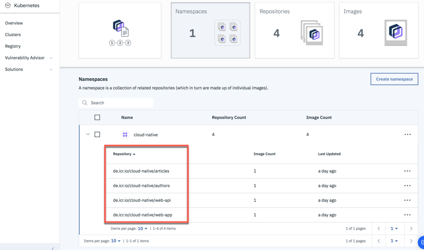
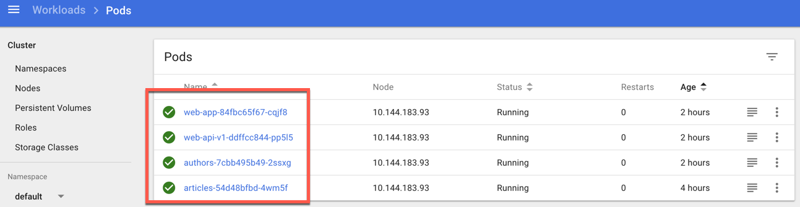
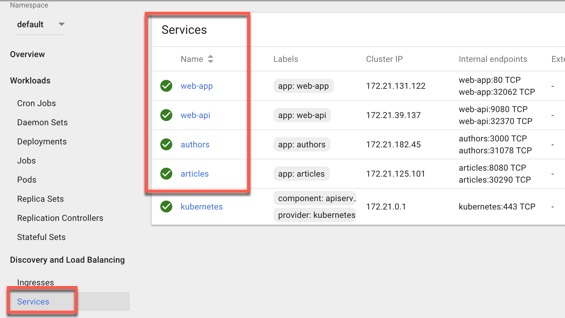
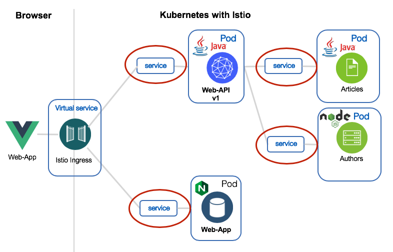
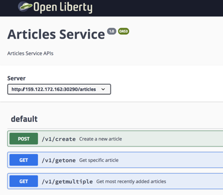
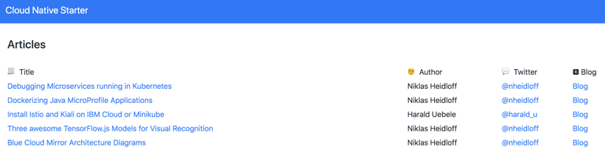

[home](README.md)
# Building and deploying Containers

In this lab we build and deploy containers with microservices to Kubernetes. Along this way we inspect the **Dockerfiles** for the container images and we take a look into the configured **yaml files** to create the **deployment** for the microservices. The following diagram shows a high level overview of the steps in the lab, which are mostly automated with bash scripts.


1. Uploading the container definition
2. Building and storing of the production container image inside the IBM Cloud Registry
3. Deploying the containers into the Kuberentes Cluster

## 1. The container images

Before we will execute the bash scripts to build and upload the container images, we will take a look into the Dockerfiles to build these container images. 

The following picture shows a brief preview of the result of the running container in Kubernetes, when we finished the lab. These are the containers we will storing inside the **container registry** in IBM Cloud.



Here we can see the created Pods for each container inside the IBM Kubernetes cluster.



---

### 1.1 Java container images

The **Articles** and the **Authors** microservices are written in Java and they are running on [OpenLiberty](https://openliberty.io/).

---

#### 1.1.1 Articles container image definition

Let's take a look into the [Dockerfile](../articles-java-jee/Dockerfile.nojava) to create the Articles service. Inside the Dockerfile we use **two stages** to build the container image. 
The reason for the two stages is, we have the objective to be **independed** of local environment settings, when we build our production services. With this concept we don't have to ensure that **Java** and **Maven** (or wrong versions of them) is installed on the local machine of the developers.

In short words one container is only responsible to build the microservice, let us call this container **build environment container** and the other container will contain the microservice, we call this the **production** container.

* **Build environment container**

In the following Dockerfile extract, we can see how we create our **build environment container** based on the maven 3.5 image from the [dockerhub](https://hub.docker.com/_/maven/) and copy the needed pom.xml file to build the application. (more details about the **pom.xml** are in the [optional lab](06-java-development.md))

```Dockerfile
FROM maven:3.5-jdk-8 as BUILD
COPY src /usr/src/app/src
COPY pom.xml /usr/src/app
```

Then we build the executable **articles.war** file inside the **build container** image. Here we use the maven command ```mvn -f pom.xml clean package`` to build the [war](https://en.wikipedia.org/wiki/WAR_(file_format)) file.

```Dockerfile
RUN mvn -f /usr/src/app/pom.xml clean package
```

* **Production container**

In the following Dockerfile extract, we do create the **production container** based on the **openliberty** with **microProfile2**.
Then we install the **zipkintracer** for later usage. But the **zipkintracer** is not in scope for this lab.
The server configiration is defined in the server.xml. (more details about the **server.xml** are in the [optional lab](06-java-development.md))


```Dockerfile
FROM openliberty/open-liberty:microProfile2-java8-openj9
ADD liberty-opentracing-zipkintracer-1.2-sample.zip /
RUN unzip liberty-opentracing-zipkintracer-1.2-sample.zip -d /opt/ol/wlp/usr/ \
 && rm liberty-opentracing-zipkintracer-1.2-sample.zip
COPY liberty/server.xml /config/
```

Now it is time to copy the build result **articles.war** from our **build environment container** into the correct place inside the **production container**.

```Dockerfile
COPY --from=BUILD /usr/src/app/target/articles.war /config/dropins/
```
With this last step the container is ready to be deployed to Kubernetes.

---

#### 1.1.2 Web-api-V1 container image definition

The **Web API** [Dockerfile](../web-apo-java-jee/Dockerfile.nojava) to create the **Web API** service, works in the same way as we did  before for the **Articles container**.

---

### 1.2. Node.js container images

The **Web app** and the **Authors** services are written in Node.js.

---

#### 1.2.1 Web app container image definition

The **Web app** [Dockerfile](../web-app-vuejs/Dockerfile) to create the  **Web app** application works in the same way as for **Articles container**. Inside the Dockerfile we use the same two stages to build the **production container** image.

Here you can see the **build environment container** is based on the alpine 8 image from the [dockerhub](https://hub.docker.com/_/alpine). This container already contains the [yarn](https://yarnpkg.com/en/) package manager to build the [VUE UI](https://vuejs.org/) web  application.

```Dockerfile
FROM node:8-alpine as BUILD
 
COPY src /usr/src/app/src
COPY public /usr/src/app/public
COPY package.json /usr/src/app/
COPY babel.config.js /usr/src/app/

WORKDIR /usr/src/app/
RUN yarn install
RUN yarn build
```

The **production container** is based on the [nginx](https://hub.docker.com/_/nginx) container.

```Dockerfile
FROM nginx:latest
COPY nginx.conf /etc/nginx/conf.d/default.conf
COPY --from=BUILD /usr/src/app/dist /usr/share/nginx/html
```

If last step of the **Dockerfile** is executed, the container is ready to be deployed to Kubernetes.

---

#### 1.2.2 Authors container image definition

The Authors [Dockerfile](../**Authors**/Dockerfile) to create the **Web API** service does directly create the production image and this image is based on the alpine 8 container image from the [dockerhub](https://hub.docker.com/_/alpine).

```Dockerfile
FROM node:8-alpine

# Create app directory
WORKDIR /usr/src/app

# Install app dependencies
COPY package*.json ./
RUN npm install

# Bundle app source
COPY . .

# Server listens on
EXPOSE 3000

CMD ["npm", "start"]
```
If this last step is executed of the **Dockerfile** the container is ready to be deployed to Kubernetes.

---

### 1.3 YAML Configurations for the deployment to Kubernetes

Now we examine the deployment yamls to deploy the container to **Pods** and creating **Services** to access them in the Kubernetes Cluster. In the following image you can see the deployed **Pods** and **Services** in the Kuberentes cluster:

|Pods| Services|
|----|----|
|    ||

_Note:_ In the lab **Using traffic management in Kubernetes with Istio** we will take more detailed look into the deployment and service yaml configurations.

---

#### 1.3.1 Web app

* Service and Deployment configuration for the micro service

With "[kind: Service](https://kubernetes.io/docs/concepts/services-networking/service/)" we define the access to our microservice inside Kubernetes and the "[kind: Deployment](https://kubernetes.io/docs/concepts/workloads/controllers/deployment/)" defines how we expose the microservice on a Pod in Kubernetes and even more configuration options we can find on the "[Kubernetes documentation](https://kubernetes.io/docs/concepts/workloads/controllers/deployment/)".

Here we can see the service and deployment configuration for the Kubernetes deployment of the **Web app**.

```yaml
kind: Service
apiVersion: v1
metadata:
  name: web-app
  labels:
    app: web-app
spec:
  selector:
    app: web-app
  ports:
    - port: 80
      name: http
  type: NodePort
---

kind: Deployment
apiVersion: apps/v1beta1
metadata:
  name: web-app
spec:
  replicas: 1
  template:
    metadata:
      labels:
        app: web-app
        version: v1
    spec:
      containers:
      - name: web-app
        image: web-app:1
        ports:
        - containerPort: 80
      restartPolicy: Always
---

```

---

#### 1.3.2 Web-api-V1

In deployment yaml for the Web-api-V1, we can inspect the **Service** and the **Deployment** definition for the **Web api** microservice.

```yaml
kind: Deployment
apiVersion: apps/v1beta1
metadata:
  name: web-api-v1
spec:
  replicas: 1
  template:
    metadata:
      labels:
        app: web-api
        version: v1
    spec:
      containers:
      - name: web-api
        image: web-api:1
        ports:
        - containerPort: 9080
        livenessProbe:
          exec:
            command: ["sh", "-c", "curl -s http://localhost:9080/"]
          initialDelaySeconds: 20
        readinessProbe:
          exec:
            command: ["sh", "-c", "curl -s http://localhost:9080/health | grep -q web-api"]
          initialDelaySeconds: 40
      restartPolicy: Always
---
```

---

#### 1.3.3 Articles

As defined in the [Twelve-Factor-App](https://12factor.net/) it’s important for cloud-native applications to **store configuration externally**, rather than in the code since this makes it possible to deploy applications to different environments. An app’s config is everything that is likely to vary between deploys (staging, production, developer environments, etc). This includes: Resource handles to backing services or credentials to external services.

Microservices that are implemented with Java EE can leverage MicroProfile config. The configuration can be done, for example, in **Kubernetes yaml** files and accessed from Java code via annotations and APIs. The **‘Articles’** microservice uses configuration to define whether or not to **create ten articles** the first time it is invoked. In the yaml file an environment variable pointing to a **ConfigMap** is defined.

In our sample you can find the [environment](articles-java-jee/deployment/kubernetes.yaml#L35) and [ConfigMap](articles-java-jee/deployment/kubernetes.yaml#L54) definition.

* ConfigMap

```yaml
kind: ConfigMap
apiVersion: v1
metadata:
  name: articles-config
data:
  samplescreation: CREATE
  inmemory: USE_IN_MEMORY_STORE
```
* Environment

```yaml
  env:
    - name: samplescreation
      valueFrom:
        configMapKeyRef:
          name: articles-config
          key: samplescreation
```

In the Java code the **configuration** can be accessed via **@Inject**  and **@ConfigProperty**.
[CoreService class](articles-java-jee/src/main/java/com/ibm/articles/business/CoreService.java)
 
```java
 @ConfigProperty.

public class CoreService {
  private static final String CREATE_SAMPLES = "CREATE";
  @Inject
  @ConfigProperty(name = "samplescreation", defaultValue = "dontcreate")
  private String samplescreation;
  @PostConstruct
  private void addArticles() {
    if (samplescreation.equalsIgnoreCase(CREATE_SAMPLES))
      addSampleArticles();
    }
```

In the deployment yaml for articles, you can inspect the **Service**, the **Deployment** and the **ConfigMap** definition.

```yaml
kind: Service
apiVersion: v1
metadata:
  name: articles
  labels:
    app: articles
spec:
  selector:
    app: articles
  ports:
    - port: 8080
      name: http
  type: NodePort
---

kind: Deployment
apiVersion: apps/v1beta1
metadata:
  name: articles
spec:
  replicas: 1
  template:
    metadata:
      labels:
        app: articles
        version: v1
    spec:
      containers:
      - name: articles
        image: us.icr.io/cloud-native/articles:1
        ports:
        - containerPort: 8080
        env:
        - name: samplescreation
          valueFrom:
            configMapKeyRef:
              name: articles-config
              key: samplescreation
        livenessProbe:
          exec:
            command: ["sh", "-c", "curl -s http://localhost:8080/"]
          initialDelaySeconds: 20
        readinessProbe:
          exec:
            command: ["sh", "-c", "curl -s http://localhost:8080/health | grep -q articles"]
          initialDelaySeconds: 40
      restartPolicy: Always
---

kind: ConfigMap
apiVersion: v1
metadata:
  name: articles-config
data:
  samplescreation: CREATE
---
```

---

### 1.4 Ingress configuration

You can see in the diagram below, we are using a Ingress from Istio to provide access from the internet to the microservice **Web API** and the **Web app**.



The important topic of the following yaml configuration is the matching (**"match"**) of **URIs** and **services**. With that configuation of the **kind: VirtualService** for the [Ingress gateway](https://kubernetes.io/docs/concepts/services-networking/ingress/) we define the routing access, from the internet over the services to the microservice **Web api** and the **Web app**. 

```yaml
apiVersion: networking.istio.io/v1alpha3
kind: VirtualService
metadata:
  name: virtualservice-ingress-web-api-web-app
spec:
  hosts:
  - "*"
  gateways:
  - default-gateway-ingress-http
  http:
  - match:
    - uri:
        prefix: /web-api/v1/getmultiple 
    route:
      - destination:
          host: web-api
          subset: v1
...
  - match:
    - uri:
        prefix: /openapi/ui/ 
    route:
    - destination:
        port:
          number: 9080
        host: web-api
  - match:
    - uri:
        prefix: /openapi
    route:
    - destination:
        port:
          number: 9080
        host: web-api
...
  - match:
    - uri:
        prefix: /
    route:
    - destination:
        port:
          number: 80
        host: web-app
---
```

---

### 1.5 Hands-on tasks - Deploy the containers to the Kubernetes Cluster

### 1.5.1 Gain access to your cluster

1. Log in to your IBM Cloud account. Include the --sso option if using a federated ID.

```sh
$ ibmcloud login -a https://cloud.ibm.com -r us-south -g default
```

2. Download the kubeconfig files for your cluster.

```sh
$ ibmcloud ks cluster-config --cluster cloud-native
```

3. Set the KUBECONFIG environment variable. Copy the output from the previous command and paste it in your terminal. The command output looks similar to the following example:

```sh
$ export KUBECONFIG=/Users/$USER/.bluemix/plugins/container-service/clusters/hands-on-verification/kube-config-mil01-cloud-native.yml
```

4. Verify that you can connect to your cluster by listing your worker nodes.

```sh
$ kubectl get nodes
```

---

### 1.5.2 Build and deploy the container

In the following bash scripts, we use **ibmcloud** and **kubectl** commands to interact with IBM Cloud, IBM Container Registry Service and the IBM Kubernetes service in IBM Cloud. With **sed** and **awk** we extract the output from the comandline.

To build the containers in IBM Cloud we do **not** use Docker commands, because the container will be built inside the **IBM Container Registry** with the ```ibmcloud cr build``` command.

* Sample command to upload and build the container inside the **IBM Cloud Registry**

```sh
$ ibmcloud cr build -f Dockerfile.nojava --tag $REGISTRY/$REGISTRY_NAMESPACE/articles:1 .
```

To deploy the container images into Kubernetes, we use the **kubectl apply** command for the needed yaml configuration files. 

* Sample command to deploy the container to the Kubernetes Cluster

```sh
$ kubectl apply -f deployment/IKS-kubernetes.yaml
```

With [sed](https://en.wikipedia.org/wiki/Sed_(Unix)) and [awk]( https://en.wikipedia.org/wiki/AWK) we extract the output of the command line executions and put them into variables, or we write the information into files, to use them later as input for the next commands inside the bash script.

* Sample command to write registry information into a yaml file with **sed**.

```sh
  $ sed "s+articles:1+$REGISTRY/$REGISTRY_NAMESPACE/articles:1+g" deployment/kubernetes.yaml
```

* Sample command extract output information for a cluster ip into a bash variable, with **awk**.

```sh
  $ clusterip=$(ibmcloud ks workers --cluster $CLUSTER_NAME | awk '/Ready/ {print $2;exit;}')
  $ nodeport=$(kubectl get svc articles --output 'jsonpath={.spec.ports[*].nodePort}')
```

1. Invoke following bash scripts to build and deploy the microservices to Kubernetes:

**The scripts do automate following task:**

* **Deleting** the **existing** container configuration in the Kubernetes Cluster
* **Building** and **uploading** the container to the IBM Cloud Registry Service
* **Extracting** configure the yaml configuration files for container in Kubernetes
* **Installing** the container in Kubernetes

```sh
$ ./iks-scripts/deploy-articles-java-jee.sh
$ ./iks-scripts/deploy-authors-nodejs.sh
$ ./iks-scripts/deploy-web-api-java-jee.sh
$ ./iks-scripts/deploy-web-app-vuejs.sh
```

**The script does automate following task:**

* Deploying Istio Ingress definitions for **web-api v1** only

```sh
$ ./scripts/deploy-istio-ingress-v1.sh
```

2. Invoke the curl command to displayed the urls of services.

```sh
$ ./iks-scripts/show-urls.sh
```

A sample output result for the ```show-urls.sh``` script:

```sh
....
2019-05-16 15:09:51 articles
2019-05-16 15:09:51 API explorer: http://159.122.172.162:30290/openapi/ui/
2019-05-16 15:09:51 Sample API: curl http://159.122.172.162:30290/articles/v1/getmultiple?amount=10
2019-05-16 15:09:51 ------------------------------------------------------------------------------------
2019-05-16 15:09:51 authors
2019-05-16 15:09:51 Sample API: curl http://159.122.172.162:31078/api/v1/getauthor?name=Niklas%20Heidloff
2019-05-16 15:09:51 ------------------------------------------------------------------------------------
2019-05-16 15:09:51 web-api
2019-05-16 15:09:51 API explorer: http://159.122.172.162:31380/openapi/ui/
2019-05-16 15:09:51 Metrics: http://159.122.172.162:32370/metrics/application
2019-05-16 15:09:51 Sample API: curl http://159.122.172.162:31380/web-api/v1/getmultiple
2019-05-16 15:09:51 ------------------------------------------------------------------------------------
2019-05-16 15:09:51 web-app
2019-05-16 15:09:52 Web app: http://159.122.172.162:31380/
2019-05-16 15:09:52 ------------------------------------------------------------------------------------
```

---

### 1.5.2 Verify the running services 

For the next steps use the results of the ```show-urls.sh``` script.

1. Open the Articels API explorer in a browser ```http://YOUR_IP:30290/openapi/ui/```



2. Execute the curl **getauthor** command to get a Author

```sh
$ curl http://YOUR_IP:31078/api/v1/getauthor?name=Niklas%20Heidloff
```

You should get the following result:

```
$ {"name":"Niklas Heidloff","twitter":"@nheidloff","blog":"http://heidloff.net"}
```

3. Open the API explorer **Web API** v1 in a browser http://YOUR_IP:31380/openapi/ui/


4. Open the the Application in a browser: http://YOUR_IP:31380/



---
Now, we've finished the **Lab - Building and deploying Containers**.
Let's get started with the [Defining and exposing REST APIs](03-rest-api.md).

_Note:_ **Congratulations** :thumbsup:, you have finished the first important step of **hands-on workshop** to get the core **Cloud Native Starter** application running on Kubernetes.

---

Resources:

* [Configuring Microservices with MicroProfile and Kubernetes'](http://heidloff.net/article/configuring-java-microservices-microprofile-kubernetes/)
* [Dockerizing Java MicroProfile Applications](http://heidloff.net/article/dockerizing-container-java-microprofile)


