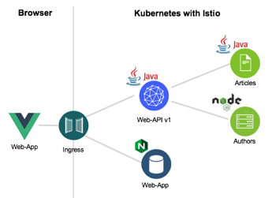
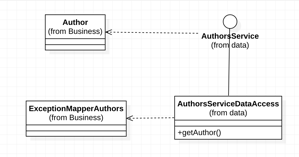
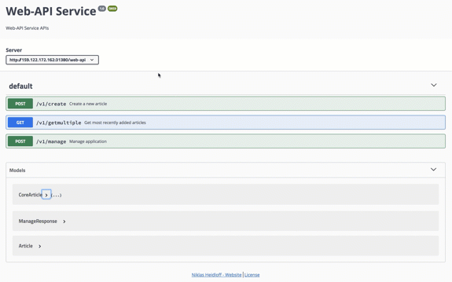

[home](README.md)
# Defining and exposing REST APIs

****** **UNDER CONSTRUCTION** ******

## 1. Making the REST API life easier for Java developers with MicroProfile

### 1.1 JSON data and Java objects

MicroProfile comes with a REST Client which defines a type safe client programming model. The REST Client makes it easier to convert between the JSON data and Java objects in both directions.

There is pretty good [documentation](https://github.com/OpenLiberty/guide-microprofile-rest-client) about the REST Client available. 

In the following Lab describes how we use the MicroProfile REST client in the **Cloud Native Starter** sample application. The application has a **Web API** service which implements the **BFF** (backend for frontend pattern). The **Web API** service uses the REST Client to invoke the **'Articles'** and the **‘Authors’** services



The sequence diagram below shows a simplified view how the **REST API** is used to get all articles in a **JSON format**. 


In the simplified class diagram below you can see the major high level relations of the classes to implement the access to the **‘Authors’** REST Client to consume JSON data. These classes make that easier to convert between the **JSON data** and **Java objects** in both directions for the developer.



Let's get us a closer to the class implementations. First we need to define the **interface** of the service we want to invoke. Here we use the [interface AuthorsService](../web-api-java-jee/src/main/java/com/ibm/webapi/data/AuthorsService.java). The method **‘getAuthor’** returns an object of the Author class.

```java
import javax.ws.rs.GET;
import javax.ws.rs.Produces;
import javax.ws.rs.core.MediaType;
import com.ibm.webapi.business.Author;
import com.ibm.webapi.business.NonexistentAuthor;
 
@RegisterProvider(ExceptionMapperArticles.class)
public interface AuthorsService {
  @GET
  @Produces(MediaType.APPLICATION_JSON)
  public Author getAuthor(String name) throws NonexistentAuthor; 
}
```

The class **Author** defines the structure for the JSON data exchange.

```java
public class Author {
   public String name;
   public String twitter;
   public String blog;
}
```

The invocation of the **Authors** service happens in [AuthorsServiceDataAccess.java](../web-api-java-jee/src/main/java/com/ibm/webapi/data/AuthorsService.java). 
The [RestClientBuilder](https://openliberty.io/docs/ref/javadocs/microprofile-1.3-javadoc/org/eclipse/microprofile/rest/client/RestClientBuilder.html) is used to get an implementation of the AuthorsService interface. 
_IMPORTANT:_ The **deserialization** of the **JSON data** into a **Java object** is done automatically.

```java
import org.eclipse.microprofile.rest.client.RestClientBuilder;
import com.ibm.webapi.business.Author;
import com.ibm.webapi.business.NonexistentAuthor;
 
public class AuthorsServiceDataAccess {
   static final String BASE_URL = "http://authors/api/v1/";
 
   public AuthorsServiceDataAccess() {} 
 
   public Author getAuthor(String name) throws NoConnectivity, NonexistentAuthor {
      try {
         URL apiUrl = new URL(BASE_URL + "getauthor?name=" + name);
         AuthorsService customRestClient = RestClientBuilder.newBuilder().baseUrl(apiUrl).register(ExceptionMapperAuthors.class).build(AuthorsService.class);
         return customRestClient.getAuthor(name);
      } catch (NonexistentAuthor e) {
         throw new NonexistentAuthor(e);            
      } catch (Exception e) {
         throw new NoConnectivity(e);
      }
   }
}
```

In order to use the **RESTClientBuilder** we need to understand the concept of the [ResponseExceptionMapper](https://download.eclipse.org/microprofile/microprofile-rest-client-1.0/apidocs/index.html?org/eclipse/microprofile/rest/client/ext/ResponseExceptionMapper.html). This mapper is used to translate certain **HTTP response error codes** back into **Java exceptions**.

```java
import org.eclipse.microprofile.rest.client.ext.ResponseExceptionMapper;
import com.ibm.webapi.business.NonexistentAuthor;
 
@Provider
public class ExceptionMapperAuthors implements ResponseExceptionMapper<NonexistentAuthor> {
   @Override
   public boolean handles(int status, MultivaluedMap<String, Object> headers) {
      return status == 204;
   }
   @Override
   public NonexistentAuthor toThrowable(Response response) {
      switch (response.getStatus()) {
         case 204:
            return new NonexistentAuthor();
        }
        return null;
   }   
}
```

---

### 1.2 Using the REST call with JSON data

The following code shows how the **REST API** is used to get the Author information inside the [Service class](../web-api-java-jee/src/main/java/com/ibm/webapi/business/Service.java).


```java
for (int index = 0; index < coreArticles.size(); index++) {
	CoreArticle coreArticle = coreArticles.get(index);
	Article article = new Article();
	article.id = coreArticle.id;
	article.title = coreArticle.title;
	article.url = coreArticle.url;
	article.authorName = coreArticle.author;
	try {
		Author author = DataAccessManager.getAuthorsDataAccess().getAuthor(coreArticle.author);
		article.authorBlog = author.blog;
	   article.authorTwitter = author.twitter;
      ...
   }
   ...
} 
```

---

### 1.3 Expose the REST API with Open API

The **MicroProfile** supports also the definition REST APIs via [JAX-RS](https://en.wikipedia.org/wiki/Java_API_for_RESTful_Web_Services). We use MircoProfile to create a **Open API** documentation and api explorer. 
We the **Open API** can use for documentation and testing of the REST API of our microservice. Inside the class [articles](articles-java-jee/src/main/java/com/ibm/articles/apis/) we use the profiles **@GET**, **@Path** and others,  to expose and document REST API with the MicroProfile during writting of the code with **Open API**.

```java
package com.ibm.webapi.apis;
 
import javax.ws.rs.*;
import org.eclipse.microprofile.openapi.annotations.*;
 
@RequestScoped
@Path("/v1")
@OpenAPIDefinition(info = @Info(title = "Web-API Service", version = "1.0", description = "Web-API Service APIs", contact = @Contact(url = "https://github.com/nheidloff/cloud-native-starter", name = "Niklas Heidloff"), license = @License(name = "License", url = "https://github.com/nheidloff/cloud-native-starter/blob/master/LICENSE")))
public class GetArticles {
   @Inject
   com.ibm.webapi.business.Service service;
   @Inject
   ArticleAsJson articleAsJson;
 
   @GET
   @Path("/getmultiple")
   @Produces(MediaType.APPLICATION_JSON)
   @APIResponses(value = { 
      @APIResponse(responseCode = "200", description = "Get most recently added articles", content = @Content(mediaType = "application/json", schema = @Schema(type = SchemaType.ARRAY, implementation = Article.class))),          
      @APIResponse(responseCode = "500", description = "Internal service error") })
   @Operation(summary = "Get most recently added articles", description = "Get most recently added articles")
   public Response getArticles() {
.....
```

The following image shows an automatically created **Open API explorer** for the **Web API** microservice.


---

## 2. Hands-on tasks - Defining and exposing REST APIs

### 2.1 Gain access to your cluster

1. Log in to your IBM Cloud account. Include the --sso option if using a federated ID.

```sh
$ ibmcloud login -a https://cloud.ibm.com -r us-south -g default
```

2. Download the kubeconfig files for your cluster.

```sh
$ ibmcloud ks cluster-config --cluster cloud-native
```

3. Set the KUBECONFIG environment variable. Copy the output from the previous command and paste it in your terminal. The command output looks similar to the following example:

```sh
export KUBECONFIG=/Users/$USER/.bluemix/plugins/container-service/clusters/cloud-native/kube-config-mil01-cloud-native.yml
```

4. Verify that you can connect to your cluster by listing your worker nodes.

```sh
kubectl get nod
```

---

### 2.2 Defining and exposing REST APIs

In the following bash scripts we use **ibmcloud** and **kubectl** commands to interact with **IBM Cloud Platform**, **IBM Container Registry Service** and the **IBM Kubernetes Service**. With **sed** and **awk** we extract the output from the comandline.

1. Invoke the following commands to set up the lab. 

```sh
$ cd $PROJECT_HOME
$ ./scripts/delete-all.sh
$ ./iks-scripts/deploy-articles-java-jee.sh
$ ./iks-scripts/deploy-authors-nodejs.sh
$ ./iks-scripts/deploy-web-api-java-jee.sh
$ ./iks-scripts/deploy-istio-ingress-v1.sh
$ ./iks-scripts/show-urls.sh
```

Now we use the ```‘web-api/v1/getmultiple‘``` endpoint with the **CURL command** and from the **Open API explorer**.

The sequence diagram below shows once again the simplified view, how the **‘Authors’** REST API is used to get all articles in a JSON format.


---

### 2.2 Using CURL

Now we invoke the following curl command of the **'Web API'** microservice. The IP is displayed as output of 'scripts/show-urls.sh'.

```sh
 curl http://YOUR_IP:31380/web-api/v1/getmultiple
```
After the execution of the command we should get following result:

```sh
curl http://159.122.172.162:31380/web-api/v1/getmultiple
[{"id":"1557993525215","title":"Debugging Microservices running in Kubernetes","url":"http://heidloff.net/article/debugging-microservices-kubernetes","authorName":"Niklas Heidloff","authorBlog":"http://heidloff.net","authorTwitter":"@nheidloff"},{"id":"1557993525210","title":"Dockerizing Java MicroProfile Applications","url":"http://heidloff.net/article/dockerizing-container-java-microprofile","authorName":"Niklas Heidloff","authorBlog":"http://heidloff.net","authorTwitter":"@nheidloff"},{"id":"1557993525204","title":"Install Istio and Kiali on IBM Cloud or Minikube","url":"https://haralduebele.blog/2019/02/22/install-istio-and-kiali-on-ibm-cloud-or-minikube/","authorName":"Harald Uebele","authorBlog":"https://haralduebele.blog","authorTwitter":"@harald_u"},{"id":"1557993525199","title":"Three awesome TensorFlow.js Models for Visual Recognition","url":"http://heidloff.net/article/tensorflowjs-visual-recognition","authorName":"Niklas Heidloff","authorBlog":"http://heidloff.net","authorTwitter":"@nheidloff"},{"id":"1557993525194","title":"Blue Cloud Mirror Architecture Diagrams","url":"http://heidloff.net/article/blue-cloud-mirror-architecture-diagrams","authorName":"Niklas Heidloff","authorBlog":"http://heidloff.net","authorTwitter":"@nheidloff"}]
```

### 2.3 Using the Open API explorer

We can use also the **Open API explorer** to call the operation.



---

Now, we've finished the **Defining and exposing REST APIs**.
Let's get started with the [Lab - Using traffic management in Kubernetes](04-traffic-management.md).

---

Read the following resources to learn more about the MicroProfile REST Client.

* [Guide: Consuming RESTful services with template interfaces](https://github.com/OpenLiberty/guide-microprofile-rest-client)
* [Rest Client for MicroProfile](https://github.com/eclipse/microprofile-rest-client)
* [MicroProfile Rest Client in Istio](https://www.eclipse.org/community/eclipse_newsletter/2018/september/MicroProfile_istio.php#restclient)
* [Java Microservices with MicroProfile – Rest Client and JSON-B](https://www.ibm.com/blogs/bluemix/2018/10/migrate-java-microservices-from-spring-to-microprofile-p3/)

---

Resources:

* ['Invoking REST APIs from Java Microservices'](http://heidloff.net/invoke-rest-apis-java-microprofile-microservice)
* ['Demo: Expose REST APIs'](documentation/DemoExposeRESTAPIs.md)
* ['Demo: Consume REST APIs'](documentation/DemoConsumeRESTAPIs.md)