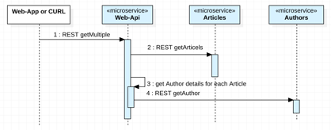

[home](README.md)
# Defining and exposing REST APIs

****** **UNDER CONSTRUCTION** ******

## Making the REST API life easier for Java developers with MicroProfile

MicroProfile comes with a REST Client which defines a type safe client programming model. The REST Client makes it easier to convert between the JSON data and Java objects in both directions.

There is pretty good [documentation](https://github.com/OpenLiberty/guide-microprofile-rest-client) about the REST Client available. 

In this Lab we describe how we use this client in the **Cloud Native Starter** sample application. The application has a **Web API** service which implements the **BFF** (backend for frontend pattern). The Web API service uses the REST Client to invoke another **‘Authors’** service written in **Node.JS**.


In the following Lab we do examine the usage of the **‘Authors’** microservice in the **Web-api**.

The sequence diagram below shows a simplified view when the **‘Authors’** REST API is used, if we want to get all articles.



In the simplified class diagram below you can see the major high level relations of the classes which do implement the access to **‘Authors’** REST API.


First you need to define the **interface** of the service you want to invoke. Here we use the [interface AuthorsService](../web-api-java-jee/src/main/java/com/ibm/webapi/data/AuthorsService.java).

```java
import javax.ws.rs.GET;
import javax.ws.rs.Produces;
import javax.ws.rs.core.MediaType;
import com.ibm.webapi.business.Author;
import com.ibm.webapi.business.NonexistentAuthor;
 
@RegisterProvider(ExceptionMapperArticles.class)
public interface AuthorsService {
  @GET
  @Produces(MediaType.APPLICATION_JSON)
  public Author getAuthor(String name) throws NonexistentAuthor; 
}
```

The method **‘getAuthor’** returns an object of the Author class.

```java
public class Author {
   public String name;
   public String twitter;
   public String blog;
}
```

The actual invocation of the authors service happens in [AuthorsServiceDataAccess.java](../web-api-java-jee/src/main/java/com/ibm/webapi/data/AuthorsService.java). The [RestClientBuilder](https://openliberty.io/docs/ref/javadocs/microprofile-1.3-javadoc/org/eclipse/microprofile/rest/client/RestClientBuilder.html) is used to get an implementation of the AuthorsService interface. The deserialization of the data into a Java object is done automatically.

```java
import org.eclipse.microprofile.rest.client.RestClientBuilder;
import com.ibm.webapi.business.Author;
import com.ibm.webapi.business.NonexistentAuthor;
 
public class AuthorsServiceDataAccess {
   static final String BASE_URL = "http://authors/api/v1/";
 
   public AuthorsServiceDataAccess() {} 
 
   public Author getAuthor(String name) throws NoConnectivity, NonexistentAuthor {
      try {
         URL apiUrl = new URL(BASE_URL + "getauthor?name=" + name);
         AuthorsService customRestClient = RestClientBuilder.newBuilder().baseUrl(apiUrl).register(ExceptionMapperAuthors.class).build(AuthorsService.class);
         return customRestClient.getAuthor(name);
      } catch (NonexistentAuthor e) {
         throw new NonexistentAuthor(e);            
      } catch (Exception e) {
         throw new NoConnectivity(e);
      }
   }
}
```

In order to use the RESTClientBuilder you need to understand the concept of the [ResponseExceptionMapper](https://download.eclipse.org/microprofile/microprofile-rest-client-1.0/apidocs/index.html?org/eclipse/microprofile/rest/client/ext/ResponseExceptionMapper.html). This mapper is used to translate certain HTTP response error codes back into Java exceptions.

```java
import org.eclipse.microprofile.rest.client.ext.ResponseExceptionMapper;
import com.ibm.webapi.business.NonexistentAuthor;
 
@Provider
public class ExceptionMapperAuthors implements ResponseExceptionMapper<NonexistentAuthor> {
   @Override
   public boolean handles(int status, MultivaluedMap<String, Object> headers) {
      return status == 204;
   }
   @Override
   public NonexistentAuthor toThrowable(Response response) {
      switch (response.getStatus()) {
         case 204:
            return new NonexistentAuthor();
        }
        return null;
   }   
}
```

The following code shows how the REST API is used to get the Author information in the [Service class](../web-api-java-jee/src/main/java/com/ibm/webapi/business/Service.java).


```java
for (int index = 0; index < coreArticles.size(); index++) {
	CoreArticle coreArticle = coreArticles.get(index);
	Article article = new Article();
	article.id = coreArticle.id;
	article.title = coreArticle.title;
	article.url = coreArticle.url;
	article.authorName = coreArticle.author;
	try {
		Author author = DataAccessManager.getAuthorsDataAccess().getAuthor(coreArticle.author);
		article.authorBlog = author.blog;
	   article.authorTwitter = author.twitter;
} 
```

## Lab

Invoke the following commands to set up the lab. Skip the commands you've already executed.

```sh
$ cd $PROJECT_HOME
$ ./iks-scripts/delete-all.sh
$ ./iks-scripts/deploy-articles-java-jee.sh
$ ./iks-scripts/deploy-authors-nodejs.sh
$ ./iks-scripts/deploy-web-api-java-jee.sh
$ ./iks-scripts/deploy-istio-ingress-v1.sh
$ ./iks-scripts/show-urls.sh
```

Invoke the curl command of the **'web-api'** microserivce which is displayed as output of 'scripts/show-urls.sh' to get ten articles, for example **'curl http://159.122.172.162:31380/web-api/v1/getmultiple'**.

You should get following result:

```sh
curl http://159.122.172.162:31380/web-api/v1/getmultiple
[{"id":"1557993525215","title":"Debugging Microservices running in Kubernetes","url":"http://heidloff.net/article/debugging-microservices-kubernetes","authorName":"Niklas Heidloff","authorBlog":"http://heidloff.net","authorTwitter":"@nheidloff"},{"id":"1557993525210","title":"Dockerizing Java MicroProfile Applications","url":"http://heidloff.net/article/dockerizing-container-java-microprofile","authorName":"Niklas Heidloff","authorBlog":"http://heidloff.net","authorTwitter":"@nheidloff"},{"id":"1557993525204","title":"Install Istio and Kiali on IBM Cloud or Minikube","url":"https://haralduebele.blog/2019/02/22/install-istio-and-kiali-on-ibm-cloud-or-minikube/","authorName":"Harald Uebele","authorBlog":"https://haralduebele.blog","authorTwitter":"@harald_u"},{"id":"1557993525199","title":"Three awesome TensorFlow.js Models for Visual Recognition","url":"http://heidloff.net/article/tensorflowjs-visual-recognition","authorName":"Niklas Heidloff","authorBlog":"http://heidloff.net","authorTwitter":"@nheidloff"},{"id":"1557993525194","title":"Blue Cloud Mirror Architecture Diagrams","url":"http://heidloff.net/article/blue-cloud-mirror-architecture-diagrams","authorName":"Niklas Heidloff","authorBlog":"http://heidloff.net","authorTwitter":"@nheidloff"}]
```

## Document REST call GetArticels in OpenAPI

With the usage of the MicroProfile you can document you REST API during the development with [OpenApi](https://github.com/OpenLiberty/guide-microprofile-openapi).

Here is a sample of the usage inside the the class [GetArticles](../web-api-java-jee/src/main/java/com/ibm/webapi/apis/GetArticles.java) to implement a REST call.

Here you can see the definition of the **@Path("/getmultiple")**, which we used before in our CURL command.

```java
...
public class GetArticles {
   .....
   @GET
	@Path("/getmultiple")
	@Produces(MediaType.APPLICATION_JSON)
	@APIResponses(value = {
			@APIResponse(responseCode = "200", description = "Get most recently added articles", content = @Content(mediaType = "application/json", schema = @Schema(type = SchemaType.ARRAY, implementation = Article.class))),			
			@APIResponse(responseCode = "500", description = "Internal service error") })
	@Operation(summary = "Get most recently added articles", description = "Get most recently added articles")
   .....
```

With that we get also the API Explorer, we can use for our documentation and testing of the REST API the microservice.


Read the following resources to learn more about the MicroProfile REST Client and OpenAPI.

* [Guide: Consuming RESTful services with template interfaces](https://github.com/OpenLiberty/guide-microprofile-rest-client)
* [Rest Client for MicroProfile](https://github.com/eclipse/microprofile-rest-client)
* [MicroProfile Rest Client in Istio](https://www.eclipse.org/community/eclipse_newsletter/2018/september/MicroProfile_istio.php#restclient)
* [Java Microservices with MicroProfile – Rest Client and JSON-B](https://www.ibm.com/blogs/bluemix/2018/10/migrate-java-microservices-from-spring-to-microprofile-p3/)
* [Guide microprofile penapi](https://github.com/OpenLiberty/guide-microprofile-openapi)

Now, we've finished the **Defining and exposing REST APIs**.
Let's get started with the [Lab - Using traffic management in Kubernetes](04-traffic-management.md).

---

Resources:

* ['Invoking REST APIs from Java Microservices'](http://heidloff.net/invoke-rest-apis-java-microprofile-microservice)

* ['Demo: Consume REST APIs'](https://github.com/nheidloff/cloud-native-starter/blob/master/documentation/DemoConsumeRESTAPIs.md)