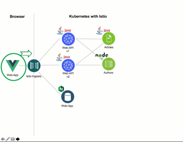

[home](README.md)
# Using traffic management in Kubernetes with Istio

The **“Cloud Native Starter”** is a sample [polyglot](https://en.wikipedia.org/wiki/Polyglot_(disambiguation)) microservices application with Java and Node.js on Kubernetes using Istio for traffic management, tracing, metrics, fault injection, fault tolerance, etc.

There are currently not many Istio examples available. The one most widely used is probably [Istio’s own “Bookinfo”](https://developer.ibm.com/solutions/container-orchestration-and-deployment/?cm_mmc=Search_Google-_-Developer_IBM+Developer-_-WW_EP-_-%2Bistio_b&cm_mmca1=000019RS&cm_mmca2=10004796&cm_mmca7=9041823&cm_mmca8=aud-396679157191:kwd-448983149697&cm_mmca9=_k_EAIaIQobChMIq_ynq8yi4gIVrDLTCh1T2g9AEAAYASAAEgIVAfD_BwE_k_&cm_mmca10=322762525080&cm_mmca11=b&gclid=EAIaIQobChMIq_ynq8yi4gIVrDLTCh1T2g9AEAAYASAAEgIVAfD_BwE) sample or the [Red Hat Istio tutorial](https://github.com/redhat-developer-demos/istio-tutorial). These tutorials and examples do focus on the request routing not as a part for a user-facing service behind the **Istio ingress**.

In this part we create a **new instance** and of a **new version** for the **Web API** microservice.


We configure the routing to split the usage between our two instances and versions of our **Web API** microservice.



_Note:_ Here is a 3-min teaser video to the related topic: Traffic management in Kubernetes with Istio

[](https://www.youtube.com/watch?v=VT9TzuoTEZ0 "Click play on youtube")

## 1.1 Deployment definition

We need to understand; these two versions of the **Web API** do exist as **two** different Kubernetes deployments and they run **in parallel**. That is defined in the [kubernetes-deployment-v1](../web-api-java-jee/deployment/kubernetes-deployment-v1.yaml) and [kubernetes-deployment-v2](web-api-java-jee/deployment/kubernetes-deployment-v2.yaml).

Commonly, in Kubernetes we would replace v1 with v2. With **Istio** we can use two or more deployments of different versions of an app to do a **green/blue**, **A/B**, or [canary deployment](https://www.ibm.com/cloud/garage/tutorials/use-canary-testing-in-kubernetes-using-istio-toolchain) to test, if v2 works as expected. We can slowly roll out our changes to a small subset of users before rolling it out to the entire infrastructure and making it available to everyone. 

The **“version”** label is important for Istio to distinguish between the two deployments in Kubernetes. 

| Version 1   |  Version 2    | 
|--- | --- |
|    |      | 

---

## 1.2 Service definition

In Kubernetes we have one [service definition](../web-api-java-jee/deployment/kubernetes-service.yaml). The **selector** in the configuration needs only the **“app”** label. Without Istio it will distribute traffic between the two deployments **evenly**. The port is named (“name: http”), because this is a [requirement](https://istio.io/docs/setup/kubernetes/prepare/requirements/) for Istio.


---

## 1.3 Istio gateway

By the way: [What is Istio?](https://istio.io/docs/concepts/what-is-istio/)

> At a high level, Istio helps reduce the complexity of cloud native deployments, and eases the strain on your development teams. It is a completely open source service mesh that layers transparently onto existing distributed applications. It is also a platform, including APIs that let it integrate into any logging platform, or telemetry or policy system. Istio’s diverse feature set lets you successfully, and efficiently, run a distributed microservice architecture, and provides a uniform way to secure, connect, and monitor microservices.

What we need to understand from Istio in our situation is: Istio works with [envoy proxies](https://www.envoyproxy.io/), to **control** inbound and outbound traffic and to gather [telemetry data](https://en.wikipedia.org/wiki/Telemetry#Software) of a Kubernetes Pod. The envoy proxy is **injected as additional container** into a Pod. The image below is from the [Istio documentation](https://istio.io/docs/concepts/what-is-istio/) and shows the basic Istio architecture.


The following image shows a simplified view on the given information for our situation. The Pods do have **injected additional containers**.


We want to control the route traffic (e.g. REST API calls). To control the traffic into a **Kubernetes application** a **Kubernetes Ingress** is required. With Istio, we have a similar **Istio Ingress Gateway** which is a Pod running in Kubernetes. This gateway in turn uses the **Istio ingress gateway** which is a Pod running in Kubernetes. In following pricture we see the definition of our Istio gateway. The [Istio ingress.yaml](../web-api-java-jee/deployment/istio-ingress.yaml).

In our example, this gateway listens on **port 80** and answers to any request (“*”). The “hosts: *” should not be used in production, of course. 


In the gif we can see the **Istio Gateway** instance in our Kubernetes, we installed before. 


---

## 1.4 Virtual Service

One of the required Istio configuration is the **“Virtual Service”** which overlays the Kubernetes service definition. The **Web API** service in the picture below exposes 3 REST URIs. Two of them pointing to a API documentation (Swagger/Open API), they are defined as ```/openapi``` and ```/openapi/ui/``` and they are currently independent of the version of **Web API**. 
The third URI is ```/web-api/v1/getmultiple``` and this is version-specific. 

Base on this given information, we have following VirtualService definition:


1. Pointer to the Ingress Gateway
2. URI that directly point to the Kubernetes service web-api listenting on port 9080 (without Istio)
3. URI that uses ```“subset: v1”``` of the service web-api which we haven’t defined yet, this is Istio specific
4. Root ```/``` is pointing to port ```80``` of the **Web app** service which is different from web-api! It is the service that provides the Vue app to the browser.

## 1.5 Destination rule

To control the traffic we need to define a **DestinationRule**, this is  Istio specific. 

In the image below we can see, this configuration defines a subset of calls will select the ```v1``` Pod that belong to **Web API** and have a selector label of ```“version: v1”```. This is our deployment for **“web-api-v1”**.


With this Istio rule, we set in place all incoming traffic will go to version 1 of the **Web API**. In the following image you can see in Kiali, all the traffic is routed to version 1.


---

## 1.6 Traffic distribution

We can change the configuration for the VirtualService to distribute incoming traffic, e.g. **80%** to version 1 and **20%** to version 2:


We can verify the traffic in Kiali:


---

## 1.7 Hands-on tasks - Traffic Routing

In order to demonstrate **traffic routing** we run the following  commands. We will configure the **Cloud Native Starter** application that **20 %** of the **Web API** API request will return 10 articles as defined in version 2 and **80 %** of the requests are still showing only 5 articles which is version 1. 

### 1.7.1 Gain access to your cluster

1. Log in to your IBM Cloud account. Include the --sso option if using a federated ID.

```sh
$ ibmcloud login -a https://cloud.ibm.com -r us-south -g default
```

2. Download the kubeconfig files for your cluster.

```sh
$ ibmcloud ks cluster-config --cluster cloud-native
```

3. Set the ```KUBECONFIG``` environment variable. Copy the output from the previous command and paste it in your terminal. The command output looks similar to the following example:

```sh
$ export KUBECONFIG=/Users/$USER/.bluemix/plugins/container-service/clusters/hands-on-verification/kube-config-mil01-cloud-native.yml
```

4. Verify that you can connect to your cluster by listing your worker nodes.

```sh
$ kubectl get nodes
```

### 1.7.2 Traffic Routing

In the following bash scripts we use **ibmcloud** and **kubectl** commands to interact with IBM Cloud, IBM Container Registry Service and the IBM Kubernetes service in IBM Cloud. With ```sed``` and ```awk``` we extract the output from the comandline.

1. Execute following script to setup

    ```sh
    $ cd $PROJECT_HOME
    $ ./iks-scripts/check-prerequisites.sh
    $ ./scripts/delete-all.sh
    $ ./iks-scripts/deploy-articles-java-jee.sh
    $ ./iks-scripts/deploy-authors-nodejs.sh
    $ ./iks-scripts/deploy-web-app-vuejs.sh
    ```
_Optional:_ You can verify the new **Web app** version in Kubernetes.


2. Install the two Versions on the **Web API**

    ```sh
    $ iks-scripts/deploy-web-api-java-jee.sh
    $ iks-scripts/deploy-web-api-java-jee-v2.sh
    ```

3. This script changes **Istio Ingress Service configration** for the **Web API**. The configuration you can find [here](../istio/istio-ingress-service-web-api-v1-v2-80-20.yaml). Now execute the these to scripts.

    ```sh
    $ scripts/deploy-istio-ingress-v1-v2.sh
    $ iks-scripts/show-urls.sh
    ```

4.  We will use Kiali to monitor the distribution of the requests.
    Access Kiali on you local machine:

    ```sh
    $ kubectl -n istio-system port-forward $(kubectl -n istio-system get pod -l app=kiali -o jsonpath='{.items[0].metadata.name}') 20001:20001
    ```
    
    _Note:_ If you use the **workshop Docker image for Windows**, you have of open **kiali** in a browser on the windows host.
    
    ```http://{CLUSTER-IP}:31380/kiali/console/applications?namespaces=default```


 system a windows hyou don't need to follow these steps. Everything is in place already.

5. Then open http://localhost:20001/kiali in your browser and logon with Username: admin, Password: admin.

    

6. Configure your graph in **Kiali**. Select **Graph**, **Versioned app graph** and **Request percentage**.  

    


7. Open the **Web APP** in a new browser tab: http://YOUR_IP:31380/
_Note:_ This is on of the links we get from the ```iks-scripts/show-urls.sh``` script.

   

8. Now we observe in Kiali the request routing for the **Web API** implementations. Refresh the browser of the **Web APP** and watch the Kiali graph. 

   

---

Now, we've finished the **Using traffic management in Kubernetes**.
Let's get started with the [Lab - Resiliency](05-resiliency.md).

---

Resources:

* ['Managing Microservices Traffic with Istio'](https://haralduebele.blog/2019/03/11/managing-microservices-traffic-with-istio/)
* ['Demo: Traffic Routing'](../documentation/DemoTrafficRouting.md)