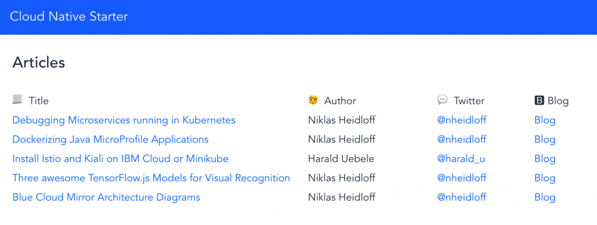
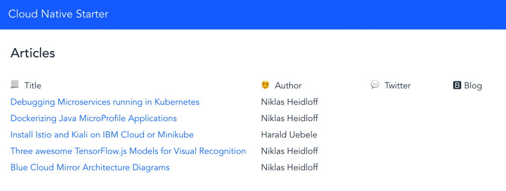

[home](README.md)
# Resiliency

As stated in the [reactive manifesto](https://www.reactivemanifesto.org/) cloud-native reactive applications need to be **resilient**:

> " **The system stays responsive in the face of failure.** This applies not only to highly-available, mission-critical systems – any system that is not resilient will be unresponsive after a failure. Resilience is achieved by replication, containment, isolation … "

In distributed systems we need to **design for failure**. For example, microservices, which invoke other microservices, must be intelligent enough to continue to work even if some of their dependencies are currently not available.

There are several different ways to build resilient service meshes with Istio, for example via **circuit breakers** ([Martin Fowler blog](https://martinfowler.com/bliki/CircuitBreaker.html)/[implementation](https://istio.io/docs/concepts/traffic-management/#circuit-breakers)) and [retries](https://istio.io/docs/concepts/traffic-management/#timeouts-and-retries).

The Istio functionality for resilient cloud-native applications is **generic** and **independent** from the implementation of the microservices. However in some cases the **handling of failures depends on the business logic** of the applications which is why this needs to be implemented in the microservices.

In **Cloud Native Starter**, the **Web app** frontend, implemented in Vue.js, displays articles. The service ‘**Web API**’ implements the **BFF** (backend for frontend) pattern. The web application accesses the ‘**Web API**’ service which invokes both the ‘articles’ and **Authors** services. The initial page of the **Web app** shows the five most recent articles including information about the authors. When we **delete** the **Authors** service inside Kubernetes, the **Web app** will still display five articles, but this time without the information about the authors, even when the **Web app** cannot display the complete information anymore. In this simple scenario it still makes sense to display the titles and links of the articles. 

| With the author service   |  When the author service is deleted|
| --- | --- |    
|  |  |   

The implementation of this behavior has been done in the class [Service.java](../web-api-java-jee/src/main/java/com/ibm/webapi/business/Service.java#L68). You can see the ```catch (NoConnectivity | NonexistentAuthor e)``` does handle the situation and set a default value.

```java
try {
   Author author = DataAccessManager.getAuthorsDataAccess().getAuthor(coreArticle.author);
   article.authorBlog = author.blog;
   article.authorTwitter = author.twitter;
} catch (NoConnectivity | NonexistentAuthor e) {    
   article.authorBlog = "";
   article.authorTwitter = "";
}
```

After the articles service is deleted, we will notice that the same 5 articles are displayed when we refresh the browser. That’s because in this trivial scenario the ‘**Web API**’ service **caches** the last read articles. If the ‘articles’ service is not available it simply returns the information from the cache.

|  When the author service is deleted   |   When the author and articles service is deleted |
| --- | --- |    
|  |  | 

We are using the [Eclipse MicroProfile fallback annotation](https://www.openliberty.io/guides/microprofile-fallback.html). In this case a fallback method is invoked if the original method throws an exception. Here we have the two operations inside the [service.java](../classweb-api-java-jee/src/main/java/com/ibm/webapi/business/Service.java#L45).

* The definition of the fallback profile **@Fallback**

```java
@Fallback(fallbackMethod = "fallbackNoArticlesService")
public List<Article> getArticles() throws NoDataAccess {
   List<CoreArticle> coreArticles = new ArrayList<CoreArticle>();   
   try {
      coreArticles = DataAccessManager.getArticlesDataAccess().getArticles(5);                          
   } catch (NoConnectivity e) {
      System.err.println("com.ibm.webapi.business.getArticles: Cannot connect to articles service");
      throw new NoDataAccess(e);
   }
...
} 
```

* The implementation of the fallback profile. Here we create a list with the last shown articles ```lastReadArticles = new ArrayList<Article>();```.

```java
...
public List<Article> fallbackNoArticlesService() {
   System.err.println("com.ibm.webapi.business.fallbackNoArticlesService: Cannot connect to articles service");
   if (lastReadArticles == null) lastReadArticles = new ArrayList<Article>();
      return lastReadArticles;
}
```
---

## 2. Hands-on tasks - Resiliency

Resiliency is part of the code: if an API call is not answered because of an error ar a timeout, the business logic must have a implementation of a fallback. 

---

### 2.1 Gain access to your cluster

1. Log in to your IBM Cloud account. Include the --sso option if using a federated ID.

   ```sh
   $ ibmcloud login -a https://cloud.ibm.com -r us-south -g default
   ```

2. Download the kubeconfig files for your cluster.

   ```sh
   $ ibmcloud ks cluster-config --cluster cloud-native
   ```

3. Set the KUBECONFIG environment variable. Copy the output from the previous command and paste it in your terminal. The command output looks similar to the following example:

   ```sh
   $ export KUBECONFIG=/Users/$USER/.bluemix/plugins/container-service/clusters/hands-on-verification/kube-config-mil01-cloud-native.yml
   ```

4. Verify that you can connect to your cluster by listing your worker nodes.

   ```sh
   $ kubectl get nodes
   ```

---

### 2.2 Setup and test the resiliency

In the following bash scripts we use **ibmcloud** and **kubectl** commands to interact with IBM Cloud, IBM Container Registry Service and the IBM Kubernetes service in IBM Cloud. With **sed** and **awk** we extract the output from the comandline.

1. In order to demonstrate resiliency run the following commands to create a working set of services:

   ```sh
   $ ./iks-scripts/check-prerequisites.sh
   $ ./scripts/delete-all.sh
   $ ./iks-scripts/deploy-articles-java-jee.sh
   $ ./iks-scripts/deploy-web-api-java-jee.sh
   $ ./iks-scripts/deploy-authors-nodejs.sh
   $ ./iks-scripts/deploy-web-app-vuejs.sh
   $ ./scripts/deploy-istio-ingress-v1.sh
   $ ./iks-scripts/show-urls.sh
   ```

2. Open the **Web APP** in a new browser tab: http://YOUR_IP:31380/

_Note:_ You get this link as output of the ```iks-scripts/show-urls.sh``` script.

   

2. Delete the **Authors** service

   ```sh
   $ ./scripts/delete-authors-nodejs.sh
   ```

   Refresh the browser and verify the remaining information. The details for the author are no longer avaiable. 

   

3. Delete the **articles** service

   ```sh
   $ ./scripts/delete-articles-java-jee.sh
   ```

   Refresh the browser and verify the remaining information. Although the articles service is gone, title and author are still displayed because the fallback method displays a cached version.


   

---

Now, we've finished the **Resiliency**.

**Congratulations** :thumbsup:, you have finished :checkered_flag: this **hands-on workshop** :-).

_Note:_ If you want to do more, you can move on with the [optional Lab - Replace the Node.js Authors microservice with a simple Java implementation](06-java-development.md).

---

Resources:

* ['Developing resilient Microservices with Istio and MicroProfile'](http://heidloff.net/article/resiliency-microservice-microprofile-java-istio)
* ['MicroProfile, the microservice programming model made for Istio'](https://www.eclipse.org/community/eclipse_newsletter/2018/september/MicroProfile_istio.php)
* ['Demo: Resiliency'](../documentation/DemoResiliency.md)

