[home](README.md)
# Optional - Lab - Replace the Node.js Authors microservice with a simple Java implementation

In that optional lab we will replace the existing Authors microservice written in Node.js with a Java implementation, as you can see in the gif below.

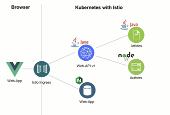

We see, with a microservice architecture and REST APIs we can easily replace microservice implementation, without any impact to the remaining **Cloud Native Starter** application.

In that service we only need to implement to provide a **REST API** for a ```getauthor`` request. Normally, we would implement also a database access, but in our case, we will only return sample data information. That sounds not a lot, but with this small sample we touch following topics:

•	Usage of [Maven](https://maven.apache.org/) for Java 

•	Configuration of an [OpenLiberty Server](https://openliberty.io)

•	Implementation of a [REST GET endpoint with MicroProfile](https://openliberty.io/blog/2018/01/31/mpRestClient.html)

•	[Health check](https://openliberty.io/guides/kubernetes-microprofile-health.html#adding-a-health-check-to-the-inventory-microservice) implementation using a MicroProfile for Kubernetes 

•	Definition of a [Dockerfile](https://docs.docker.com/engine/reference/builder/) with the reuse for existing containers from the [Dockerhub](https://hub.docker.com)

•	[Kubernetes deployment configuration](https://kubernetes.io/docs/concepts/workloads/controllers/deployment/)


That are the major steps we will follow to replace the  **Authors** service in our lab.

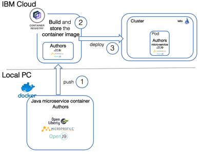

0. Develop the Java **Authors** service 
1. Uploading the container definition
2. Building and storing of the production container image inside the IBM Cloud Registry
3. Deploying the containers into the Kuberentes Cluster

---

# 1. Usage of Maven for Java

Let’s start with the [Maven](https://maven.apache.org/)
project for our Java project.

> Maven Apache Maven is a software project management and comprehension tool. Based on the concept of a **project object model** (POM), Maven can manage a project's build, reporting and documentation from a central piece of information.

In the **pom** file we define the configuation of our Java project, with **dependencies**, **build** and **properties** including for example the complier information as you can see in the [pom file](../authors-java-jee/pom.xml) below.

```xml
<project xmlns="http://maven.apache.org/POM/4.0.0"
	xmlns:xsi="http://www.w3.org/2001/XMLSchema-instance"
	xsi:schemaLocation="http://maven.apache.org/POM/4.0.0 http://maven.apache.org/xsd/maven-4.0.0.xsd">
	<modelVersion>4.0.0</modelVersion>
	<groupId>com.ibm.cloud</groupId>
	<artifactId>authors</artifactId>
	<version>1.0-SNAPSHOT</version>
	<packaging>war</packaging>

	<dependencies>
		<dependency>
			<groupId>javax</groupId>
			<artifactId>javaee-api</artifactId>
			<version>8.0</version>
			<scope>provided</scope>
		</dependency>
		<dependency>
			<groupId>org.eclipse.microprofile</groupId>
			<artifactId>microprofile</artifactId>
			<version>2.1</version>
			<scope>provided</scope>
			<type>pom</type>
		</dependency>
	</dependencies>

	<build>
		<finalName>authors</finalName>
	</build>

	<properties>
		<maven.compiler.source>1.8</maven.compiler.source>
		<maven.compiler.target>1.8</maven.compiler.target>
		<failOnMissingWebXml>false</failOnMissingWebXml>
		<project.build.sourceEncoding>UTF-8</project.build.sourceEncoding>
	</properties>
</project>
```
---

# 2. Configuration the Open Liberty Server

Our **Authors** mircroserice runs later on **OpenLiberty** Server in a container on Kubernetes.

We need to configure the **OpenLiberty** server a [server.xml](../authors-java-jee/liberty/server.xml) file. For our Java implementation we use the MicroProfile and with the feature definition in the **server.xml** we provide that information to our server.
In the configuration we notice the entries ```webProfile-8.0``` and ```microProfile-2.1```.
The server must be reached in the network; therefore, we define the  **httpEndpoint** including **http ports** we use for our microservice. For configuration details we can take a look into the [openliberty documentation](https://openliberty.io/docs/ref/config/).

_IMPORTANT:_ We should remember these **ports** e.g. ```httpPort="3000"``` should be exposed in the **Dockerfile** for our container and mapped inside the **Kubernetes** deployment configurations.

Also the name of the executable **web application** is definied in that **server.xml**.

```xml
<?xml version="1.0" encoding="UTF-8"?>
<server description="OpenLiberty Server">
	
    <featureManager>
        <feature>webProfile-8.0</feature>
        <feature>microProfile-2.1</feature>
    </featureManager>

    <httpEndpoint id="defaultHttpEndpoint" host="*" httpPort="3000" httpsPort="9443"/>

    <webApplication location="authors.war" contextRoot="api"/>

</server>
```

---

# 3. Implementation of the REST GET endpoint with MicroProfile

The sequence diagram below shows a simplified view how the **REST API** is used to get all articles. We will just replace the **Authors** microservice.

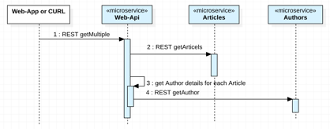

## 3.1 MicroProfile basics

In the most of the following classes we will use [MicroProfile](https://openliberty.io/docs/intro/microprofile.html).

> Microservice architecture is a popular approach for building cloud-native applications in which each capability is developed as an independent service. It enables small, autonomous teams to develop, deploy, and scale their respective services independently.

> **Eclipse MicroProfile** is a modular set of technologies designed so that you can write cloud-native Java™ microservices. In this introduction, learn how MicroProfile helps you develop and manage cloud-native microservices. Then, follow the Open Liberty MicroProfile guides to gain hands-on experience with MicroProfile so that you can build microservices with Open Liberty.

In the following image we see a list of MicroProfiles and the red marked profiles we will use in minimum in our lab.

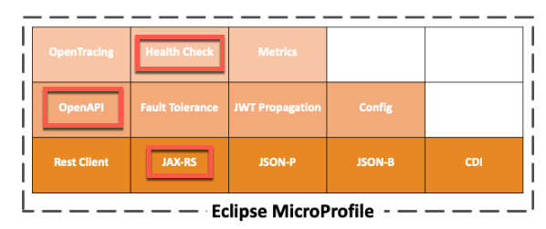

---

## 3.2 Needed Java classes to **expose** the **Authors** service

For the implementation for the **Authors** service to **expose** the REST API, we need basicly three classes:

* **AuthorsApplication** class repesents our web application.
* **Author** class repesents the data structure we use for the Author.
* **GetAuthor** class repesents the REST API.

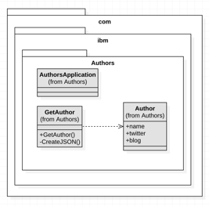

---

### 3.2.1 **Class AuthorsApplication**

Our web application does not implement any business or other logic, it simple needs to run on server with no UI. The AuthorsApplication class extends the [javax.ws.rs.core.Application](https://www.ibm.com/support/knowledgecenter/en/SSEQTP_9.0.0/com.ibm.websphere.base.doc/ae/twbs_jaxrs_configjaxrs11method.html) class to do this. With this extension the ```AuthorsApplication``` class provides access to the classes inside from the ```com.ibm.authors``` package during the runtime. With ```@ApplicationPath``` from MicroProfile we define the base path of the application.

```java
package com.ibm.authors;

import javax.ws.rs.core.Application;
import javax.ws.rs.ApplicationPath;

@ApplicationPath("v1")
public class AuthorsApplication extends Application {
}
```

---

### 3.2.2 **Class Author**

This class simply repesents the data structure we use for the [Author](../authors-java-jee/src/main/java/com/ibm/authors/). No MircoProfile is used here.

```java
package com.ibm.authors;

public class Author {
public String name;
public String twitter;
public String blog;
}
```

---

### 3.2.3 **Class GetAuthor**

This class implements the REST API response for our microservice **Authors**. We implement our REST client with the [MicroProfile REST Client](https://github.com/eclipse/microprofile-rest-client/blob/master/README.adoc) in the code we use profiles statements ```@Path```, ```@Get``` from [JAX-RS](https://jcp.org/en/jsr/detail?id=339) and form the [OpenAPI](https://www.openapis.org/) documentation ```@OpenAPIDefinition``` the [MicroProfile OpenAPI](https://github.com/eclipse/microprofile-open-api), which creates automatically a API explorer.

Let's remember the **server.xml** configuration. We added the **MicroProfile** to the server, as you can see in the code below.

```xml
<featureManager>
        <feature>microProfile-2.1</feature>
        ....
</featureManager> 
```

With the combination of the **server.xml** and our usage of **MicroProfile** in the **GetAuthor** class, we can access a **OpenAPI exlporer** with this URL ```http://host:http_port/openapi``` later.

This is the source code of the [GetAuthors class](../authors-java-jee/src/main/java/com/ibm/authors/GetAuthor.java) with the used **MicroProfiles**.

```java
@ApplicationScoped
@Path("/getauthor")
@OpenAPIDefinition(info = @Info(title = "Authors Service", version = "1.0", description = "Authors Service APIs", contact = @Contact(url = "https://github.com/nheidloff/cloud-native-starter", name = "Niklas Heidloff"), license = @License(name = "License", url = "https://github.com/nheidloff/cloud-native-starter/blob/master/LICENSE")))
public class GetAuthor {

	@GET
	@APIResponses(value = {
		@APIResponse(
	      responseCode = "404",
	      description = "Author Not Found"
	    ),
	    @APIResponse(
	      responseCode = "200",
	      description = "Author with requested name",
	      content = @Content(
	        mediaType = "application/json",
	        schema = @Schema(implementation = Author.class)
	      )
	    ),
	    @APIResponse(
	      responseCode = "500",
	      description = "Internal service error"  	      
	    )
	})
	@Operation(
		    summary = "Get specific author",
		    description = "Get specific author"
	)
	public Response getAuthor(@Parameter(
            description = "The unique name of the author",
            required = true,
            example = "Niklas Heidloff",
            schema = @Schema(type = SchemaType.STRING))
			@QueryParam("name") String name) {
		
			Author author = new Author();
			author.name = "Niklas Heidloff";
			author.twitter = "https://twitter.com/nheidloff";
			author.blog = "http://heidloff.net";

			return Response.ok(this.createJson(author)).build();
	}

	private JsonObject createJson(Author author) {
		JsonObject output = Json.createObjectBuilder().add("name", author.name).add("twitter", author.twitter)
				.add("blog", author.blog).build();
		return output;
	}
}
```

## 3.3 Supporting live and readiness probes in Kubernetes with HealthCheck

We add the class **HealthEndpoint** into the **Authors** package  as you can see in the following image.

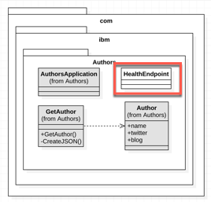

Let's understand what we want to support:

> Kubernetes **provides liveness** and **readiness probes** that are used to check the health of your containers, you will work with readiness probes. These probes can check certain files in your containers, check a TCP socket, or make HTTP requests. **MicroProfile Health** exposes a **health endpoint** on your microservices. Kubernetes polls the endpoint as specified by the probes to react appropriately to any change in the microservice’s status. Read the Adding health reports to microservices guide to learn more about MicroProfile Health.

For more information we can use the [Kubernetes Microprofile Health documentation](https://openliberty.io/guides/kubernetes-microprofile-health.html) and the documentation on [GitHub](https://github.com/eclipse/microprofile-health)

This is the implementation for the Health Check for Kubernetes for the **Authors** service in the [HealthEndpoint class](../authors-java-jee/src/main/java/com/ibm/authors/HealthEndpoint.java)

```java
@Health
@ApplicationScoped
public class HealthEndpoint implements HealthCheck {

    @Override
    public HealthCheckResponse call() {
        return HealthCheckResponse.named("authors").withData("authors", "ok").up().build();
    }
}
```

The usage of **HealthEndpoint** we can find in the deployment yaml, we use for the deployment Kubernetes. IN the following yaml extract we can see the ```livenessProbe``` definition.

```yaml
livenessProbe:
    exec:
        command: ["sh", "-c", "curl -s http://localhost:3000/"]
        initialDelaySeconds: 20
    readinessProbe:
        exec:
            command: ["sh", "-c", "curl -s http://localhost:3000/health | grep -q authors"]
        initialDelaySeconds: 40
```

---

# 4. The Dockerfile and the usage of dockerhub

With the [Dockerfile](authors-java-jee/Dockerfile) we define the  how to build a container. For detailed information we use the [Dockerfile documentation](https://docs.docker.com/engine/reference/builder/)

If we build a container, we usually start with an existing container image, which contains a minimum on configuration we need, for example: the OS, the Java version or even more. Therefor we examine [dockerhub](https://hub.docker.com/search?q=maven&type=image&image_filter=official) or we search in the internet, to you the the starting point which fits to our needs. We see **maven** container image on dockerhub the following picture.

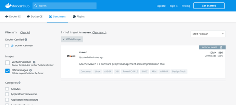

Inside the Dockerfile we use **two stages** to build the container image. The reason for the two stages is, we have the objective to be **independed** of local environment settings, when we build our production services. With this concept we don't have to ensure that **Java** and **Maven** (or wrong versions of them) is installed on the local machine of the developers.

In short words one container is only responsible to build the microservice, let us call this container **build environment container** and the other container will contain the microservice, we call this the **production** container.


* **Build environment container**

In the following Dockerfile extract, we can see how we create our **build environment container** based on the maven 3.5 image from the [dockerhub](https://hub.docker.com/_/maven/).

Here we use the **pom** file, we defined before, to build our **Authors service** with ```RUN mvn -f /usr/src/app/pom.xml clean package```.

```dockerfile
FROM maven:3.5-jdk-8 as BUILD
 
COPY src /usr/src/app/src
COPY pom.xml /usr/src/app
RUN mvn -f /usr/src/app/pom.xml clean package
```

* **Production container**

The starting point for the our **Production container** is the [OpenLiberty container](https://hub.docker.com/_/open-liberty).

We copy the **Authors service** code with the **server.xml** for the OpenLiberty server to this container. 
_REMEMBER:_ The **service.xml** contains the ports we use for our **Authors service**.

```dockerfile
FROM openliberty/open-liberty:microProfile2-java8-openj9 

COPY liberty/server.xml /config/
COPY --from=BUILD /usr/src/app/target/authors.war /config/apps/
```
---

# 5.Kubernetes deployment configuration

Now we examine the **deployment** and **service** yaml. The yamls do contain the  deploy the container to a **Pod** and creating **Services** to access them in the Kubernetes Cluster. 

In the following image we see the relevant dependencies for this lab.

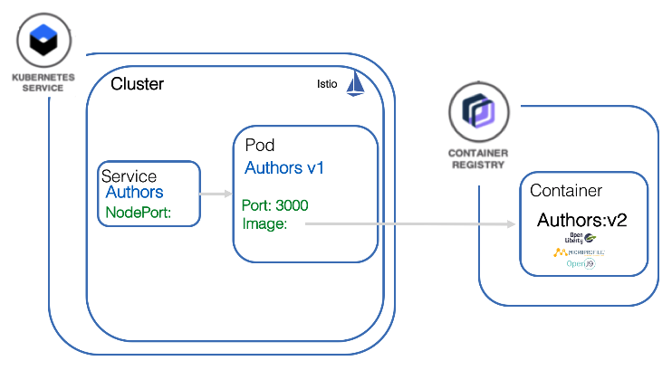

## 5.1 Deployment

The deployment will deploy the container to a Pod in Kubernetes.
For more details we use the [Kubernetes documentation](https://kubernetes.io/docs/concepts/workloads/pods/pod-overview/) for Pods.

> A Pod is the basic building block of Kubernetes–the smallest and simplest unit in the Kubernetes object model that you create or deploy. A Pod represents processes running on your Cluster .


Let's start with the **deployment yaml**. For more details we use will the [Kubernetes documentation](https://kubernetes.io/docs/concepts/workloads/controllers/deployment/) for deployments.

Definition of the ```kind``` defines this is a ```Deployment``` configuration.

```yml
kind: Deployment
apiVersion: apps/v1beta1
metadata:
  name: authors
```

Inside the ```spec``` section, we give the deployment a app name and version label.

```yml
spec:
  ...
  template:
    metadata:
      labels:
        app: authors
        version: v1
```

Then we define a ```name``` for the container and we provide the concret container ```image``` location, e.g. where the container can be found in the **Container Registry**. 

_NOTE:_ We will replace ```authors:1``` later with the IBM Container Registry information. 

The ```containerPort``` depends on the port definition inside our **Dockerfile** or better in our **server.xml**.

Now we should remember the usage of **HealthEndpoint** class for our **Authors**, here we see the ```livenessProbe``` definition.


```yml
spec:
      containers:
      - name: authors
        image: authors:1
        ports:
        - containerPort: 3000
        livenessProbe:
```
This is the full [deployment.yaml](../authors-java-jee/deployment/deployment.yaml) file.

```yaml
kind: Deployment
apiVersion: apps/v1beta1
metadata:
  name: authors
spec:
  replicas: 1
  template:
    metadata:
      labels:
        app: authors
        version: v1
    spec:
      containers:
      - name: authors
        image: authors:1
        ports:
        - containerPort: 3000
        livenessProbe:
          exec:
            command: ["sh", "-c", "curl -s http://localhost:3000/"]
          initialDelaySeconds: 20
        readinessProbe:
          exec:
            command: ["sh", "-c", "curl -s http://localhost:3000/health | grep -q authors"]
          initialDelaySeconds: 40
      restartPolicy: Always
```
## 5.2 Service

After the definition of the **Pod** we need to define how to access the Pod, therefor we use a **service** in Kubernetes. For more details we use the [Kubernetes documentation](https://kubernetes.io/docs/concepts/services-networking/service/) for service.

> A Kubernetes Service is an abstraction which defines a logical set of Pods and a policy by which to access them - sometimes called a micro-service. The set of Pods targeted by a Service is (usually) determined by a Label Selector.

In the service we map the **NodePort** of the cluster to the port 3000 of the **Authors** service running in the **authors** Pod, as we can see in the following picture. 

_Note:_ Later we get the actual port for the service using the command line: ```nodeport=$(kubectl get svc authors --ignore-not-found --output 'jsonpath={.spec.ports[*].nodePort}')```.


In the [service.yaml](../authors-java-jee/deployment/service.yaml) we see find our selector to the Pod **authors**. If the service is deployed, it is possible that our **Articles** service can find the **Authors** service.

```yaml
kind: Service
apiVersion: v1
metadata:
  name: authors
  labels:
    app: authors
spec:
  selector:
    app: authors
  ports:
    - port: 3000
      name: http
  type: NodePort
---
```

# 5. Hands-on tasks - Replace the Node.js Authors microservice with a simple Java implementation

### 2.1 Gain access to your cluster

1. Log in to your IBM Cloud account. Include the --sso option if using a federated ID.

    ```sh
    $ ibmcloud login -a https://cloud.ibm.com -r us-south -g default
    ```

2. Download the kubeconfig files for your cluster.

    ```sh
    $ ibmcloud ks cluster-config --cluster cloud-native
    ```

3. Set the KUBECONFIG environment variable. Copy the output from the previous command and paste it in your terminal. The command output looks similar to the following example:

    ```sh
    $ export KUBECONFIG=/Users/$USER/.bluemix/plugins/container-service/clusters/cloud-native/kube-config-mil01-cloud-native.yml
    ```

4. Verify you can connect to your cluster by listing your worker nodes.

    ```sh
    $ kubectl get nodes
    ```

5. Ensure you have no remaining microservices running from the other labs in this workshop.

    ```sh
    $ scripts/delete-all.sh
    ```

6. Verify the delete with following commands.

    ```sh
    $ kubectl get pods
    $ kubectl get services  
    ```

### 2.1 Build the container and upload to the IBM Container Registry

1. Logon to the IBM Cloud Container Registry 

    ```sh
    $ cd authors-java-jee
    $ ibmcloud cr login
    ```

2. List you namespaces inside the IBM Cloud Container Registry 

    ```sh
    $ ibmcloud cr namespaces
    ```

    _Sample result outout:_

    ```sh
    $ Listing namespaces for account 'Thomas Südbröcker's Account' in registry 'de.icr.io'...
    $
    $ Namespace   
    $ cloud-native
    ```

3. Now upload the code and build the container image inside IBM Cloud Container Registry. We use the upper information we got from listing the namespaces.

    ```sh
    $ ibmcloud cr build -f Dockerfile --tag $REGISTRY/$REGISTRY_NAMESPACE/authors:2 .
    ```

    _Sample result values:_

    ```sh
    $ ibmcloud cr build -f Dockerfile --tag de.icr.io/cloud-native/authors:2 .
    ```

    _Optional:_ Verify the container upload in the IBM Cloud web UI.

    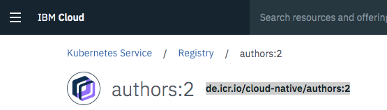

4. List the container images to verify the upload.

    ```sh
    $ ibmcloud cr images
    ```

    _Sample result output:_

    ```sh
    $ REPOSITORY                        TAG   DIGEST         NAMESPACE      CREATED          SIZE     SECURITY STATUS   
    $ de.icr.io/cloud-native/articles   1     b5dc1f96a69a   cloud-native   1 day ago        273 MB   7 Issues   
    $ de.icr.io/cloud-native/authors    2     217b7716dce1   cloud-native   30 seconds ago   259 MB   7 Issues   
    ```

    Copy the REPOSITORY path for the uploaded **Authors** container image.
    In this case sample: ```de.icr.io/cloud-native/authors```

### 2.3 Deploy the container image

1. Open the ```../authors-java-jee/deployment/deployment.yaml```with a editor and replace the value for the image location with the path we got from the IBM Container Registry and just replace the ```authors:1``` text, and add following statement ```imagePullPolicy: Always``` and **save** the file.

    Before:
    ```yml
    image: authors:1
    ```

    Sample change:
    ```yml
    image: de.icr.io/cloud-native/authors:2
    imagePullPolicy: Always
    ```

2. Now we apply the deployment we will create the new **Authors** Pod.

    ```sh
    $ kubectl apply -f deployment/deployment.yaml
    ```

3. Now we apply the service we will create the new **Authors** Service.

    ```sh
    $ kubectl apply -f deployment/service.yaml
    ```

4. Get cluster (node) IP address

    ```sh
    $ clusterip=$(ibmcloud ks workers --cluster cloud-native | awk '/Ready/ {print $2;exit;}')
    $ echo $clusterip
    $ 159.122.172.162
    ```

5. Get nodeport.

    ```sh
    $ nodeport=$(kubectl get svc authors --ignore-not-found --output 'jsonpath={.spec.ports[*].nodePort}')
    $ echo $nodeport
    $ 30108
    ```

5. Open API explorer.

    ```sh
    $ open http://${clusterip}:${nodeport}/openapi/ui/
    ```

    Sample result in your browser:

    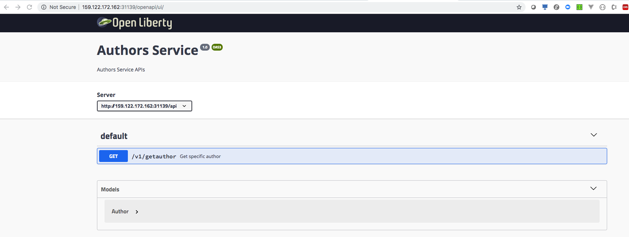


6. Execute curl to test the **Authors** service.

    ```sh
    $ curl http://${clusterip}:${nodeport}/api/v1/getauthor?name=Niklas%20Heidloff
    ```

    Sample result:
    ```
    $ {"name":"Niklas Heidloff","twitter":"@nheidloff","blog":"http://heidloff.net"}
    ```

7. Execute following curl command to test the **HealthCheck** implementation for the **Authors** service.

    ```sh
    $ curl http://${clusterip}:${nodeport}/health
    $ {"checks":[{"data":{"authors":"ok"},"name":"authors","state":"UP"}],"outcome":"UP"} 
    ```

    Optional: We can also verify that call in the browser.

    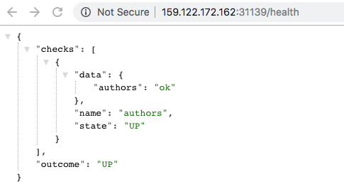

---

Now, we've finished the **Replace the Node.js Authors microservice with a simple Java implementation**.

**Congratulations** :thumbsup: and **greatest respect** :muscle:, you did the **extra mile** and you have finished this **hands-on workshop + optional lab** :-).

---

Resources:

* ['Simplest possible Microservice in Java'](../authors-java-jee/README.md)
* ['How to deploy a container to the IBM Cloud Kubernetes Service](https://suedbroecker.net/2019/03/05/how-to-deploy-a-container-to-the-ibm-cloud-kubernetes-service/)